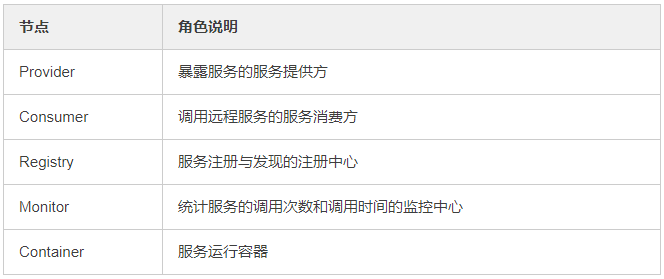
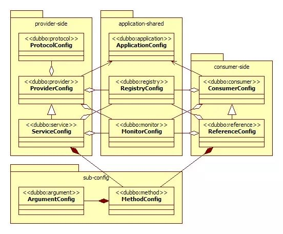

[TOC]


线程和oracle问的都多

mysql的存储过程

spring有什么模式

最奇葩的是他不问我最近的项目，问我第二个项目里面的技术。

单点登录token怎么产生的。

消息中间件，点对点时如何保证消息不重复。

反射，泛型，异常，注解。说一下。都写过自定义吗。说下自定义的实现

陈诗坦（上课）

陈东海


[CAP 定理的含义 - 阮一峰的网络日志](http://www.ruanyifeng.com/blog/2018/07/cap.html "CAP 定理的含义 - 阮一峰的网络日志")

[Java就业指导 - 萌小Q - 博客园](https://www.cnblogs.com/Qian123/articles/5671900.html#3681485 "Java就业指导 - 萌小Q - 博客园")


## 面经


[【原创】JAVA面试解析（有赞一面） - 孤独烟 - 博客园](https://www.cnblogs.com/rjzheng/p/10052014.html "[原创]JAVA面试解析（有赞一面） - 孤独烟 - 博客园")

[广州千锋 - 面试宝典](http://www.funtl.com/2018/04/07/contents/Java-%E9%9D%A2%E8%AF%95%E5%AE%9D%E5%85%B8/ "广州千锋 - 面试宝典")

[如何在面试中介绍自己的项目经验？](https://mp.weixin.qq.com/s?__biz=MzUxNTU4NjAwMw==&mid=2247484209&idx=1&sn=e86a490f4f93fcdd47ffd0cb338d48d4&chksm=f9b5218dcec2a89ba305b5dd8d55fcafbcfc3f07ad24527e928dc125e084b66d1f49682b79b2&mpshare=1&scene=2&srcid=1201n70YQ21KfBuB5k47jAo7&from=timeline#rd "Java之间")


**几份学习笔记：** 优秀的人太多，该份笔记列表将会不断增加

- [CyC2018/CS-Notes: Computer Science Learning Notes](https://github.com/CyC2018/CS-Notes "CyC2018/CS-Notes: Computer Science Learning Notes")
- [crossoverJie/JCSprout: 👨‍🎓 Java Core Sprout : basic, concurrent, algorithm](https://github.com/crossoverJie/JCSprout "crossoverJie/JCSprout: 👨‍🎓 Java Core Sprout : basic, concurrent, algorithm") 
- [Snailclimb/JavaGuide: 【Java学习+面试指南】 一份涵盖大部分Java程序员所需要掌握的核心知识。](https://github.com/Snailclimb/JavaGuide "Snailclimb/JavaGuide: [Java学习+面试指南] 一份涵盖大部分Java程序员所需要掌握的核心知识。")
- [xingshaocheng/architect-awesome: 后端架构师技术图谱](https://github.com/xingshaocheng/architect-awesome "xingshaocheng/architect-awesome: 后端架构师技术图谱")
- [frank-lam/fullstack-tutorial: Full Stack Developer Tutorial，后台技术栈/全栈开发/架构师之路，秋招/春招/校招/面试。 from zero to hero.](https://github.com/frank-lam/fullstack-tutorial) 像Java虚拟机方面的文章比其它的笔记都详细；并提供了一些优秀的开源项目的链接。
- [francistao/LearningNotes: Enjoy Learning.](https://github.com/francistao/LearningNotes "francistao/LearningNotes: Enjoy Learning.") 集合源码解析，JVM，Java并发
- [CarpenterLee/JCFInternals: 深入理解Java集合框架](https://github.com/CarpenterLee/JCFInternals "CarpenterLee/JCFInternals: 深入理解Java集合框架")  配有大量图示，非常不错的讲解集合的资源


## Java基础


### 面向对象的特征

默认三大特性

- 继承
- 封装
- 多态
- 抽象（如果说有4个就加上抽象）


### Java基本数据类型


- byte
- short
- int
- long
- float
- double
- boolean
- char


哪些类型可以用于switch语句的判断呢？

Math.round()方法 


> [Java 基本数据类型 - 菜鸟教程](http://www.runoob.com/java/java-basic-datatypes.html "Java 基本数据类型 | 菜鸟教程")
>
>

### equals() 和 hashCode()

`hashCode()`方法给对象返回一个hash code值。这个方法被用于hash tables，例如HashMap

**需要注意的是当equals()方法被override时，hashCode()也要被override。按照一般hashCode()方法的实现来说，相等的对象，它们的hash code一定相等。**

Java对象的eqauls方法和hashCode方法是这样规定的：

**1、相等** **（相同）** **的对象必须具有相等的哈希码（或者散列码）。**

**2、如果两个对象的hashCode相同，它们并不一定相同。**


### final 

final关键字主要用在三个地方：变量、方法、类


final 值的初始化


### static

1. 修饰成员变量和成员方法
2. 静态代码块
3. 修饰类(只能修饰内部类)
4. 静态导包(用来导入类中的静态资源，1.5之后的新特性)


**静态变量：**又称为类变量，也就是说这个变量属于类的，类所有的实例都共享静态变量，可以直接通过类名来访问它。静态变量在内存中只存在一份，存放在 Java 内存区域的**方法区**。

**实例变量：**每创建一个实例就会产生一个实例变量，它与该实例同生共死。

方法区与 Java 堆一样，是各个线程共享的内存区域，它用于存储已被虚拟机加载的类信息、常量、静态变量、即时编译器编译后的代码等数据。


[JavaGuide/static](https://github.com/Snailclimb/JavaGuide/blob/master/Java%E7%9B%B8%E5%85%B3/static.md "JavaGuide/static.md at master · Snailclimb/JavaGuide")


### 创建对象有几种方式

创建对象有几种方式：5种  [Java中创建对象的几种方式 ](https://blog.csdn.net/hustzw07/article/details/72518298 )

使用 new关键字、使用Clone方法、使用反序列化、使用Class类的newInstance方法、使用Constructor类的newInstance方法 （使用反射）。


### String，StringBuilder，StringBuffer


String为字符串常量，而StringBuilder和StringBuffer均为字符串变量，即String对象一旦创建之后该对象是不可更改的，但后两者的对象是变量，是可以更改的。

在线程安全上，StringBuilder是线程不安全的，而StringBuffer是线程安全的


String：适用于少量的字符串操作的情况

StringBuilder：适用于单线程下在字符缓冲区进行大量操作的情况

StringBuffer：适用多线程下在字符缓冲区进行大量操作的情况


[Java中的String，StringBuilder，StringBuffer三者的区别 - 酥风 - 博客园](https://www.cnblogs.com/su-feng/p/6659064.html "Java中的String，StringBuilder，StringBuffer三者的区别 - 酥风 - 博客园")

[关于StringBuffer和StringBuilder的可变性，文档中叙述有误 by liangpeng9631 · Pull Request #56 · Snailclimb/JavaGuide](https://github.com/Snailclimb/JavaGuide/pull/56 "关于StringBuffer和StringBuilder的可变性，文档中叙述有误 by liangpeng9631 · Pull Request #56 · Snailclimb/JavaGuide")


### final, finally, finalize 的区别


- final：用于声明属性,方法和类, 分别表示属性不可变, 方法不可覆盖, 类不可继承.
- 是异常处理语句结构的一部分，表示总是执行.
- finalize：是Object类的一个**方法**，在垃圾收集器执行的时候**会调用被回收对象的finalize方法**，可以覆盖此方法提供垃圾收集时的其他资源回收，例如关闭文件等， JVM不保证此方法总被调用。


### 抽象类和接口的区别

默认的方法实现

实现

构造器

访问修饰符

main方法

多继承


答：抽象类和接口都不能够实例化，但可以定义抽象类和接口类型的引用。一个类如果继承了某个抽象类或者实现了某个接口都需要对其中的抽象方法全部进行实现，否则该类仍然需要被声明为抽象类。接口比抽象类更加抽象，因为抽象类中可以定义构造器，可以有抽象方法和具体方法，而接口中不能定义构造器而且其中的方法全部都是抽象方法。抽象类中的成员可以是private、默认、protected、public的，而接口中的成员全都是public的。抽象类中可以定义成员变量，而接口中定义的成员变量实际上都是常量。有抽象方法的类必须被声明为抽象类，而抽象类未必要有抽象方法。


### Switch

**switch 是否能作用在byte 上，是否能作用在long 上，是否能作用在String上？**
答：在Java 5以前，switch(expr)中，expr只能是byte、short、char、int。从Java 5开始，Java中引入了枚举类型，expr也可以是enum类型，从Java 7开始，expr还可以是字符串（String），但是长整型（long）在目前所有的版本中都是不可以的。


### 其它面试题


**Math.round(11.5) 等于多少？Math.round(-11.5)等于多少？**
答：Math.round(11.5)的返回值是12，Math.round(-11.5)的返回值是-11。四舍五入的原理是在参数上加0.5然后进行下取整。


**用最有效率的方法计算2乘以8？**
答： 2 << 3（左移3位相当于乘以2的3次方，右移3位相当于除以2的3次方）。


**数组有没有length()方法？String有没有length()方法？**
答：数组没有length()方法，有length 的属性。String 有length()方法。JavaScript中，获得字符串的长度是通过length属性得到的，这一点容易和Java混淆。


**两个对象值相同(x.equals(y) == true)，但却可有不同的hash code，这句话对不对？**
答：不对，如果两个对象x和y满足x.equals(y) == true，它们的哈希码（hash code）应当相同。Java对于eqauls方法和hashCode方法是这样规定的：(1)如果两个对象相同（equals方法返回true），那么它们的hashCode值一定要相同；(2)如果两个对象的hashCode相同，它们并不一定相同。当然，你未必要按照要求去做，但是如果你违背了上述原则就会发现在使用容器时，相同的对象可以出现在Set集合中，同时增加新元素的效率会大大下降（对于使用哈希存储的系统，如果哈希码频繁的冲突将会造成存取性能急剧下降）。


**数据类型之间的转换：**
如何将字符串转换为基本数据类型？  
如何将基本数据类型转换为字符串？  

答：
- 调用基本数据类型对应的包装类中的方法parseXXX(String)或valueOf(String)即可返回相应基本类型；
- 一种方法是将基本数据类型与空字符串（”"）连接（+）即可获得其所对应的字符串；另一种方法是调用String 类中的valueOf()方法返回相应字符串


**当一个对象被当作参数传递到一个方法后，此方法可改变这个对象的属性，并可返回变化后的结果，那么这里到底是值传递还是引用传递？**

> 一度搞混，因为先接触C++；在牛客中收藏有相关题目。

答：是值传递。Java语言的方法调用只支持参数的值传递。当一个对象实例作为一个参数被传递到方法中时，参数的值就是对该对象的引用。对象的属性可以在被调用过程中被改变，但对对象引用的改变是不会影响到调用者的。C++和C#中可以通过传引用或传输出参数来改变传入的参数的值。在C#中可以编写如下所示的代码，但是在Java中却做不到。

```c++
`using System;` `namespace CS01 {` `    ``class` `Program {``        ``public` `static` `void` `swap(ref ``int` `x, ref ``int` `y) {``            ``int` `temp = x;``            ``x = y;``            ``y = temp;``        ``}` `        ``public` `static` `void` `Main (string[] args) {``            ``int` `a = ``5``, b = ``10``;``            ``swap (ref a, ref b);``            ``// a = 10, b = 5;``            ``Console.WriteLine (``"a = {0}, b = {1}"``, a, b);``        ``}``    ``}``}`
```

> 说明：Java中没有传引用实在是非常的不方便，这一点在Java 8中仍然没有得到改进，正是如此在Java编写的代码中才会出现大量的Wrapper类（将需要通过方法调用修改的引用置于一个Wrapper类中，再将Wrapper对象传入方法），这样的做法只会让代码变得臃肿，尤其是让从C和C++转型为Java程序员的开发者无法容忍。


**Object 类包含哪些方法？**

- `protected Object clone() throws CloneNotSupportedException `创建并返回此对象的副本。
- `public boolean equals(Object obj) `判断另一对象与此对象是否「相等」。
- `protected void finalize() throws Throwable `当垃圾回收机制确定该对象不再被调用时，垃圾回收器会调用此方法。
- `public final Class getClass() `返回此对象的运行时类。
- `public int hashCode() `返回此对象的散列码值。
- `public String toString() `返回此对象的字符串表示形式。

`Object `类的 `notify`，`notifyAll `和 `wait `方法都在同步程序中独立运行线程的活动方面发挥了作用，这将在后面的课程中讨论，在此不做介绍。其中有五种方法:

- `public final void notify()`
- `public final void notifyAll()`
- `public final void wait()`
- `public final void wait(long timeout)`
- `public final void wait(long timeout, int nanos)`


### 内部类


### 异常


#### try catch finally 执行顺序

见书中示例。


>  补充 [Java提高篇——Java 异常处理 - 萌小Q - 博客园](https://www.cnblogs.com/Qian123/p/5715402.html "Java提高篇——Java 异常处理 - 萌小Q - 博客园")


#### 项目中异常如何处理？

Spring MVC异常处理器。


### IO流


- 磁盘操作：File
- 字节操作：InputStream 和 OutputStream
- 字符操作：Reader 和 Writer

- 对象操作：Serializable
- 网络操作：Socket
- 新的输入/输出：NIO


转换流：

- InputStreamReader 实现从字节流解码成字符流；
- OutputStreamWriter 实现字符流编码成为字节流。


使用递归的方式遍历文件夹


[CS-Notes/Java IO.md](https://github.com/CyC2018/CS-Notes/blob/master/notes/Java%20IO.md "CS-Notes/Java IO.md at master · CyC2018/CS-Notes")


#### Java序列化框架

**序列化** (Serialization)是将 ***(Java)对象*** 的状态信息转换为 **可以存储或传输** 的形式的过程，而相反的过程就称为反序列化。


Java默认的序列化机制效率很低、序列化后的码流也较大，所以涌现出了非常多的优秀的Java序列化框架，例如：[hessian](https://link.jianshu.com/?t=http://hessian.caucho.com/)、[protobuf](https://link.jianshu.com/?t=https://github.com/google/protobuf)、[thrift](https://link.jianshu.com/?t=https://thrift.apache.org/)、[protostuff](https://link.jianshu.com/?t=http://www.protostuff.io/)、[kryo](https://link.jianshu.com/?t=https://github.com/EsotericSoftware/kryo)、[msgpack](https://link.jianshu.com/?t=http://msgpack.org/)、[avro](https://link.jianshu.com/?t=https://avro.apache.org/)、[fst](https://link.jianshu.com/?t=https://github.com/RuedigerMoeller/fast-serialization) 等等。


Json相关框架

Google Protobuf框架


### 集合

[CS-Notes/Java 容器.md](https://github.com/CyC2018/CS-Notes/blob/master/notes/Java%20%E5%AE%B9%E5%99%A8.md "CS-Notes/Java 容器.md at master · CyC2018/CS-Notes")  ⭐

[LearningNotes: JavaSE](https://github.com/francistao/LearningNotes "francistao/LearningNotes: Enjoy Learning.")  源码解析


#### ArrayList

底层实现

ArrayList是基于数组实现的，是一个动态数组，其容量能自动增长，类似于C语言中的动态申请内存，动态增长内存。

ArrayList不是线程安全的，只能在单线程环境下，多线程环境下可以考虑用collections.synchronizedList(List l)函数返回一个线程安全的ArrayList类，也可以使用concurrent并发包下的CopyOnWriteArrayList类。


 **List**

- ArrayList：基于动态数组实现，支持随机访问。
- Vector：和 ArrayList 类似，但它是线程安全的。（慢）
- LinkedList：基于双向链表实现，只能顺序访问，但是可以快速地在链表中间插入和删除元素。不仅如此，LinkedList 还可以用作栈、队列和双向队列。


问题：

- ArraList与Vector的区别？底层都是使用动态数组存放数据，但后者在 `add()`方法上使用了 `synchronized`进行同步写数据，所以开销大。


#### HashMap


- java 中， 为什么基本类型不能做为 HashMap 的键值， 而只能是引用类型，把引用类型作
  为 HashMap 的键值， 需要注意哪些地方？ 

- HashMap与HashTable的区别？

  - HashMap是支持null键和null值的，而HashTable在遇到null时，会抛出NullPointerException异常。

  - HashMap/HashTable内部用**Entry数组**实现哈希表，而对于映射到同一个哈希桶（数组的同一个位置）的键值对，使用**Entry链表**来存储 (解决hash冲突) 。
  - HashTable是线程安全的，HashMap不是，也就是说HashTable在多线程使用的情况下，不需要做额外的同步，而HashMap则不行。因为HashTable公开的方法上添加了 synchronized 关键字。
  - **HashTable已经被淘汰了**，不要在代码中再使用它。如果你不需要线程安全，那么使用HashMap，如果需要线程安全，那么使用ConcurrentHashMap。

- HashMap的结构是怎样的？

  二维结构，第一维是数组，第二维是链表。

  简单来说，HashMap由数组 + 链表组成的，数组是HashMap的主体，链表则是主要为了解决哈希冲突而存在的。

- put方法

- get方法

  get 和 put 类似，首先会将传入的 **Key** 做 `hash` 运算计算出 hashcode,然后根据数组长度取模计算出在数组中的 index 下标。如果该位置上(index上) 是一个链表就需要遍历整个链表，通过 `key.equals(k)` 来找到对应的元素。


**HashMap简单实现原理：**

HashMap的主干是一个Entry数组。Entry是HashMap的基本组成单元，每一个Entry包含一个key-value键值对。

Entry是HashMap中的一个静态内部类：

```java
static class Entry<K,V> implements Map.Entry<K,V> {
        final K key;
        V value;
        Entry<K,V> next;//存储指向下一个Entry的引用，单链表结构
        int hash;//对key的hashcode值进行hash运算后得到的值，存储在Entry，避免重复计算

        /**
         * Creates new entry.
         */
        Entry(int h, K k, V v, Entry<K,V> n) {
            value = v;
            next = n;
            key = k;
            hash = h;
        }
```


HashMap的整体结构如下:


 HashMap是基于哈希表实现的，每一个元素都是一个key-value对，其内部通过单链表解决冲突问题，容量不足（超过了阈值）时，同样会自动增长。

HashMap是非线程安全的，只是用于单线程环境下，多线程环境下可以采用concurrent并发包下的concurrentHashMap。


两个重要参数

- 容量：默认16
- 负载因子：默认 0.75

当HashMap `size>16*0.75` (达到阈值) 则进行扩容。


jdk1.8之前；数组+链表；之后 数组 + 链表/红黑树 （在 `JDK1.8` 中对 `HashMap` 进行了优化： 写入链表的长度超过了阈值(默认为8)，链表将会转换为**红黑树**。）


**判断HashMap的key是否重复：**

key是否重复，是由两个步骤判断的：

```
hashcode是否一样
  如果hashcode不一样，就是在不同的坑里，一定是不重复的
  如果hashcode一样，就是在同一个坑里，还需要进行equals比较
    如果equals一样，则是重复数据
    如果equals不一样，则是不同数据。
```


> LinkedHashMap：使用双向链表来维护元素的顺序，顺序为插入顺序或者最近最少使用（LRU）顺序。


- 在Google Play中可以下载一个叫 `Algorithms` 的 app，该app主要展示了 算法动图图解，其中“哈希函数” 和 “哈希表” 部分进行了非常通俗易懂的演示，建议首先观看此演示，再看相关文章。

- [HashMap实现原理及源码分析 - dreamcatcher-cx - 博客园](https://www.cnblogs.com/chengxiao/p/6059914.html "HashMap实现原理及源码分析 - dreamcatcher-cx - 博客园")
- [HashMap 相关面试题及其解答 - 简书](https://www.jianshu.com/p/75adf47958a7 "HashMap 相关面试题及其解答 - 简书")
- https://github.com/crossoverJie/JCSprout 

- [HashMap 实现原理 - ImportNew](http://www.importnew.com/27043.html "HashMap 实现原理 - ImportNew")


#### HashSet

- 扩容机制：

- 顺序：“**不保证有序**”和“保证无序”不等价，HashSet 的 iterator 是前者而不是后者，所以在一次运行中看到有序的结果也是正常的，但不能依赖这个有序行为。


[Java HashCode原理详解 ](http://how2j.cn/k/collection/collection-hashcode/371.html)


### XML解析

DOM解析：**将整个xml文件加载到内存中，然后再逐个解析**

SAX方式解析：**通过Handler处理类逐个依次顺序解析每个节点**


## 多线程

[JAVA多线程和并发基础面试问答（转载） - 海 子 - 博客园](https://www.cnblogs.com/dolphin0520/p/3932934.html "JAVA多线程和并发基础面试问答（转载） - 海 子 - 博客园")

[Java线程面试题 Top 50 （转载） - 海 子 - 博客园](https://www.cnblogs.com/dolphin0520/p/3958019.html "Java线程面试题 Top 50 （转载） - 海 子 - 博客园")


> 面试时问多线程中线程的同步和异步？感觉很别扭。
>
> [java 多线程同步和异步详解 - 简书](https://www.jianshu.com/p/80ffa58db37f "java 多线程同步和异步详解 - 简书")  
>
> 同步：A线程要请求某个资源，但是此资源正在被B线程使用中，因为同步机制存在，A线程请求
> 不到，怎么办，A线程只能等待下去
> 异步：A线程要请求某个资源，但是此资源正在被B线程使用中，因为没有同步机制存在，A线程
> 仍然请求的到，A线程无需等待


[CS-Notes/Java 并发.md at master · CyC2018/CS-Notes](https://github.com/CyC2018/CS-Notes/blob/master/notes/Java%20%E5%B9%B6%E5%8F%91.md "CS-Notes/Java 并发.md at master · CyC2018/CS-Notes")

有三种使用线程的方法：

- 实现 Runnable 接口；
- 实现 Callable 接口；
- 继承 Thread 类。


线程的状态：

- 新建 ：new一个线程对象t1
- 就绪：调用 t1.start() 方法后
- 运行：获取了CPU后，开始回调 run()
- 阻塞：调用 wait()，join()，sleep()，yield()
- 死亡：run() 运行结束


> Object类的方法（只有**获得锁的线程**通过**同步锁对象**调用这些方法）： 
>
> - wait() 线程等待：Object类中的wait()方法，导致当前的线程等待，直到其他线程调用此对象的 notify() 方法或 notifyAll() 唤醒方法。
> - notify()，notifyAll() 线程唤醒：Object类中的notify()方法，唤醒在此对象监视器上（唤醒wait set中的一条线程）等待的单个线程。如果所有线程都在此对象上等待，则会选择唤醒其中一个线程。
> - 与每个对象具有锁一样，每个对象可以有一个线程列表，他们等待来自该信号（通知）。线程通过执行(同步锁)对象上的`wait()`方法获得这个等待列表。从那时候起，它不再执行任何其他指令，直到调用对象的notify()方法为止。
>
> Thread中的静态方法： 
>
> - sleep() 线程休眠：使线程转到阻塞状态，当睡眠结束后，就转为就绪（Runnable）状态。sleep()平台移植性好。
> - Thread.yield() 线程让步：暂停当前正在执行的线程对象，把执行机会让给相同或者更高优先级的线程。
>
> Thread类中的方法： 
>
> - join()：使其它线程等待当前线程终止
>
>


1、每个线程都将启动，每个线程都将运行直到完成。一系列线程以某种顺序启动并不意味着将按该顺序执行。对于任何一组启动的线程来说，调度程序不能保证其执行次序，持续时间也无法保证。

2、当线程目标`run()`方法结束时该线程完成。

3、一旦线程启动，它就永远不能再重新启动。只有一个新的线程可以被启动，并且只能一次。一个可运行的线程或死线程可以被重新启动。


### **线程停止的正确方法**

- stop方法：该方法使线程戛然而止（突然停止），完成了哪些工作，哪些工作还没有做都不清楚，且清理工作也没有做。所以不推荐。

- 正确方法，使用`volatile`关键字设置退出标志，比如：

  ```java
  /**
   * 军队线程
   * 模拟作战双方的行为
   */
  public class ArmyRunnable implements Runnable {
  
      /* volatile关键字
       * volatile保证了线程可以正确的读取其他线程写入的值
       * 如果不写成volatile，由于可见性的问题，当前线程有可能不能读到这个值
       * 关于可见性的问题可以参考JVM（Java内存模型），里面讲述了：happens-before原则、可见性
       * 用volatile修饰的变量，线程在每次使用变量的时候，都会读取变量修改后的值
       */
      volatile boolean keepRunning = true;
  
      @Override
      public void run() {
         //检测退出标志
          while (keepRunning) {
              //发动5连击
              for(int i=0;i<5;i++){
                  System.out.println(Thread.currentThread().getName()+"进攻对方["+i+"]");
                  //让出了处理器时间，下次该谁进攻还不一定呢！
                  Thread.yield();//yield()当前运行线程释放处理器资源
              } 
          }
          System.out.println(Thread.currentThread().getName()+"结束了战斗！");
      }
  
  }
  ```

  在其它线程中（这里是在另一个类中）更改退出标志的值：

  ```java
  ArmyRunnable armyTaskOfRevolt = new ArmyRunnable();
  //使用Runnable接口创建线程
  Thread  armyOfRevolt = new Thread(armyTaskOfRevolt,"农民起义军");
  armyOfRevolt.start();
  //更改退出标志（停止线程的方法）(Runnable中的属性)
  armyTaskOfRevolt.keepRunning = false;
  ```


### volatile关键字

讲解volatile关键字前先了解多线程的三大核心：

- 原子性
- 可见性
- 顺序性


**可见性：**

现代计算机中，由于 `CPU` 直接从主内存中读取数据的效率不高，所以都会对应的 `CPU` 高速缓存，先将主内存中的数据读取到缓存中，线程修改数据之后**首先更新到缓存**，之后才会更新到主内存。如果此时还没有将数据更新到主内存其他的线程此时来读取就是修改之前的数据。

```
+--------+
|  CPU   |
+---+----+
    ^
    |
+---+-----+
| 高速缓存 |
+---+-----+
    ^
    |    
+---+-----+
|  内存    |
+---------+
```

`volatile` 关键字就是用于保证内存可见性，当线程A更新了 volatile 修饰的变量时，它会立即刷新到主线程，并且将其余缓存中该变量的值清空，导致其余线程只能去主内存读取最新值。

使用 `volatile` 关键词修饰的变量每次读取都会得到最新的数据，不管哪个线程对这个变量的修改都会立即刷新到主内存。

`synchronized`和加锁也能能保证可见性，实现原理就是在释放锁之前其余线程是访问不到这个共享变量的。但是和 `volatile`相比开销较大。


**顺序性：**


> 这样看来，volatile和加锁都可以保证 可见性和顺序性


- `volatile` 关键字只能保证可见性，顺序性，**不能保证原子性**。


volatile 关键字的应用：

- 内存可见性方面的应用：控制停止线程的标记
- 顺序性方面的应用：双重检查锁的单例模式


 详见 [JCSprout/Java多线程三大核心](https://github.com/crossoverJie/JCSprout/blob/master/MD/Threadcore.md "JCSprout/Threadcore.md at master · crossoverJie/JCSprout")

[一篇文章看懂Java并发和线程安全（一）-技术开发专区](http://tech.it168.com/a2018/0709/3213/000003213573.shtml "一篇文章看懂Java并发和线程安全（一）-技术开发专区")


### **线程和进程的区别** 

- **进程**：*是指一个内存中运行的应用程序，每个进程都有一个独立的内存空间*，一个应用程序可以同时运行多个进程；进程也是程序的一次执行过程，是系统运行程序的基本单位；系统运行一个程序即是一个进程从创建、运行到消亡的过程。大白话: 可执行文件(.exe) 一个应用程序有多个进程
- **线程**：*进程内部的一个独立执行单元*；一个进程可以同时并发的运行多个线程，可以理解为一个进程便相当于一个单 CPU 操作系统，而线程便是这个系统中运行的多个任务。线程: 进程中的一个执行单元

- 进程：有独立的内存空间，进程中的数据存放空间（堆空间和栈空间）是独立的，至少有一个线程。
- 线程：*堆空间是共享的，栈空间是独立的*，线程消耗的资源比进程小的多。


### **start()和run()方法**


**启动一个线程是调用run()还是start()方法？**
答：启动一个线程是调用start()方法，使线程所代表的虚拟处理机处于可运行状态，这意味着它可以由JVM 调度并执行，这并不意味着线程就会立即运行。run()方法是线程启动后要进行回调（callback）的方法。


### **线程同步机制**


> 这里有一种说法，互斥与同步：
>
> **互斥的实现（加锁）**：`synchronized(lockObj)`；保证的同一时间，只有一个线程获得`lockObj`。
>
> **同步的实现：wait()/notify()/notifyAll()** 
>
> 同步是两个线程之间的一种交互的操作（一个线程发出消息另外一个线程响应）（各自调用同一把锁的相关方法） 


同步锁：

- 锁对象 可以是任意类型。
- Java中每个对象都有一个内置锁
- 多个线程对象  要使用同一把锁（注意：同一个类的两个不同对象是不同的锁）。
- 线程可以获得多个锁。比如，在一个对象的同步方法里面调用另外一个对象的同步方法，则获取了两个对象的同步锁。
- 当程序运行到非静态的synchronized同步方法上时，自动获得与正在执行代码类的当前实例（this实例）有关的锁。
- 每个对象都有且仅有一个锁，这个锁与一个特定的**对象**关联。


- 同步代码块：`synchronized` 关键字可以用于方法中的某个区块中，表示只对这个区块的资源实行互斥访问

  ```java
  synchronized(同步锁){
      需要同步的代码
  }
  ```

- 同步方法：使用`synchronized`修饰的方法,就叫做同步方法

  ```java
  public synchronized void method(){
     	可能会产生线程安全问题的代码
  }
  ```

  此时同步锁是谁?

  ​      对于非 static 方法，同步锁就是 this。  

  ​      对于 static方法，我们使用当前方法所在类的字节码对象 (类名.class)。

- Lock锁 （`java.util.concurrent.locks.Lock` 提供）

  ```java
  Lock lock = new ReentrantLock();
  ...
  lock.lock();
  //要同步的操作
  lock.unlock();
  ```


> 注意:在任何时候,最多允许一个线程拥有同步锁,谁拿到锁就进入代码块,其他的线程只能在外等着(BLOCKED)。


**sleep() :**

1. 为了让其他线程有机会执行，可以将Thread.sleep()的调用**放线程run()之内**。这样才能保证该线程执行过程中会睡眠。
2. sleep与锁无关，线程睡眠到期自动苏醒，并返回到Runnable（可运行）状态。


> 小提示：sleep()中指定的时间是线程不会运行的最短时间。因此，sleep()方法不能保证该线程睡眠到期后就开始立刻执行。


### **死锁**

[死锁_百度百科](https://baike.baidu.com/item/%E6%AD%BB%E9%94%81 "死锁_百度百科")，

死锁产生的原因有很多：

- 是多个线程同时被阻塞，它们中的一个或者全部都在等待某个资源被释放。
- 典型的另一个示例: 


死锁产生的四个必要条件：

略


### **ThreadLocal** 

ThreadLocal，很多地方叫做线程本地变量，也有些地方叫做线程本地存储，其实意思差不多。可能很多朋友都知道**ThreadLocal为变量在每个线程中都创建了一个副本**，那么每个线程可以访问自己内部的副本变量。


> [Spring Bean单例与线程安全 ](https://www.cnblogs.com/redcool/p/6398760.html "Spring Bean单例与线程安全 - 低调的小黑 - 博客园") 
>
> **ThreadLocal** 和 **线程同步机制** 相比有什么优势呢？**他们都是为了解决多线程中相同变量的访问冲突问题**。
>
> 概括起来说，对于多线程资源共享的问题，**同步机制采用了“以时间换空间”的方式，而ThreadLocal采用了“以空间换时间”的方式**。前者仅提供一份变量，让不同的线程排队访问，而后者为每一个线程都提供了一份变量，因此可以同时访问而互不影响。
>
> Spring使用ThreadLocal解决**线程安全问题** 


### **线程池** ThreadPool

什么是线程池？ 由系统维护的容纳线程的容器。

线程池作用就是限制系统中执行线程的数量；因为

- 创建/销毁线程伴随着系统开销，过于频繁的创建/销毁线程，会很大程度上影响处理效率
- 线程并发数量过多，抢占系统资源从而导致阻塞
- 对线程进行一些简单的管理

我们可以把并发执行的任务传递给一个线程池，来替代为每个并发执行的任务都启动一个新的线程。只要池里有空闲的线程，任务就会分配给一个线程执行。在线程池的内部，任务被插入一个阻塞队列（[Blocking Queue](http://tutorials.jenkov.com/java-concurrency/blocking-queues.html) ），线程池里的线程会去取这个队列里的任务。当一个新任务插入队列时，一个空闲线程就会成功的从队列中取出任务并且执行它。


在Java中，线程池的概念是Executor这个接口，具体实现为ThreadPoolExecutor类


> 多线程之间的上下文切换：
>
> 上下文切换是非常耗效率的。
>
>


面试问题：

- 线程池的任务拒绝策略
- 创建线程池的几个参数（手写）


> [线程池的介绍及简单实现](http://www.ibm.com/developerworks/cn/java/l-threadPool/index.html "线程池的介绍及简单实现")
>
> [线程池  并发编程网 – ifeve.com](http://ifeve.com/thread-pools/ "线程池  并发编程网 – ifeve.com") 这里有一个更简单的实现。
>
> [Java ThreadPoolExecutor 线程池源码分析 - 简书](https://www.jianshu.com/p/8c772124f17e?utm_campaign=maleskine&utm_content=note&utm_medium=seo_notes&utm_source=recommendation "Java ThreadPoolExecutor 线程池源码分析 - 简书")


[CarpenterLee/JCRecipes: Java Concurrency Recipes, 介绍Java并发相关的常见工具类。](https://github.com/CarpenterLee/JCRecipes "CarpenterLee/JCRecipes: Java Concurrency Recipes, 介绍Java并发相关的常见工具类。")


### **并发队列**

- 阻塞队列：使用锁实现。

  特点：若队列已满，则入队操作会被阻塞；若队列为空，出队操作被阻塞。

  比如一些任务队列就属于阻塞队列

- 非阻塞队列：使用CAS算法实现。(了解CAS算法前，需要先了解**悲观锁**和**乐观锁**)

  为什么叫非阻塞队列？

  与阻塞队列相反，非阻塞队列的执行并不会被阻塞，无论是消费者的出队，还是生产者的入队。 


> 补充：
>
> #### ConcurrentHashMap 非阻塞 Hash 集合
>
> ConcurrentHashMap 是 Java 并发包中提供的一个线程安全且高效的 HashMap 实现， ConcurrentHashMap在并发编程的场景中使用频率非常之高 。其实现原理见 《Java面试宝典Beta5.0》第214页
>
> #### SkipList (跳跃表)
>
> 来源：ConcurrentSkipListMap 非阻塞 Hash 跳表集合 
>
> 是一种可以代替平衡树的数据结构，默认是按照 Key 值升序的 。跳跃表（skiplist）是一种有序数据结构， 它通过在每个节点中维持多个指向其他节点的指针， 从而达到快速访问节点的目的。
>
> [跳跃表 — Redis 设计与实现](http://redisbook.com/preview/skiplist/content.html "跳跃表 — Redis 设计与实现")
>
>

CountDownLatch 
CyclicBarrier 

> - **并行**：指两个或多个事件在**同一时刻**发生（同时发生）。
> - **并发**：指两个或多个事件在**同一个时间段内**发生。

[说说Runnable与Callable - 每天一点 - 博客园](https://www.cnblogs.com/frinder6/p/5507082.html "说说Runnable与Callable - 每天一点 - 博客园")

[Java并发编程：volatile关键字解析 - 海 子 - 博客园](https://www.cnblogs.com/dolphin0520/p/3920373.html "Java并发编程：volatile关键字解析 - 海 子 - 博客园")

[Java并发编程 - 随笔分类 - 海 子 - 博客园](https://www.cnblogs.com/dolphin0520/category/602384.html "Java并发编程 - 随笔分类 - 海 子 - 博客园")

> synchronized   ['sɪŋkrənaɪzd] 同步的
>
> Thread  [θred] 


## 反射

反射机制

**反射的用途**
Java 反射机制是一个非常强大的功能，在很多的项目比如 Spring，MyBatis 都都可以看到反射的身影。通过反射机制，我们可以在运行期间获取对象的类型信息。利用这一点我们可以实现工厂模式和代理模式等设计模式，同时也可以解决 Java 泛型擦除等令人苦恼的问题。


**反射的实现**
获取一个对象对应的反射类，在 Java 中有下列方法可以获取一个对象的反射类

- 通过 getClass() 方法
- 通过 Class.forName() 方法
- 使用 类.class
- 通过类加载器实现，getClassLoader()


## JVM

[CS-Notes/Java 虚拟机.md](https://github.com/CyC2018/CS-Notes/blob/master/notes/Java%20%E8%99%9A%E6%8B%9F%E6%9C%BA.md "CS-Notes/Java 虚拟机.md at master · CyC2018/CS-Notes") ⭐

[fullstack-tutorial/05 Java 虚拟机.md](https://github.com/frank-lam/fullstack-tutorial/blob/master/notes/JavaArchitecture/05%20Java%20%E8%99%9A%E6%8B%9F%E6%9C%BA.md "fullstack-tutorial/05 Java 虚拟机.md at master · frank-lam/fullstack-tutorial") ⭐


**JVM是什么？**

它是一种基于计算设备的规范，是一台虚拟机，即虚构的计算机。

JVM有两个主要功能：允许Java程序运行在任何设备或操作系统（即“一次编写，到处运行”原则），以及管理和优化程序内存。


### JVM体系结构


JRE (JavaRuntimeEnvironment，Java运行环境) 所有的Java程序都要在JRE下才能运行

JVM (JavaVirtualMachine，Java虚拟机) 是JRE的一部分。它是一个虚构出来的计算机，是通过在实际的计算机上仿真模拟各种计算机功能来实现的。**JVM有自己完善的硬件架构**，如处理器、堆栈、寄存器等，还具有相应的指令系统。Java语言最重要的特点就是跨平台运行。使用JVM就是为了支持与操作系统无关，实现跨平台。


> **JRE**（Java Runtime Environment），它是运行Java程序的必需条件：
>
> - 核心虚拟机（**JVM**）
> - 类加载器
> - 字节码校验器
> - 大量基础类库
> - ... （运行Java程序的其他环境支持）
>
>
>
> **JDK** (Java SE Development Kit)，Java标准开发包，它包含了：
>
> - Java编译器
> - Java运行时环境（JRE）
> - 常用的Java类库
>
>


**JVM包括：**

- 类加载器 classloader：装载`.class`文件。两种装载方式
  - 隐式：运行过程中，碰到new方式生成对象时，隐式调用classLoader到JVM
  - 显式：通过`class.forname()`动态加载
- 执行引擎 execution engine ：执行字节码，或者执行本地方法
- **运行时数据区域 runtime data area**：JVM 运行时数据区 (JVM Runtime Area) 其实就是指 JVM 在运行期间，其对JVM内存空间的划分和分配。JVM在运行时将数据划分为了6个区域来存储。程序员写的所有程序都被加载到`运行时数据区域`中。


**运行时数据区域主要包括：**

- 程序计数器(Program Counter)
- Java虚拟机栈(Stack)
- 本地方法栈(Native Stack)：与Stack类似，只不过其为Native方法服务（JNI相关）
- Java堆(Heap)
- 方法区(Method Area)
  - 运行时常量池：其空间从方法区中分配，存放的为类中固定的常量信息、方法和域的引用信息。


堆内存设置的参数是什么？

- -Xmx 设置堆的最大空间大小
- -Xms 设置堆的最小空间大小


[JVM 的 工作原理，层次结构 以及 GC工作原理 - 我们俩 - SegmentFault 思否](https://segmentfault.com/a/1190000002579346 "JVM 的 工作原理，层次结构 以及 GC工作原理 - 我们俩 - SegmentFault 思否") ⭐

[JVM内幕：Java虚拟机详解 - ImportNew](http://www.importnew.com/17770.html "JVM内幕：Java虚拟机详解 - ImportNew")


> 谈到常量池，在Java体系中，共用三种常量池。分别是字符串常量池、Class常量池和运行时常量池。
>
> [好好说说Java中的常量池之Class常量池](http://blog.51cto.com/13732225/2307459 "好好说说Java中的常量池之Class常量池-Java架构的博客-51CTO博客") 


### JVM性能调优

调优方法，调优工具


### 内存溢出

- JVM Heap（堆）溢出

  解决办法：手动设置JVM Heap（堆）的大小（扩大）

- 栈溢出

  解决办法：（函数的调用层数过多）调用构造函数的 “层”太多了，递归的层次过多。

- PermGen space溢出（内存的永久保存区域）。该区域被 JVM存放Class和Meta信息的，如果载入的class过多会导致其溢出

  解决方法：手动设置MaxPermSize大小


[常见的三种Java内存溢出详解 ](http://www.jfox.info/2017/chang-jian-de-san-zhong-java-na-cun-yi-chu-xiang-jie.html "常见的三种Java内存溢出详解 ")


### 垃圾回收

> 结合 JVM

垃圾收集主要是针对（JVM的）堆和方法区进行。

程序计数器、虚拟机栈和本地方法栈这三个区域属于线程私有的，只存在于线程的生命周期内，线程结束之后也会消失，因此不需要对这三个区域进行垃圾回收。


垃圾回收主要思考三件事情：

- 哪种内存需要回收？

- 什么时候回收？

  判断对象是否存活（使用下面的方法判断一个对象是否可被回收）

  - 引用计数法

  - 可达性分析算法

    > 这两种方法判定对象是否可被回收都与引用有关。所以补充一下引用类型相关信息：
    >
    > Java 提供了四种强度不同的引用类型：强引用、软引用、弱引用、虚引用

- 怎么回收？（对应的有多种垃圾收集算法，还有多种垃圾收集器）

  - 标记-清除算法
  - 标记-整理算法
  - 复制算法
  - 分代回收算法


### 类加载机制

>  详见相关引用的链接，三份学习笔记都有


### 相关面试题


**解释内存中的栈(stack)、堆(heap)和静态区(static area)的用法？**
答：

- 通常我们定义一个基本数据类型的变量，一个对象的引用，还有就是函数调用的现场保存都使用内存中的**栈空间**；
- 而通过new关键字和构造器创建的对象放在**堆空间**；
- 程序中的字面量（literal）如直接书写的100、”hello”和常量都是放在**静态区**中。栈空间操作起来最快但是栈很小，

通常大量的对象都是放在堆空间，理论上整个内存没有被其他进程使用的空间甚至硬盘上的虚拟内存都可以被当成堆空间来使用。

```java
`String str = ``new` `String(``"hello"``);`
```

上面的语句中变量 `str` 放在栈上，用 `new` 创建出来的字符串对象放在堆上，而 `"hello"`这个字面量放在静态区。

> **补充：**较新版本的Java（从Java 6的某个更新开始）中使用了一项叫”逃逸分析”的技术，可以将一些局部对象放在栈上以提升对象的操作性能。


**String s = new String(“xyz”);创建了几个字符串对象？**
答：两个对象，一个是静态区的”xyz”，一个是用new创建在堆上的对象。


## 设计模式

[CS-Notes/设计模式.md ](https://github.com/CyC2018/CS-Notes/blob/master/notes/%E8%AE%BE%E8%AE%A1%E6%A8%A1%E5%BC%8F.md "CS-Notes/设计模式.md at master · CyC2018/CS-Notes") 23种设计模式


### 单例

同步问题。


[JavaGuide/static](https://github.com/Snailclimb/JavaGuide/blob/master/Java%E7%9B%B8%E5%85%B3/static.md "JavaGuide/static.md at master · Snailclimb/JavaGuide") 使用静态内部类实现单例的解释。


## 算法


### 排序


## Java Web


### 请求转发和重定向

**转发是服务器行为，重定向是客户端行为。**


**重定向（Redirect）** 是利用服务器返回的状态吗来实现的。如果服务器返回301或者302，则浏览器会到新的网址重新请求该资源。


### HTTP方法


#### Get和Post方法比较

**作用：**GET 用于获取资源，而 POST 用于传输实体主体。


**参数：**

GET 和 POST 的请求都能使用额外的参数，但是 GET 的参数是以查询字符串出现在 URL 中，而 POST 的参数存储在实体主体中。不能因为 POST 参数存储在实体主体中就认为它的安全性更高，因为照样可以通过一些抓包工具（Fiddler）查看。

因为 URL 只支持 ASCII 码，因此 GET 的参数中如果存在中文等字符就需要先进行编码。例如 `中文` 会转换为 `%E4%B8%AD%E6%96%87`，而空格会转换为 `%20`。POST 参考支持标准字符集。


**幂等性：**

幂等的 HTTP 方法，同样的请求被执行一次与连续执行多次的效果是一样的，服务器的状态也是一样的。换句话说就是，幂等方法不应该具有副作用（统计用途除外）。

所有的安全方法也都是幂等的。

在正确实现的条件下，GET，HEAD，PUT 和 DELETE 等方法都是幂等的，而 POST 方法不是。


#### Restful


### HTTP状态码


| 状态码 | 类别                                 | 原因短语                   |
| ------ | ------------------------------------ | -------------------------- |
| 1XX    | Informational（**信息**性状态码）    | 接收的请求正在处理         |
| 2XX    | Success（**成功**状态码）            | 请求正常处理完毕           |
| 3XX    | Redirection（**重定向**状态码）      | 需要进行附加操作以完成请求 |
| 4XX    | Client Error（**客户端错误**状态码） | 服务器无法处理请求         |
| 5XX    | Server Error（**服务器错误**状态码） | 服务器处理请求出错         |


> [CS-Notes/HTTP.md](https://github.com/CyC2018/CS-Notes/blob/master/notes/HTTP.md "CS-Notes/HTTP.md at master · CyC2018/CS-Notes")

### cookie 和 session


### 请求转发和重定向


servlet几大内置对象：


### 过滤器，监听器，拦截器


Servlet API提供了大量Listener 来对Web容器内的事件进行监听，从而当对应的事件发生时回调事件监听器内的方法。


[过滤器（Filter）与拦截器（Interceptor )区别](https://www.cnblogs.com/junzi2099/p/8022058.html)

Filter可以认为是Servlet的一种“加强版”，它主要用于对用户请求进行预处理，也可以对HttpServletResponse进行后处理，是个典型的处理链。

> Servlet中的过滤器Filter是实现了javax.servlet.Filter接口的服务器端程序，（在spring中）主要的用途是设置字符集、控制权限、控制转向、做一些业务逻辑判断等。其工作原理是，只要你在web.xml文件配置好要拦截的客户端请求，它都会帮你拦截到请求，此时你就可以对请求或响应(Request、Response)统一设置编码，简化操作

拦截器是在面向切面编程中应用的，就是在你的service或者一个方法前调用一个方法，或者在方法后调用一个方法。是基于JAVA的反射机制。拦截器不是在web.xml，比如struts在struts.xml中配置。

拦截器，在AOP(Aspect-Oriented Programming)中用于在某个方法或字段被访问之前，进行拦截，然后在之前或之后加入某些操作。拦截是AOP的一种实现策略。


执行顺序：

```
过滤前-拦截前-Action处理-拦截后-过滤后
```


**拦截器（Interceptor）使用**

interceptor 的执行顺序大致为：

1. 请求到达 DispatcherServlet
2. DispatcherServlet 发送至 Interceptor ，执行 preHandle
3. 请求达到 Controller
4. 请求结束后，postHandle 执行

Spring 中主要通过 HandlerInterceptor 接口来实现请求的拦截，实现 HandlerInterceptor 接口需要实现下面三个方法：

- preHandle() – 在handler执行之前，返回 boolean 值，true 表示继续执行，false 为停止执行并返回。
- postHandle() – 在handler执行之后, 可以在返回之前对返回的结果进行修改
- afterCompletion() – 在请求完全结束后调用，可以用来统计请求耗时等等


### 自动刷新

自动刷新不仅可以实现一段时间之后自动跳转到另一个页面，还可以实现一段时间之后自动刷新本页面。Servlet中通过HttpServletResponse对象设置Header属性实现自动刷新

```java
Response.setHeader("Refresh","1000;URL=http://localhost:8080/servlet/example.htm");
```


### Servlet生命周期


### JSP和Servlet之间的关系


## 数据库相关

[为什么开发人员必须要了解数据库锁？](https://mp.weixin.qq.com/s?__biz=MjM5ODI5Njc2MA==&mid=2655819140&idx=1&sn=b4c4e3f3681e5915b537f9485b27f733&chksm=bd74d8538a03514570c5d3ebcf02c2f084c227c0d9bfbf5534518615fd9752f63621c9d887a0&mpshare=1&scene=24&srcid=1028j4zeXeLyoCVs9d1pRn4m#rd "51CTO技术栈")


数据类型：

- 整数
- 浮点数
- 字符串
- 时间和日期


### SQL语句


- distinct
- limit
- like 与 通配符
- 排序
- 计算字段
- group by 分组
- 子查询
- 连接
- 组合查询
- 视图：
- 存储过程：好处；手写
- 游标：**在存储过程中**使用游标可以对一个结果集进行移动遍历。
- 触发器：触发器会在某个表执行以下语句时而自动执行：DELETE、INSERT、UPDATE。


存储过程可以看成是对一系列 SQL 操作的批处理。

使用存储过程的好处：

- 代码封装，保证了一定的安全性；
- 代码复用；
- 由于是预先编译，因此具有很高的性能。


> [CS-Notes/SQL.md](https://github.com/CyC2018/CS-Notes/blob/master/notes/SQL.md "CS-Notes/SQL.md at master · CyC2018/CS-Notes")


### SQL执行顺序

```
from...on...join...where...group by...with... having....
select...distinct...order by...limit 
```


### 三范式

- 第一范式：**列（属性）不可再分**，确保没列保持原子性
- 第二范式：**确保数据库表中的每一列都和主键相关**，而不能只与主键的某一部分相关（主要针对联合主键而言）
- 第三范式：**确保数据表中的每一列数据都和主键直接相关，而不能间接相关**


> [数据库设计三大范式 - Ruthless - 博客园](http://www.cnblogs.com/linjiqin/archive/2012/04/01/2428695.html "数据库设计三大范式 - Ruthless - 博客园")


### 事务的特性

什么是事务？ACID之间的关系？并发一致性问题，导致的脏读、幻读...？详见： [CS-Notes/数据库系统原理](https://github.com/CyC2018/CS-Notes/blob/master/notes/%E6%95%B0%E6%8D%AE%E5%BA%93%E7%B3%BB%E7%BB%9F%E5%8E%9F%E7%90%86.md "CS-Notes/数据库系统原理.md at master · CyC2018/CS-Notes")  

**事务**指的是满足 ACID 特性的**一组操作**，可以通过 Commit 提交一个事务，也可以使用 Rollback 进行回滚。


**ACID：**具体解释见链接。

- 原子性
- 一致性
- 隔离性
- 持久性


由上图可知，*一致性需要通过原子性和隔离性来保证*。但在**并发**情况下，**隔离性**很难保证，所以会出现并发**一致性**问题。


并发一致性问题，导致的脏读、幻读...？**详见**  [CS-Notes/数据库系统原理](https://github.com/CyC2018/CS-Notes/blob/master/notes/%E6%95%B0%E6%8D%AE%E5%BA%93%E7%B3%BB%E7%BB%9F%E5%8E%9F%E7%90%86.md "CS-Notes/数据库系统原理.md at master · CyC2018/CS-Notes")  

**并发一致性问题：**

- 丢失修改(更新)
- 脏读
- 不可重复读
- 幻读


产生并发不一致性问题**主要原因是破坏了事务的隔离性**，解决方法是通过并发控制来保证隔离性。并发控制可以通过封锁来实现，但是封锁操作需要用户自己控制，相当复杂。**数据库管理系统提供了事务的隔离级别**，让用户以一种更轻松的方式处理并发一致性问题。


**（数据库提供的）事务的隔离级别：**

MySQL数据库为我们提供的四种隔离级别


| 隔离级别                           | 描述                                                         | 读数据一致性                             | 赃读 | 不可重复读 | 幻读 |
| ---------------------------------- | ------------------------------------------------------------ | ---------------------------------------- | ---- | ---------- | ---- |
| Read Uncommitted（读取未提交内容） | 所有事务都可以看到其他未提交事务的执行结果                   | 最低级别，只能保证不读取物理上损坏的数据 | √    | √          | √    |
| Read Committed（读取已提交内容）   | 一个事务只能看见已经提交事务所做的改变（其它数据库默认）     | 语句级                                   | ×    | √          | √    |
| Repeatable Read（可重复读）        | 它确保同一事务的多个实例在并发读取数据时，会看到同样的数据行（mysql默认） | 事务级                                   | ×    | ×          | √    |
| Serializable（可串行化）           | 它通过强制事务排序，使之不可能相互冲突，从而解决幻读问题     | 最高级别，事务级                         | ×    | ×          | ×    |


隔离级别越高，越能保证数据的完整性和一致性，但是对并发性能的影响也越大。对于多数应用程序，可以优先考虑把数据库系统的隔离级别设为**Read Committed**。它能够避免脏读取，而且具有较好的并发性能。尽管它会导致不可重复读、幻读和第二类丢失更新这些并发问题，在可能出现这类问题的个别场合，**可以由应用程序采用悲观锁或乐观锁来控制**。


### 封锁

封锁粒度（mysql）：

- 行级锁
- 表级锁


封锁类型：

- 读写锁
  - 排它锁（写锁）
  - 共享锁（读锁）
- 意向锁


结合封锁粒度和封锁类型。


#### 乐观锁和悲观锁


> **乐观锁：**总是假设最好的情况，每次去拿数据的时候都认为别人不会修改，所以不会上锁，但是在更新的时候会判断一下在此期间别人有没有去更新这个数据，可以使用版本号机制和CAS算法实现。**乐观锁适用于多读的应用类型，这样可以提高吞吐量**，像数据库提供的类似于**write_condition机制**，其实都是提供的乐观锁。在Java中`java.util.concurrent.atomic`包下面的原子变量类就是使用了乐观锁的一种实现方式**CAS**实现的。
>
>  **悲观锁：**总是假设最坏的情况，每次去拿数据的时候都认为别人会修改，所以每次在拿数据的时候都会上锁，这样别人想拿这个数据就会阻塞直到它拿到锁（**共享资源每次只给一个线程使用，其它线程阻塞，用完后再把资源转让给其它线程**）。传统的关系型数据库里边就用到了很多这种锁机制，比如行锁，表锁等，读锁，写锁等，都是在做操作之前先上锁。Java中`synchronized`和`ReentrantLock`等独占锁就是悲观锁思想的实现。


**乐观锁(Optimistic Lock)**，是指操作数据库时(更新操作)，总是认为这次的操作**不会**导致冲突，不到万不得已不去拿锁，在更新时采取判断是否冲突，*适用于读操作远多于更新操作的情况*。
***乐观锁并没有被数据库实现，需要自行实现***，通常的实现方式为在表中增加版本version字段，更新时判断库中version与取出时的version值是否相等，若相等则执行更新并将version加1，若不相等则说明数据被其他线程(进程)修改，放弃修改。

```sql
select (age, version) from user where id = #{id};
# 其他操作
update user set age = 18, version = version + 1 where id = #{id} and version = #{version}
```

**悲观锁(Pessimistic Lock）**，是指操作数据库时(更新操作)，总是认为这次的操作**会**导致冲突，每次都要通过获取锁才能进行数据操作，因此要先确保获取锁成功再进行业务操作。
悲观锁需要数据库自身提供支持，MySql提供了**共享锁**和**排他锁**来实现对数据行的锁定，两种锁的介绍如下介绍。

> 实现方式：通过数据库锁机制实现，即对查询语句添加`for update`关键字。


**InnoDB引擎** 实现了以下两种类型的行锁：

- 共享锁（S）
- 排它锁（X）

对于`UPDATE`、`DELETE`和`INSERT`语句，InnoDB 会**自动**给涉及数据集加排他锁（X）

对于普通`SELECT`语句，InnoDB不会加任何锁

事务可以通过以下语句**显式地**给记录集加共享锁或排他锁：

- 共享锁: `SELECT * FROM table_name WHERE ... LOCK IN SHARE MODE`，等同读锁
- 排他锁: `SELECT * FROM table_name WHERE ... FOR UPDATE`，等同写锁


> 悲观锁和乐观锁：名为"锁"，其实不是锁，而是加锁的解决方案。
>
> 悲观锁：在`select`的时候加上排它锁，即在`select`的时候既不能读又不能写
>
> 乐观锁：通过版本号字段 `@javax.persist.Version`
>


[重新理解mysql的锁、事务隔离级别及事务传播行为 - 程序园](http://www.voidcn.com/article/p-yttjumru-bsg.html "重新理解mysql的锁、事务隔离级别及事务传播行为 - 程序园") ⭐

[浅谈数据库乐观锁和悲观锁 - 简书](https://www.jianshu.com/p/39d8b7437b0b "浅谈数据库乐观锁和悲观锁 - 简书")

[JavaGuide/面试必备之乐观锁与悲观锁.md at master · Snailclimb/JavaGuide](https://github.com/Snailclimb/JavaGuide/blob/master/%E9%9D%A2%E8%AF%95%E5%BF%85%E5%A4%87/%E9%9D%A2%E8%AF%95%E5%BF%85%E5%A4%87%E4%B9%8B%E4%B9%90%E8%A7%82%E9%94%81%E4%B8%8E%E6%82%B2%E8%A7%82%E9%94%81.md "JavaGuide/面试必备之乐观锁与悲观锁.md at master · Snailclimb/JavaGuide")

[事务隔离级别_百度百科](https://baike.baidu.com/item/%E4%BA%8B%E5%8A%A1%E9%9A%94%E7%A6%BB%E7%BA%A7%E5%88%AB "事务隔离级别_百度百科")

> 详见各链接，更深入的解释这里没有摘抄。


数据库中添加事务后数据的变更方式：


**事务与锁：**

**事务**指的是满足 ACID 特性的**一组操作**；所以事务并不仅仅出现在数据库操作中，比如分布式事务。


```
事务的隔离性遭到破坏 ————  并发
多线程同步机制 ———— 锁机制
```


### 数据库引擎


mysql数据库引擎：这里只介绍 InnoDB和MyISAM引擎


两者的比较：

- 事务：InnoDB 是事务型的，可以使用 Commit 和 Rollback 语句。
- 并发：MyISAM 只支持表级锁，而 InnoDB 还支持行级锁。
- 外键：InnoDB 支持外键。
- 备份：InnoDB 支持在线热备份。
- 崩溃恢复：MyISAM 崩溃后发生损坏的概率比 InnoDB 高很多，而且恢复的速度也更慢。
- 其它特性：MyISAM 支持压缩表和空间数据索引。


另外InnoDB：

主索引是聚簇索引，在索引中保存了数据，从而避免直接读取磁盘，因此对查询性能有很大的提升。

内部做了很多优化，包括从磁盘读取数据时采用的可预测性读、能够加快读操作并且自动创建的自适应哈希索引、能够加速插入操作的插入缓冲区等


[CS-Notes/MySQL.md](https://github.com/CyC2018/CS-Notes/blob/master/notes/MySQL.md "CS-Notes/MySQL.md at master · CyC2018/CS-Notes")


### SQL优化

[20+条MySQL性能优化的最佳经验 ](http://www.jfox.info/2017/20-tiao-mysql-xing-nen-you-hua-de-zui-jia-jing-yan.html "20+条MySQL性能优化的最佳经验 | java面试") ⭐

[JCSprout/SQL优化](https://github.com/crossoverJie/JCSprout/blob/master/MD/SQL-optimization.md "JCSprout/SQL-optimization.md at master · crossoverJie/JCSprout")

[SQL调优 - 萌小Q - 博客园](https://www.cnblogs.com/Qian123/p/5666569.html "SQL调优 - 萌小Q - 博客园") 

[sql优化的几种方法 - 想念的专栏 - CSDN博客](https://blog.csdn.net/jie_liang/article/details/77340905 "sql优化的几种方法 - 想念的专栏 - CSDN博客") 

[CS-Notes/MySQL.md](https://github.com/CyC2018/CS-Notes/blob/master/notes/MySQL.md "CS-Notes/MySQL.md at master · CyC2018/CS-Notes") 


做题

sql级联删除


- EXPLAIN 你的 SELECT 查询

- 当只要一行数据时使用 `LIMIT 1`：在这种情况下，加上 `LIMIT 1` 可以增加性能。这样一样，MySQL数据库引擎会在找到一条数据后停止搜索，而不是继续往后查少下一条符合记录的数据。

- 为搜索字段建索引

- 在Join表的时候使用相当类型的列，并将其索引：如果你的应用程序有很多 JOIN 查询，你应该确认两个表中Join的字段是被建过索引的。这样，MySQL内部会启动为你优化Join的SQL语句的机制。而且，这些被用来Join的字段，应该是相同的类型的。例如：如果你要把 DECIMAL 字段和一个 INT 字段Join在一起，MySQL就无法使用它们的索引

- 避免 `SELECT *`

- 永远为每张表设置一个ID

- 拆分大的 DELETE 或 INSERT 语句：如果你需要在一个在线的网站上去执行一个大的 DELETE 或 INSERT 查询，你需要非常小心，要避免你的操作让你的整个网站停止相应。因为这两个操作是会锁表的，表一锁住了，别的操作都进不来了。


#### **慢查询**

分析MySQL语句**查询性能**的方法除了使用 **EXPLAIN** 输出**执行计划**，还可以让MySQL**记录**下查询超过指定时间的语句，我们将超过指定时间的SQL语句查询称为“**慢查询**”。

慢查询主要体现在慢上，通常意义上来讲，只要返回时间大于 >1 sec上的查询都可以称为慢查询。慢查询会导致CPU，内存消耗过高。数据库服务器压力陡然过大，那么大部分情况来讲，肯定是由某些慢查询导致的。


#### **执行计划**

explain 显示了mysql **如何使用索引**来处理select语句以及连接表。可以**帮助选择更好的索引**和写出更优化的查询语句。

使用方法，在select 语句前加上explain就可以了 


几个执行计划，及其输出（详见SegmentFault的链接）：

`explain select * from user_info where id = 2;`

| id   | select_type | table     | type  | possible_keys | key     | key_len | ref   | rows | Extra |
| ---- | ----------- | --------- | ----- | ------------- | ------- | ------- | ----- | ---- | ----- |
| 1    | SIMPLE      | user_info | const | PRIMARY       | PRIMARY | 8       | const | 1    |       |


`EXPLAIN SELECT name FROM  user_info;`

| id   | select_type | table     | type  | possible_keys | key        | key_len | ref  | rows | Extra       |
| ---- | ----------- | --------- | ----- | ------------- | ---------- | ------- | ---- | ---- | ----------- |
| 1    | SIMPLE      | user_info | index |               | name_index | 152     |      | 10   | Using index |


`EXPLAIN SELECT age FROM  user_info WHERE age = 20;`

| id   | select_type | table     | type | possible_keys | key  | key_len | ref  | rows | Extra       |
| ---- | ----------- | --------- | ---- | ------------- | ---- | ------- | ---- | ---- | ----------- |
| 1    | SIMPLE      | user_info | ALL  |               |      |         |      | 10   | Using where |


这里主要简单的关注一下 `type` 和 `row` 字段对应的属性值：

**type字段：**

根据此字段判断此次查询是**全表扫描**还是**索引扫描**。

不同的 type 类型的性能关系如下:
`ALL < index < range ~ index_merge < ref < eq_ref < const < system`

`ALL` 类型因为是全表扫描, 因此在相同的查询条件下, 它是速度最慢的.
而 `index` 类型的查询虽然不是全表扫描, 但是它扫描了所有的索引, 因此比 ALL 类型的稍快.
后面的几种类型都是利用了索引来查询数据, 因此可以过滤部分或大部分数据, 因此查询效率就比较高了.

**row字段：**

MySQL 查询优化器根据统计信息, 估算 SQL 要查找到结果集需要扫描读取的数据行数。
这个值非常直观显示 SQL 的效率好坏，原则上 rows 越小越好。


[MySQL 性能优化神器 Explain 使用分析 - 后台开发 - SegmentFault 思否](https://segmentfault.com/a/1190000008131735 "MySQL 性能优化神器 Explain 使用分析 - 后台开发 - SegmentFault 思否") ⭐

[读懂 MySQL 执行计划 - 文章 - 伯乐在线](http://blog.jobbole.com/112877/ "读懂 MySQL 执行计划 - 文章 - 伯乐在线")


#### **索引**

问题：索引是什么？如何使用索引？索引的类型？索引的优缺点？

> MySQL

MySQL官方对索引的定义为：**索引（Index）是帮助MySQL高效获取数据的数据结构**。提取句子主干，就可以得到索引的本质：索引是数据结构。

我们知道，数据库查询是数据库的最主要功能之一。我们都希望查询数据的速度能尽可能的快，因此数据库系统的设计者会从查询算法的角度进行优化。最基本的查询算法当然是[顺序查找](http://en.wikipedia.org/wiki/Linear_search)（linear search），这种复杂度为O(n)的算法在数据量很大时显然是糟糕的，好在计算机科学的发展提供了很多更优秀的查找算法，例如[二分查找](http://en.wikipedia.org/wiki/Binary_search_algorithm)（binary search）、[二叉树查找](http://en.wikipedia.org/wiki/Binary_search_tree)（binary tree search）等。如果稍微分析一下会发现，每种查找算法都只能应用于特定的数据结构之上，例如二分查找要求被检索数据有序，而二叉树查找只能应用于[二叉查找树](http://en.wikipedia.org/wiki/Binary_search_tree)上，但是数据本身的组织结构不可能完全满足各种数据结构（例如，理论上不可能同时将两列都按顺序进行组织），**所以，在数据之外，数据库系统还维护着满足特定查找算法的数据结构，这些数据结构以某种方式引用（指向）数据**，这样就可以在这些数据结构上实现高级查找算法。这种数据结构，就是索引。


索引是在存储引擎层实现的，而不是在服务器层实现的，所以不同存储引擎具有不同的索引类型和实现。


**B+ Tree索引**

- 主索引（是一种聚簇索引的索引方式，一个表只能有一个聚簇索引）
- 辅助索引


因为不再需要进行全表扫描，只需要对树进行搜索即可，所以查找速度快很多。

除了用于查找，还可以用于排序和分组。


>  插入删除操作会破坏平衡树的平衡性，因此在插入删除操作之后，需要对树进行一个分裂、合并、旋转等操作来维护平衡性。
>
> 而 B+ Tree也是基于平衡树(B Tree)来实现的。


**索引优化：**

1.独立的列

在进行查询时，索引列**不能**是表达式的一部分，也**不能**是函数的参数，否则无法使用索引。

例如下面的查询**不能使用** actor_id 列的索引：

```sql
SELECT actor_id FROM sakila.actor WHERE actor_id + 1 = 5;
```

2.多列索引

在需要使用多个列作为条件进行查询时，使用多列索引比使用多个单列索引性能更好。例如下面的语句中，最好把 actor_id 和 film_id 设置为多列索引。

```
SELECT film_id, actor_ id FROM sakila.film_actor
WHERE actor_id = 1 AND film_id = 1;
```

3.索引列的顺序


**索引类型：**

- 普通索引：仅加速查询
- 唯一索引：加速查询 + 列值唯一（可以有null）
- 主键索引：加速查询 + 列值唯一（不可以有null）+ 表中只有一个
- 组合索引：多列值组成一个索引，专门用于组合搜索，其效率大于索引合并
- 全文索引：对文本的内容进行分词，进行搜索


创建普通索引`CREATE INDEX index_name ON table_name(col_name);`

创建唯一索引`CREATE UNIQUE INDEX index_name ON table_name(col_name);`

创建普通组合索引`CREATE INDEX index_name ON table_name(col_name_1,col_name_2);`

创建唯一组合索引`CREATE UNIQUE INDEX index_name ON table_name(col_name_1,col_name_2);`


**索引的缺点：**

- 创建索引和维护索引要耗费时间，这种时间随着数据量的增加而增加。

- 索引需要占物理空间，除了数据表占数据空间之外，每一个索引还要占一定的物理空间，如果要建立聚簇索引，那么需要的空间就会更大。

- 当对表中的数据进行增加、删除和修改的时候，索引也要动态的维护，这样就降低了数据的维护速度。


[CS-Notes/MySQL.md ](https://github.com/CyC2018/CS-Notes/blob/master/notes/MySQL.md "CS-Notes/MySQL.md at master · CyC2018/CS-Notes")

[MySQL索引背后的数据结构及算法原理](http://blog.codinglabs.org/articles/theory-of-mysql-index.html "CodingLabs - MySQL索引背后的数据结构及算法原理") ⭐

[数据库两大必备神器：索引和锁底层原理是什么！-Java架构的博客-51CTO博客](http://blog.51cto.com/13732225/2300174 "数据库两大必备神器：索引和锁底层原理是什么！-Java架构的博客-51CTO博客")  ⭐

[浅谈索引的优缺点和建立索引的原则 - 简书](https://www.jianshu.com/p/107e5bdf4148 "浅谈索引的优缺点和建立索引的原则 - 简书")


#### **拆分表**

表结构优化；大字段分离到单独的表中

垂直分割


### 数据库部署


使用mycat 实现数据库分片

Mycat是数据库分库分表的中间件，Mycat使用最多的两个功能是：

- 读写分离
- 分库分表功能

[大规模MySQL运维陷阱：使用MyCat踩坑篇 - 51CTO.COM](http://database.51cto.com/art/201809/584469.htm) 作者的观点有待验证。


主从复制


读写分离：也可以在代码层面实现（慕课）。


## Spring全家桶

介绍spring

[java面试](http://www.jfox.info/ "java面试")

[Spring中常见面试题 | java面试](http://www.jfox.info/2018/120f4b3/ "Spring中常见面试题 | java面试")


### spring


[Spring 和 Spring MVC经典面试题及答案 - 林逗哥 - CSDN博客](https://blog.csdn.net/weixin_37020977/article/details/81007286 "Spring 和 Spring MVC经典面试题及答案 - 林逗哥 - CSDN博客") ⭐


Spring Bean生命周期：

[Spring Bean的生命周期（非常详细）](https://www.cnblogs.com/zrtqsk/p/3735273.html "Spring Bean的生命周期（非常详细） - Chandler Qian - 博客园")

[Spring Bean生命周期 - 简书](https://www.jianshu.com/p/3944792a5fff "Spring Bean生命周期 - 简书") 

[Spring基础学习(三)—详解Bean(下) - ✈✈✈ - 博客园](https://www.cnblogs.com/yangang2013/p/5556049.html "Spring基础学习(三)—详解Bean(下) - ✈✈✈ - 博客园")  这里有个简单的一点的解释。


**spring原理：**


**spring中使用到的设计模式：**


**开发中主要使用 Spring 的什么技术 ?**
  ①. IOC 容器管理各层的组件
  ②. 使用 AOP 配置声明式事务
  ③. 整合其他框架.


**什么是Spring ，它有什么特点？** 

Spring是一个轻量级的控制反转(IoC)和面向切面(AOP)的容器框架。 

 

◆轻量——从大小与开销两方面而言Spring都是轻量的。完整的Spring框架可以在一个大小只有1MB多的JAR文件里发布。并 且Spring所需的处理开销也是微不足道的。此外，Spring是非侵入式的：典型地，Spring应用中的对象不依赖于Spring的特定类。 

◆控制反转——Spring通过一种称作控制反转（IoC）的技术促进了松耦 合。当应用了IoC，一个对象依赖的其它对象会通过被动的方式传递进来，而不是这个对象自己创建或者查找依赖对象。你可以认为IoC与JNDI相反——不 是对象从容器中查找依赖，而是容器在对象初始化时不等对象请求就主动将依赖传递给它。 

◆面向切面——Spring提供了面向切面编程的丰富支持，允许通过分离应用的 业务逻辑与系统级服务（例如审计（auditing）和事务（）管理）进行内聚性的开发。应用对象只实现它们应该做的——完成业务逻辑——仅此而已。它们 并不负责（甚至是意识）其它的系统级关注点，例如日志或事务支持。 

◆容器——Spring包含并管理应用对象的配置和生命周期，在这个意义上它是 一种容器，你可以配置你的每个bean如何被创建——基于一个可配置原型（prototype），你的bean可以创建一个单独的实例或者每次需要时都生 成一个新的实例——以及它们是如何相互关联的。然而，Spring不应该被混同于传统的重量级的EJB容器，它们经常是庞大与笨重的，难以使用。 

◆框架——Spring可以将简单的组件配置、组合成为复杂的应用。在Spring中，应用对象被声明式地组合，典型地是在一个XML文件里。Spring也提供了很多基础功能（事务管理、持久化框架集成等等），将应用逻辑的开发留给了你。 

 


**你如何理解AOP中的连接点（Joinpoint）、切点（Pointcut）、增强（Advice）、引介（Introduction）、织入（Weaving）、切面（Aspect）这些概念？**


**什么是IoC和DI？DI是如何实现的？**


**解释一下什么叫AOP（面向切面编程）？**
答：AOP（Aspect-Oriented Programming）指一种程序设计范型，该范型以一种称为切面（aspect）的语言构造为基础，切面是一种新的模块化机制，用来描述分散在对象、类或方法中的横切关注点（crosscutting concern）。


**简述 AOP 和 IOC 概念**
  AOP: Aspect Oriented Program, 面向(方面)切面的编程;Filter(过滤器)也是一种   AOP.  AOP  是一种新的方法论 ,  是对传统   OOP(Object-Oriented Programming, 面向对象编程) 的补充. AOP 的主要编程对像是切面(aspect), 而切面模块化横切关注点.可以举例通过事务说明. 
  IOC: Invert Of Control, 控制反转. 也成为 DI(依赖注入)其思想是反转资源获取的方向. 传统的资源查找方式要求组件向容器发起请求查找资源.作为回应, 容器适时的返回资源. 而应用了 IOC 之后, 则是容器主动地将资源推送给它所管理的组件,组件所要做的仅是选择一种合适的方式来接受资源. 这种行为也被称为查找的被动形式.


**IOC 容器对 Bean 的生命周期:**
  ①. 通过构造器或工厂方法创建 Bean 实例
  ②. 为 Bean 的属性设置值和对其他 Bean 的引用
  ③. 将Bean实例传递给Bean后置处理器的postProcessBeforeInitialization 方法
  ④. 调用 Bean 的初始化方法(init-method)
  ⑤. 将Bean实例传递给Bean后置处理器的postProcessAfterInitialization 方法
  ⑦. Bean 可以使用了
  ⑧. 当容器关闭时, 调用 Bean 的销毁方法(destroy-method)


**什么是JDBC驱动？**

JDBC Driver 是一种实现 Java 应用与数据库交互的软件。JDBC 驱动有下面4种：

1. JDBC-ODBC bridge 驱动
2. Native-API 驱动（部分是 Java 驱动）
3. 网络协议驱动（全部是 Java 驱动）
4. Thin driver（全部是 Java 驱动）


**使用 Java 连接数据库有哪几步？**

- 注册驱动类
- 新建数据库连接
- 新建语句（statement）
- 查询
- 关闭连接


**列举Spring配置中常用的重要注解**

- @Autowired

@Component ：标准一个普通的spring Bean类。 @Repository：标注一个DAO组件类。 @Service：标注一个业务逻辑组件类。 


**SpringMVC 常用的注解**

@controller

@autowired

@RequestMapping

 说出 Spring MVC 常用的 5 个注解:
  @RequestMapping 、 @PathVariable 、 @RequestParam 、 @RequestBoy 、@ResponseBody


**AOP里面重要的几个名词概念解释：** 

切面（Aspect）： 一个关注点的模块化，这个关注点可能会横切多个对象。事务管理是J2EE应用中一个关于横切关注点的很好的例子。 在Spring AOP中，切面可以使用通用类（基于模式的风格） 或者在普通类中以 @Aspect 注解（@AspectJ风格）来实现。 


连接点（Joinpoint）： 在程序执行过程中某个特定的点，比如某方法调用的时候或者处理异常的时候。 在Spring AOP中，一个连接点 总是 代表一个方法的执行。 通过声明一个org.aspectj.lang.JoinPoint类型的参数可以使通知（Advice）的主体部分获得连接点信息。 


通知（Advice）： 在切面的某个特定的连接点（Joinpoint）上执行的动作。通知有各种类型，其中包括“around”、“before”和“after”等通知。 通知的类型将在后面部分进行讨论。许多AOP框架，包括Spring，都是以拦截器做通知模型， 并维护一个以连接点为中心的拦截器链。 


切入点（Pointcut）： 匹配连接点（Joinpoint）的断言。通知和一个切入点表达式关联，并在满足这个切入点的连接点上运行（例如，当执行某个特定名称的方法时）。 切入点表达式如何和连接点匹配是AOP的核心：Spring缺省使用AspectJ切入点语法。 


引入（Introduction）： （也被称为内部类型声明（inter-type declaration））。声明额外的方法或者某个类型的字段。 Spring允许引入新的接口（以及一个对应的实现）到任何被代理的对象。 例如，你可以使用一个引入来使bean实现 IsModified 接口，以便简化缓存机制。 


目标对象（Target Object）： 被一个或者多个切面（aspect）所通知（advise）的对象。也有人把它叫做 被通知（advised） 对象。 既然Spring AOP是通过运行时代理实现的，这个对象永远是一个 被代理（proxied） 对象。 


AOP代理（AOP Proxy）： AOP框架创建的对象，用来实现切面契约（aspect contract）（包括通知方法执行等功能）。 在Spring中，AOP代理可以是JDK动态代理或者CGLIB代理。 注意：Spring 2.0最新引入的基于模式（schema-based）风格和@AspectJ注解风格的切面声明，对于使用这些风格的用户来说，代理的创建是透明的。 

织入（Weaving）： 把切面（aspect）连接到其它的应用程序类型或者对象上，并创建一个被通知（advised）的对象。 这些可以在编译时（例如使用AspectJ编译器），类加载时和运行时完成。 Spring和其他纯Java AOP框架一样，在运行时完成织入。 


通知的类型： 

前置通知（Before advice）： 在某连接点（join point）之前执行的通知，但这个通知不能阻止连接点前的执行（除非它抛出一个异常）。 

返回后通知（After returning advice）： 在某连接点（join point）正常完成后执行的通知：例如，一个方法没有抛出任何异常，正常返回。 

抛出异常后通知（After throwing advice）： 在方法抛出异常退出时执行的通知。 

后通知（After (finally) advice）： 当某连接点退出的时候执行的通知（不论是正常返回还是异常退出）。 

环绕通知（Around Advice）： 包围一个连接点（join point）的通知，如方法调用。这是最强大的一种通知类型。 环绕通知可以在方法调用前后完成自定义的行为。它也会选择是否继续执行连接点或直接返回它们自己的返回值或抛出异常来结束执行。 

环绕通知是最常用的一种通知类型。大部分基于拦截的AOP框架，例如Nanning和JBoss4，都只提供环绕通知。 

切入点（pointcut）和连接点（join point）匹配的概念是AOP的关键，这使得AOP不同于其它仅仅提供拦截功能的旧技术。 切入点使得定位通知（advice）可独立于OO层次。 例如，一个提供声明式事务管理的around通知可以被应用到一组横跨多个对象中的方法上（例如服务层的所有业务操作）。


### spring mvc

原理，request流程，生命周期


[springMVC的生命周期](https://blog.csdn.net/l_blackeagle/article/details/61926695 "springMVC的生命周期 - l_blackeagle的博客 - CSDN博客") 相比于之前书上看到的多了 **处理器适配器 **


[Spring MVC 处理异常的3种方式 - 赵弘添 - 博客园](https://www.cnblogs.com/zhaohongtian/p/6807100.html "Spring MVC 处理异常的3种方式 - 赵弘添 - 博客园")


**SpringMvc怎么和AJAX相互调用的**

  通过Jackson框架就可以把Java里面的对象直接转化成Js可以识别的Json对象

  具体步骤如下:

1. 加入Jackson.jar

2. 在配置文件中配置json的映射

3. 在接受Ajax方法里面可以直接返回Object，List等，但方法前面要加上`@ResponseBody`注解


**当一个方法向AJAX返回特殊对象,譬如Object,List等,需要做什么处理**

要加上@ResponseBody注解


如何使用 SpringMVC 完成 JSON 操作：
  ①. 配置 MappingJacksonHttpMessageConverter
  ②. 使用 @RequestBody 注解或 ResponseEntity 作为返回值


请你谈谈SSM整合：


**项目中异常如何处理**？

Spring MVC异常处理器。

- 在`controller`中统一处理异常，调用业务逻辑`service`时使用`try-catch`包围 （不推荐）
- 基于异常类（自定义），即针对某类异常。(需要使用@ResponseState注解对自定义异常类进行标注)
- 基于控制器（`controller`），即针对某个控制器。（在控制器中增加一个异常处理方法，并使用`@ExceptionHandler`标注）
- 全局异常处理

[Spring MVC 处理异常的3种方式 - 赵弘添 - 博客园](https://www.cnblogs.com/zhaohongtian/p/6807100.html "Spring MVC 处理异常的3种方式 - 赵弘添 - 博客园")


[SpringMvc面试题 - t0404的博客 - CSDN博客](https://blog.csdn.net/t0404/article/details/51945003 "SpringMvc面试题 - t0404的博客 - CSDN博客")


### spring Security


### Spring Data


spring data 与 spring data jpa 的区别？


### Spring事务


[可能是最漂亮的Spring事务管理详解](https://juejin.im/post/5b00c52ef265da0b95276091)

[Spring编程式和声明式事务实例讲解](https://juejin.im/post/5b010f27518825426539ba38)

其中事务管理暂时不懂，当下记住如何使用即可，比如记住声明式事务方式之一的 **基于 @Transactional 的全注解方式：** 将声明式事务管理简化到了极致。开发人员只需在配置文件中加上一行启用相关后处理 Bean 的配置，然后在需要实施事务管理的方法或者类上使用 @Transactional 指定事务规则即可实现事务管理，而且功能也不必其他方式逊色。

Transactional 的读法。


### Spring Boot


### Spring Cloud


## Mybatis


持久化

分页

批量处理


[Mybatis学习记录 - 掘金](https://juejin.im/post/5c12330a6fb9a04a016432e0?utm_source=gold_browser_extension "Mybatis学习记录 - 掘金")


简单介绍下你对mybatis的理解

MyBatis 是一款优秀的持久层框架，它支持定制化 SQL、存储过程以及高级映射。MyBatis 避免了几乎所有的 JDBC 代码和手动设置参数以及获取结果集。MyBatis 可以使用简单的 XML 或注解来配置和映射原生信息，将接口和 Java 的 POJOs(Plain Old Java Objects,普通的 Java对象)映射成数据库中的记录。

- 它是一个持久化框架
- 它支持sql、存储过程、高级映射
- 它支持手动设置参数并且分装结果集
- 它支持xml和注解两种配置方式


**MyBatis中使用#和$书写占位符有什么区别？**
答：`#`将传入的数据都当成一个字符串，会对传入的数据自动加上引号；`$`将传入的数据直接显示生成在SQL中。注意：使用`$`占位符可能会导致SQL注射攻击，能用`#`的地方就不要使用`$`，写order by子句的时候应该用`$`而不是`#`。


**MyBatis中的动态SQL是什么意思？**
答：对于一些复杂的查询，我们可能会指定多个查询条件，但是这些条件可能存在也可能不存在，例如在58同城上面找房子，我们可能会指定面积、楼层和所在位置来查找房源，也可能会指定面积、价格、户型和所在位置来查找房源，此时就需要根据用户指定的条件动态生成SQL语句。如果不使用持久层框架我们可能需要自己拼装SQL语句，还好MyBatis提供了动态SQL的功能来解决这个问题。MyBatis中用于实现动态SQL的元素主要有：

- if
- choose / when / otherwise
- trim
- where
- set
- foreach


**Mybatis 的编程步骤是什么样的？**
1、创建 SqlSessionFactory
2、通过 SqlSessionFactory 创建 SqlSession
3、通过 sqlsession 执行数据库操作
4、调用 session.commit()提交事务
5、调用 session.close()关闭会话 


## Dubbo


注意：箭头的颜色含义；此图必须要会画


[Dubbo 架构](http://dubbo.incubator.apache.org/zh-cn/docs/user/preface/architecture.html "architecture")

摘选的部分特点：

- 注册中心全部宕掉后，服务提供者和服务消费者仍能通过本地缓存通讯。
- 注册中心和监控中心都是**可选的**，服务消费者可以直连服务提供者
- 注册中心负责服务地址的注册与查找，相当于目录服务，服务提供者和消费者只在启动时与注册中心交互，注册中心不转发请求，压力较小

- 注册中心和监控中心全部宕机，不影响已运行的提供者和消费者，**消费者在本地缓存了提供者列表** 
- 数据库宕掉后，注册中心仍能通过缓存提供服务列表查询，但不能注册新服务


**Dubbo是什么？**

Dubbo是阿里巴巴开源的基于 Java 的高性能 RPC 分布式服务框架。


> [官方介绍](http://dubbo.apache.org/zh-cn/ "home")：Apache Dubbo (incubating) `|ˈdʌbəʊ|` 是一款高性能、轻量级的开源Java RPC框架，它提供了三大核心能力：面向接口的远程方法调用，智能容错和负载均衡，以及服务自动注册和发现。


**为什么使用Dubbo?**

使用 Dubbo 可以将核心业务抽取出来，作为独立的服务，逐渐形成稳定的服务中心，可用于提高业务复用灵活扩展，使前端应用能更快速的响应多变的市场需求。


**Dubbo里面有哪几种节点角色？**




**画一画服务注册与发现的流程图**


**Dubbo有哪几种配置方式？**

1）Spring 配置方式
2）Java API 配置方式


**Dubbo 核心的配置有哪些？**


配置之间的关系:



> 补充Dubbo的服务治理图


**Dubbo默认使用什么注册中心，还有别的选择吗？**

推荐使用 Zookeeper 作为注册中心，还有 Redis、Multicast、Simple 注册中心，但不推荐。


**Dubbo需要 Web 容器吗？**

不需要，如果硬要用 Web 容器，只会增加复杂性，也浪费资源。

**Dubbo内置了哪几种服务容器？**

- Spring Container
- Jetty Container
- Log4j Container

Dubbo 的服务容器只是一个简单的 Main 方法，并加载一个简单的 Spring 容器，用于暴露服务。


**Dubbo推荐使用什么序列化框架，你知道的还有哪些？**

推荐使用Hessian序列化，还有Duddo、FastJson、Java自带序列化。


[史上最全 40 道 Dubbo 面试题及答案，看完碾压面试官](https://www.itcodemonkey.com/article/10057.html "史上最全 40 道 Dubbo 面试题及答案，看完碾压面试官！ - IT程序猿")


## Zookeeper


ZooKeeper所提供的服务主要是通过：数据结构+原语+watcher机制，三个部分来实现的。


- 数据结构：自习设计的**Znode**数据结构
- 原语：对Znode的一些操作
- watcher机制：用于在分布式环境下发布通知的通知机制


节点类型：

- 临时节点
- 永久节点

> 还可细分为是否是顺序节点


Zookeeper是什么？

ZooKeeper是一个**分布式**的，开放源码的分布式**应用程序协调服务**，是Google的Chubby（闭源）一个开源的实现，它是**集群的管理者**，**监视着集群中各个节点的状态根据节点提交的反馈进行下一步合理操作**。


ZooKeeper是一种为分布式应用所设计的高可用、高性能且一致的开源协调服务，它提供了一项基本服务：**分布式锁服务**。由于ZooKeeper的开源特性，后来我们的开发者在分布式锁的基础上，摸索了出了其他的使用方法：**配置维护、组服务、分布式消息队列**、**分布式通知/协调**等。


Zookeeper提供了什么？

1. 文件系统。（Znode节点）
2. 通知机制。


Zookeeper做了什么？

1、命名服务
2、配置管理
3、集群管理
4、分布式锁
5、队列管理


Zookeeper的命名服务？

命名服务是指通过指定的名字来**获取资源**或者**服务的地址**，利用zk创建一个全局的路径，即是**唯一**的路径，这个路径就可以作为一个名字，指向集群中的集群，提供的服务的地址，或者一个远程的对象等等。


> **分布式协调技术** 主要用来解决分布式环境当中多个进程之间的同步控制，让他们有序的去访问某种临界资源，防止造成"脏数据"的后果。
>
> 分布式锁也是我们**分布式协调技术**实现的核心内容


[zookeeper面试题 - 个人文章 - SegmentFault 思否](https://segmentfault.com/a/1190000014479433 "zookeeper面试题 - 个人文章 - SegmentFault 思否")

[ZooKeeper学习第一期---Zookeeper简单介绍 - 开源中国](https://my.oschina.net/u/4008390/blog/2963092?nocache=1544075487274 "ZooKeeper学习第一期---Zookeeper简单介绍 - watermelon11的个人空间 - 开源中国") ⭐ 已经出到第9期，


## Redis

[读完这篇文章，就基本搞定了Redis数据库](https://mp.weixin.qq.com/s?__biz=MjM5ODI5Njc2MA==&mid=2655819214&idx=1&sn=876739ed2df78a420536e0c3a17eab26&chksm=bd74d8198a03510f0c639bf2410432a76cfc200546ec320e6fcbffbdd003ffc6048148b6d65a&mpshare=1&scene=24&srcid=1028pVsJdfE8OC8D7EzolBbI#rd "读完这篇文章，就基本搞定了Redis数据库")

[为什么分布式一定要有Redis?](https://mp.weixin.qq.com/s?__biz=MjM5ODI5Njc2MA==&mid=2655816862&idx=1&sn=29c6f6f509b12e4e39141f8b7b5bc1e2&chksm=bd74c1498a03485f14c58763ea4a00dbcaa73a2da6ede80fc512d55940b34aa89063fcaa6266&scene=21#wechat_redirect "51CTO技术栈") 


数据类型：

- String
- List
- Hash
- Set
- Sort Set （俗称 ZSet）


单线程为什么这么快？

1. 纯内存
2. 非阻塞IO
3. 避免线程切换和竞争消耗


Redis的几个主要问题：

- 类型和使用场景
- **缓存和数据库双写一致性问题**
- **缓存雪崩问题**
- **缓存击穿问题**
- **缓存的并发竞争问题**
- Redis集群部署，（一致性哈希问题）

 


### 缓存和数据库双写一致性问题

[【原创】分布式之数据库和缓存双写一致性方案解析 - 孤独烟 - 博客园](https://www.cnblogs.com/rjzheng/p/9041659.html "[原创]分布式之数据库和缓存双写一致性方案解析 - 孤独烟 - 博客园") 

[分布式之数据库和缓存双写一致性方案解析！ - 徐刘根的博客 - CSDN博客](https://blog.csdn.net/xlgen157387/article/details/80389101 "分布式之数据库和缓存双写一致性方案解析！ - 徐刘根的博客 - CSDN博客")


[进阶的Redis之哈希分片原理与集群实战 - 掘金](https://juejin.im/post/5be8ee10e51d450bd74ed516?utm_source=gold_browser_extension "进阶的Redis之哈希分片原理与集群实战 - 掘金")


项目中哪些地方使用到redis：

- 广告：
- 购物车：
- 秒杀：
- 用户注册功能：使用redis缓存**短信验证码**， 可以使用注册时的用户名或电话号码作为key


## 秒杀


[qiurunze123/miaosha: 😮😮秒杀系统设计与实现.互联网工程师进阶与分析🙋🐓](https://github.com/qiurunze123/miaosha "qiurunze123/miaosha: 😮😮秒杀系统设计与实现.互联网工程师进阶与分析🙋🐓")  包含秒杀系统中各种问题的解决思路。


## 购物车


**支付接口是怎么做的？**
调用微信的支付接口，参考微信提供的 api
使用了微信的统一下单接口和查询支付状态接口
每个接口需要的参数放入到 map 中使用微信提供的 sdk 转成 XML 字符串， httpClient
远程提交参数和接收结果。 


## 全文检索 solr，ES


- Lucene是apache下的一个子项目，是一个开放源代码的全文检索引擎工具包。（是一个索引与搜索类库）

- Solr是一个高性能，使用Java开发，基于Lucene的全文搜索服务器。
- Elasticsearch跟Solr一样，也是一个基于Lucene的搜索服务器，它提供了一个分布式多用户能力的全文搜索引擎，基于RESTful web接口。


Solr与Elasticsearch的优缺点：


solr的索引查询为什么比数据库要快？

Solr使用的是Lucene API实现的全文检索。全文检索本质上是查询的索引。而数据库中并不是所有的字段都建立的索引，更何况如果使用like查询时很大的可能是不使用索引，所以使用solr查询时要比查数据库快


solr如何分词？

schema.xml文件中配置一个IK分词器，然后域指定分词器为IK


lucence 内部结构是什么？

- 索引（Index）：
- 段（Segment）：
- 文档（Document）：
- 域（Field）：
- 词（Term）：


[Lucene&amp;Solr&amp;ElasticSearch-面试题 - Ms_lang的博客 - CSDN博客](https://blog.csdn.net/Ms_lang/article/details/83215015 "Lucene&amp;Solr&amp;ElasticSearch-面试题 - Ms_lang的博客 - CSDN博客")


## 单点登录

[单点登录原理与简单实现 - ywlaker - 博客园](https://www.cnblogs.com/ywlaker/p/6113927.html "单点登录原理与简单实现 - ywlaker - 博客园") **强烈推荐**，有不明白的地方记得看下面的评论。

关键点： 理解全局会话和局部会话；令牌只在各系统中使用；浏览器和全局会话和局部会话之间依然和单系统一样使用cookie（每个系统cookie不同）

可能产生的疑惑讲解：访问系统2，如果没登录，会跳转到认证中心，此时浏览器和认证中心**已经**在**全局会话中**了（认证中心检测到用户已经在全局会话中）


**单系统**中的cookie不能跨域，浏览器发送http请求时会自动携带与该域匹配的cookie，而不是所有cookie；所以使用cookie的方式不能用于分布式集群系统中。

单点登录全称Single Sign On（以下简称SSO），是指在多系统应用群中登录一个系统，便可在其他所有系统中得到授权而无需再次登录，包括单点登录与单点注销两部分


**注意：**有多台服务器并不代表有多个不同的域，也有可能是一个域下有多台服务器。


**单点登录框架CAS：**

CAS Server：（某台服务器）独立部署，主要负责对用户的认证工作

CAS Client：（另一台服务器）负责处理对客户端受保护资源的访问请求，需要登录时重定向到CAS Server


> 补充：[基于Token的WEB后台认证机制 - 红心李 - 博客园](http://www.cnblogs.com/xiekeli/p/5607107.html "基于Token的WEB后台认证机制 - 红心李 - 博客园")  是否有关系？
>
> [基于 Token 的身份验证：JSON Web Token（附：Node.js 项目） - 宁皓网](https://ninghao.net/blog/2834 "基于 Token 的身份验证：JSON Web Token（附：Node.js 项目） - 宁皓网")


### 跨域


## 主键ID生成策略

在分布式系统中


- UUID
- 数据库自增
- 雪花算法
- 基于Redis自研


## 消息队列

JMS即 Java消息服务（Java Message Service），是规范。


JMS 定义了五种不同的**消息正文格式**，以及调用的消息类型，允许你发送并接收以一些不同形式的数据，提供现有消息格式的一些级别的兼容性。

- TextMessage--一个字符串对象
- MapMessage--一套名称-值对
- ObjectMessage--一个序列化的 Java 对象
- BytesMessage--一个字节的数据流
- StreamMessage -- Java 原始值的数据流 


JMS消息传递类型：

- 点对点
- 发布/订阅模式


**Queue 和 Topic对比：**

注意


**共同点：** 不管是消息在 Queue 中还是在 Topic 中，消费该消息的方法都是通过实现 MessageListener接口中的 onMessage方法来消费。


与Spring整合，使用Spring提供的 JmsTemplate 类（模板类）


什么是死信？


## 分布式锁


利用排他性实现，具有排他性的地方：

- 文件系统：文件名必须唯一

- 数据库： 主键，唯一约束 ，for update（数据库中也利用了锁）
- 缓存 redis： 利用 setnx 命令
- zookeeper：每个节点的名称必须唯一


排除前两种，分布式锁主要使用下面两种方式实现：

- Redis
- Zookeeper


## 分布式事务


分布式事务就是指事务的参与者、支持事务的服务器、资源服务器以及事务管理器分别位于不同的分布式系统的不同节点之上。

简单的说，就是一次大的操作由不同的小操作组成，这些小的操作分布在不同的服务器上，且属于不同的应用，分布式事务需要保证这些小操作要么全部成功，要么全部失败。

本质上来说，分布式事务就是为了保证不同数据库的数据一致性。


分布式事务的原理很简单，它的精华就是**冻结资源**和**幂等性**。


3种柔性事务解决方案：

- 可靠消息的最终一致性方案。特点：
  - 可独立部署，独立伸缩（扩展性）
  - 兼容所有实现JMS标准的MQ中间件
  - 能降低业务系统与消息系统间的耦合性
  - 可实现数据可靠性的前提下确保最终一致性 
- TCC两阶段型方案。特点：
  - 不与具体的服务框架耦合（在RPC架构中通用）
  - 位于业务服务层，而非资源层
  - 可以灵活选择业务资源的锁定粒度
  - 适用于强隔离性、严格一致性要求的业务场景
  - 适用于执行时间较短的业务
- 最大努力通知型方案。


[分布式的事务该怎么做？-码农翻身](https://mp.weixin.qq.com/s?__biz=MzAxOTc0NzExNg==&mid=2665515414&idx=1&sn=0c468c090bfc563dbf6485be0c623157&chksm=80d671d5b7a1f8c3e483d1f63a117a640eda25332b8ed66d45c859c80149a7542e0612b37f8e&scene=0#rd "码农翻身") 清晰易懂的解释TCC

[深入理解分布式事务 – 码农网](http://www.codeceo.com/article/distributed-transaction.html "深入理解分布式事务 – 码农网") 

[终于有人把“TCC分布式事务”实现原理讲明白了！ - 51CTO.COM](http://developer.51cto.com/art/201811/587425.htm "终于有人把"TCC分布式事务"实现原理讲明白了！ - 51CTO.COM") 还讲到了最终一致性分布式事务


## 前端


盒子模型


### anglar


### Vue


### JS


闭包


## 网络


什么是长连接？

长连接，指在一个连接上可以连续发送多个[数据包](https://baike.baidu.com/item/%E6%95%B0%E6%8D%AE%E5%8C%85/489739)，在连接保持期间，如果没有数据包发送，需要双方发链路检测包。涉及TCP保活，握手。

短连接，是指通讯双方有数据交互时，就建立一个连接，数据发送完成后，则断开此连接，即每次连接只完成一项业务的发送。


长连接、心跳和断线重连  [TCP长连接与短连接、心跳机制 ](https://blog.csdn.net/pmt123456/article/details/58233999)


## 项目

### 介绍自己的项目

在该网上商城中，商家可以申请入驻到平台进行商品的销售，并可以通过商家管理系统进行商
品管理，内容发布等功能；运营商可以通过运营商管理系统对商家进行管理，对商品进行审核
等。用户可以在前台系统中进行注册、登录、浏览商品、首页、下单等操作，通过搜索系统搜
索商品，并可以通过 订单系统，提供下单、查询订单、修改订单状态，以及参加秒杀团购等
各种活动。


在该网上商城中，实现了商品管理，商家管理，商品、搜索、购买、秒杀等功能。该系统后端使
用 SSM 开发；前端主要使用 AngularJS+BootStrap 开发；使用 Dubbo 服务中间件来发布服
务，并使用 Zookeeper 作为注册中心；使用 Redis 缓存减轻 MySQL 数据库压力；使用 solr
实现商品的搜索；使用 Nginx 做负载均衡； 同时采用分布式系统架构来支持系统的高并发和
高可用。 


### 人员配置

前端：2-3  angularjs   服务于整个部门

后端：Java 8-10 1个主要负责品优购项目  1主负责测试人员  1项目经理(产品经理)  1个专业前端  1个UI设计师 为品优购服务器

测试：服务于整个部门  3

运维：服务于整个部门  2  网络、服务器   集群

UI设计师 服务于整个部门 2

架构师

部门经理


### 服务器配置


**当初设计项目时预计的访问量计划是多少？**
访问量计划是 2000—3000

一个tomcat，大概200-300，所以需要大概10台tomcat


项目中一共 15 台项目服务，那么为了每一台高可用一主一备，但首页项目高并发设为四台服
务器，则一共 32 台项目服务器， 再加 redis 集群用了 3 台，为了每一台高可用一主一备一共 6 台，
fastdfs 一个 trackerServer 一个 storageServer 搭建集群一共 6 台， solr 集群 7 台服务器， nginx 为了高
可用一主一备一共 2 台， mysql 数据库集群 3 台！ activemq 消息中间件高可用 2 台；
共计： 58 台服务器！


### 开发周期


### **你在项目开发中碰到过哪些重大且棘手的问题** 

见面试200问

- 需求不明确
- solr 高亮不能显示的问题 ：前台使用 angularJS 加载搜索结果，但是发现高亮不能展示 
- 使用 cas 单独登录不能很好实现想要的效果


### 参与项目的需求分析和项目构建


### 参与商品展示模块及搜索模块的开发 day10-day11


数据来源：tb_item

域字段配置具体配置什么？ 是否索引（是否可以根据该字段进行搜索操作），是否存储（是否存储，基于页面是否需要展示决定的。需要展示时，存储。）

field 标签中配置域


在


关键字搜索

根据品牌 分类 价格 规格进行过滤**条件查询**。

排序总共有： 综合、销量、新品、评价、价格 

分页


IK分词器的配置：

- 将jar包复制到solr/WEB-INF/lib下
- 复制 ` cp ext_stopword.dic mydict.dic IKAnalyzer.cfg.xml /opt/pinyougou/apache-tomcat/webapps/solr/WEB-INF/classes/`
- 在索引库下的 schema.xml 文件中配置 分词器


使用**spring data solr** 来操作 solr，solrTemplate


这里我们在一个单独的模块，并在该模块中导入数据


#### 如何将数据库中表字段与索引库中域字段关联（映射）


我们使用注解的方式来进行映射，spring-data-solr 提供了一个 `@field`注解，将该注解应用于对应的 pojo 上。


先在pojo 模块中引入 spring-data-solr依赖（记得重新安装）

如果相映射的**字段名不同**可以通过 `@field(value = "id")`，或者  `@field("id")


#### 什么商品导入索引库

- 已经上架的商品 ： tb_goods  is_marketable='1'
- 商品状态为 1 的商品 ：正常状态 tb_item   status='1'


对应的SQL语句

```sql
select item.* from tb_item item, tb_goods goods where item.goods_id=goods.id and item.status='1' and goods.is_marketable='1'
```


### 购物车模块和支付模块开发 day16

购物车功能做了吗，实现原理说一下？ 

购物车数据并不需要保存到数据库，订单数据需要保存到数据库；购物车明细对象与订单明细对象存储数据完全相同，但是购物车中还需要商家id和商家名称。


购物车中需要为不同商家生成不同的订单

**tb_order**：表示一个订单

**tb_order_item**：表示一个订单中的订单明细（商品数据）


实现方式之一： 不管用户是否登录，都保存在 Redis 中

（1）当用户未登录的情况下，获取 SessionID，以 SessionID 作为 Redis 的 Key 保存；

（2）如果用户登录了，根据用户名来保存到Redis；

（3）如果用户登录时，把 SessionID 中的 Redis 数据和用户名获取的 Redis 数据合并


Redis 中数据的保存形式：（重要）

购物车以**字符串**的形式保存；且是以json字符串的形式（保存之前先使用fastjson将购物车列表转换为json字符串）


判断添加的商品所属的商家是否存在于购物车列表：

1. 如果商家存在
   - 判断添加的商品是否存在于该商家在购物车对象的购物车明细列表中
   - 如果商品不存在购物车明细列表
   - 创建购物车明细列表对象，添加到购物车明细列表
   - 如果商品存在购物车明细列表
   - 在原有数量、小计的基础上，进行商品数据和小计金额累加
2. 商家不存在
   - 创建购物车对象
   - 创建购物车明细列表对象，将其添加到购物车
   - 再将购物车对象添加到购物车列表中


**商品表中的数据是哪里来的不知道**
商品表的数据是在商家管理后台中由商家录入的。 数据分别录入到商品表、商品描
述表和商品项表


相关模块：

购物车模块

订单模块

支付模块


### 单点登录功能的开发 day15


单点登录的各种实现方式：

- 分布式session
- 服务端session同步（一般不用）
- cas


修改 cas_servlet.xml文件


CAS与SpringSecurity整合，为什么需要整合？

- 项目中我们主要使用 CAS 来实现单点登录问题。
- CAS只能进行用户认证，并不能实现 访问权限控制


## 补充


学习一个新技术所需时间，比如消息中间件1天，边学边用。深入的话就要的久一点。


- 说说个人发展方向方面的思考


[广州千锋 - 面试宝典](http://www.funtl.com/2018/04/07/contents/Java-%E9%9D%A2%E8%AF%95%E5%AE%9D%E5%85%B8/ "广州千锋 - 面试宝典")


> 哈哈，找到了电商项目的面试题 1~6
>
> [Java电商项目面试题（六）-我是小谷粒的博客-51CTO博客](http://blog.51cto.com/13517854/2073947 "Java电商项目面试题（六）-我是小谷粒的博客-51CTO博客")
>
> 该博主还有大量pyg笔记