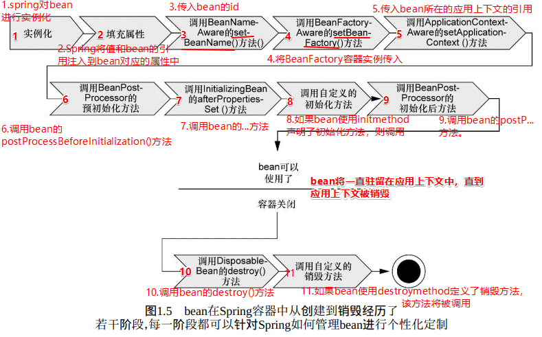

线程和oracle问的都多

mysql的存储过程

spring有什么模式

最奇葩的是他不问我最近的项目，问我第二个项目里面的技术。

单点登录token怎么产生的。

消息中间件，点对点时如何保证消息不重复。

反射，泛型，异常，注解。说一下。都写过自定义吗。说下自定义的实现

陈诗坦（上课）

陈东海


[CAP 定理的含义 - 阮一峰的网络日志](http://www.ruanyifeng.com/blog/2018/07/cap.html "CAP 定理的含义 - 阮一峰的网络日志")

[Java就业指导 - 萌小Q - 博客园](https://www.cnblogs.com/Qian123/articles/5671900.html#3681485 "Java就业指导 - 萌小Q - 博客园")


## Java基础


### 面向对象的特征

默认三大特性

- 继承
- 封装
- 多态
- 抽象（如果说有4个就加上抽象）


### Java基本数据类型


- byte
- short
- int
- long
- float
- double
- boolean
- char


哪些类型可以用于switch语句的判断呢？

Math.round()方法 


> [Java 基本数据类型 - 菜鸟教程](http://www.runoob.com/java/java-basic-datatypes.html "Java 基本数据类型 | 菜鸟教程")
>
>

### equals() 和 hashCode()

`hashCode()`方法给对象返回一个hash code值。这个方法被用于hash tables，例如HashMap

**需要注意的是当equals()方法被override时，hashCode()也要被override。按照一般hashCode()方法的实现来说，相等的对象，它们的hash code一定相等。**

Java对象的eqauls方法和hashCode方法是这样规定的：

**1、相等** **（相同）** **的对象必须具有相等的哈希码（或者散列码）。**

**2、如果两个对象的hashCode相同，它们并不一定相同。**


### final 值的初始化


### static

静态变量：又称为类变量，也就是说这个变量属于类的，类所有的实例都共享静态变量，可以直接通过类名来访问它。静态变量在内存中只存在一份。
实例变量：每创建一个实例就会产生一个实例变量，它与该实例同生共死。


### 创建对象有几种方式

创建对象有几种方式：5种  [Java中创建对象的几种方式 ](https://blog.csdn.net/hustzw07/article/details/72518298 )

使用 new关键字、使用Clone方法、使用反序列化、使用Class类的newInstance方法、使用Constructor类的newInstance方法 （使用反射）。


### String，StringBuffer，StringBuilder


### 内部类


### 异常


#### try catch finally 执行顺序

见书中示例。


>  补充 [Java提高篇——Java 异常处理 - 萌小Q - 博客园](https://www.cnblogs.com/Qian123/p/5715402.html "Java提高篇——Java 异常处理 - 萌小Q - 博客园")


#### 项目中异常如何处理？

Spring MVC异常处理器。


### IO流


### 集合


**ArrayList：** 

底层实现


**HashMap：**

java 中， 为什么基本类型不能做为 HashMap 的键值， 而只能是引用类型，把引用类型作
为 HashMap 的键值， 需要注意哪些地方？ 


两个重要参数

- 容量：默认16
- 负载因子：默认 0.75

当HashMap `size>16*0.75` (达到阈值) 则进行扩容。

底层原理：https://github.com/crossoverJie/JCSprout

1.8之前；数组+链表

首先将传入的 Key 做 `hash` 运算计算出 hashcode,然后根据数组长度取模计算出在数组中的 index 下标。

[HashMap实现原理及源码分析 - dreamcatcher-cx - 博客园](https://www.cnblogs.com/chengxiao/p/6059914.html "HashMap实现原理及源码分析 - dreamcatcher-cx - 博客园")

[HashMap 实现原理 - ImportNew](http://www.importnew.com/27043.html "HashMap 实现原理 - ImportNew")


判断HashMap的key是否重复

key是否重复，是由两个步骤判断的：
hashcode是否一样
  如果hashcode不一样，就是在不同的坑里，一定是不重复的
  如果hashcode一样，就是在同一个坑里，还需要进行equals比较
​       如果equals一样，则是重复数据
​       如果equals不一样，则是不同数据。


**HashSet：**

- 扩容机制：

- 顺序：“**不保证有序**”和“保证无序”不等价，HashSet 的 iterator 是前者而不是后者，所以在一次运行中看到有序的结果也是正常的，但不能依赖这个有序行为。


[Java HashCode原理详解 ](http://how2j.cn/k/collection/collection-hashcode/371.html)


### XML解析

DOM解析：**将整个xml文件加载到内存中，然后再逐个解析**

SAX方式解析：**通过Handler处理类逐个依次顺序解析每个节点**


## 多线程

[JAVA多线程和并发基础面试问答（转载） - 海 子 - 博客园](https://www.cnblogs.com/dolphin0520/p/3932934.html "JAVA多线程和并发基础面试问答（转载） - 海 子 - 博客园")

[Java线程面试题 Top 50 （转载） - 海 子 - 博客园](https://www.cnblogs.com/dolphin0520/p/3958019.html "Java线程面试题 Top 50 （转载） - 海 子 - 博客园")


> 面试时问多线程中线程的同步和异步？感觉很别扭。
>
> [java 多线程同步和异步详解 - 简书](https://www.jianshu.com/p/80ffa58db37f "java 多线程同步和异步详解 - 简书")  
>
> 同步：A线程要请求某个资源，但是此资源正在被B线程使用中，因为同步机制存在，A线程请求
> 不到，怎么办，A线程只能等待下去
> 异步：A线程要请求某个资源，但是此资源正在被B线程使用中，因为没有同步机制存在，A线程
> 仍然请求的到，A线程无需等待


- 新建 ：new一个线程对象t1
- 就绪：调用 t1.start() 方法后
- 运行：获取了CPU后，开始回调 run()
- 阻塞：调用 wait()，join()，sleep()，yield()
- 死亡：run() 运行结束


> Object类的方法（只有**获得锁的线程**通过**同步锁对象**调用这些方法）： 
>
> - wait() 线程等待：Object类中的wait()方法，导致当前的线程等待，直到其他线程调用此对象的 notify() 方法或 notifyAll() 唤醒方法。
> - notify()，notifyAll() 线程唤醒：Object类中的notify()方法，唤醒在此对象监视器上（唤醒wait set中的一条线程）等待的单个线程。如果所有线程都在此对象上等待，则会选择唤醒其中一个线程。
> - 与每个对象具有锁一样，每个对象可以有一个线程列表，他们等待来自该信号（通知）。线程通过执行(同步锁)对象上的`wait()`方法获得这个等待列表。从那时候起，它不再执行任何其他指令，直到调用对象的notify()方法为止。
>
> Thread中的静态方法： 
>
> - sleep() 线程休眠：使线程转到阻塞状态，当睡眠结束后，就转为就绪（Runnable）状态。sleep()平台移植性好。
> - Thread.yield() 线程让步：暂停当前正在执行的线程对象，把执行机会让给相同或者更高优先级的线程。
>
> Thread类中的方法： 
>
> - join()：使其它线程等待当前线程终止
>
>


1、每个线程都将启动，每个线程都将运行直到完成。一系列线程以某种顺序启动并不意味着将按该顺序执行。对于任何一组启动的线程来说，调度程序不能保证其执行次序，持续时间也无法保证。

2、当线程目标`run()`方法结束时该线程完成。

3、一旦线程启动，它就永远不能再重新启动。只有一个新的线程可以被启动，并且只能一次。一个可运行的线程或死线程可以被重新启动。


### **线程停止的正确方法：**

- stop方法：该方法使线程戛然而止（突然停止），完成了哪些工作，哪些工作还没有做都不清楚，且清理工作也没有做。所以不推荐。

- 正确方法，使用volatile关键字设置退出标志，比如：

  ```java
  /**
   * 军队线程
   * 模拟作战双方的行为
   */
  public class ArmyRunnable implements Runnable {
  
      /* volatile关键字
       * volatile保证了线程可以正确的读取其他线程写入的值
       * 如果不写成volatile，由于可见性的问题，当前线程有可能不能读到这个值
       * 关于可见性的问题可以参考JMM（Java内存模型），里面讲述了：happens-before原则、可见性
       * 用volatile修饰的变量，线程在每次使用变量的时候，都会读取变量修改后的值
       */
      volatile boolean keepRunning = true;
  
      @Override
      public void run() {
         //检测退出标志
          while (keepRunning) {
              //发动5连击
              for(int i=0;i<5;i++){
                  System.out.println(Thread.currentThread().getName()+"进攻对方["+i+"]");
                  //让出了处理器时间，下次该谁进攻还不一定呢！
                  Thread.yield();//yield()当前运行线程释放处理器资源
              } 
          }
          System.out.println(Thread.currentThread().getName()+"结束了战斗！");
      }
  
  }
  ```

  在其它线程中（这里是在另一个类中）更改退出标志的值：

  ```java
  ArmyRunnable armyTaskOfRevolt = new ArmyRunnable();
  //使用Runnable接口创建线程
  Thread  armyOfRevolt = new Thread(armyTaskOfRevolt,"农民起义军");
  armyOfRevolt.start();
  //更改退出标志（停止线程的方法）(Runnable中的属性)
  armyTaskOfRevolt.keepRunning = false;
  ```


### **线程和进程的区别** 

- **进程**：是指一个内存中运行的应用程序，每个进程都有一个独立的内存空间，一个应用程序可以同时运行多个进程；进程也是程序的一次执行过程，是系统运行程序的基本单位；系统运行一个程序即是一个进程从创建、运行到消亡的过程。大白话: 可执行文件(.exe) 一个应用程序有多个进程
- **线程**：进程内部的一个独立执行单元；一个进程可以同时并发的运行多个线程，可以理解为一个进程便相当于一个单 CPU 操作系统，而线程便是这个系统中运行的多个任务。线程: 进程中的一个执行单元

- 进程：有独立的内存空间，进程中的数据存放空间（堆空间和栈空间）是独立的，至少有一个线程。
- 线程：堆空间是共享的，栈空间是独立的，线程消耗的资源比进程小的多。


### **start()和run()方法**

启动一个线程是调用 `start()`方法，使线程所代表的虚拟处理机处于可运行状态，这意味着它可以由 JVM 调度并
执行，这并不意味着线程就会立即运行。
`run()`方法是线程启动后要进行回调（callback）的方法。 


### **线程同步机制**


> 这里有一种说法，互斥与同步：
>
> **互斥的实现（加锁）**：`synchronized(lockObj)`；保证的同一时间，只有一个线程获得`lockObj`。
>
> **同步的实现：wait()/notify()/notifyAll()** 
>
> 同步是两个线程之间的一种交互的操作（一个线程发出消息另外一个线程响应）（各自调用同一把锁的相关方法） 


同步锁：

- 锁对象 可以是任意类型。
- Java中每个对象都有一个内置锁
- 多个线程对象  要使用同一把锁（注意：同一个类的两个不同对象是不同的锁）。
- 线程可以获得多个锁。比如，在一个对象的同步方法里面调用另外一个对象的同步方法，则获取了两个对象的同步锁。
- 当程序运行到非静态的synchronized同步方法上时，自动获得与正在执行代码类的当前实例（this实例）有关的锁。
- 每个对象都有且仅有一个锁，这个锁与一个特定的**对象**关联。


- 同步代码块：`synchronized` 关键字可以用于方法中的某个区块中，表示只对这个区块的资源实行互斥访问

  ```java
  synchronized(同步锁){
      需要同步的代码
  }
  ```

- 同步方法：使用`synchronized`修饰的方法,就叫做同步方法

  ```java
  public synchronized void method(){
     	可能会产生线程安全问题的代码
  }
  ```

  此时同步锁是谁?

  ​      对于非 static 方法，同步锁就是 this。  

  ​      对于 static方法，我们使用当前方法所在类的字节码对象 (类名.class)。

- Lock锁 （`java.util.concurrent.locks.Lock` 提供）

  ```java
  Lock lock = new ReentrantLock();
  ...
  lock.lock();
  //要同步的操作
  lock.unlock();
  ```


> 注意:在任何时候,最多允许一个线程拥有同步锁,谁拿到锁就进入代码块,其他的线程只能在外等着(BLOCKED)。


**sleep() :**

1. 为了让其他线程有机会执行，可以将Thread.sleep()的调用**放线程run()之内**。这样才能保证该线程执行过程中会睡眠。
2. sleep与锁无关，线程睡眠到期自动苏醒，并返回到Runnable（可运行）状态。


> 小提示：sleep()中指定的时间是线程不会运行的最短时间。因此，sleep()方法不能保证该线程睡眠到期后就开始立刻执行。


### **死锁：**

[死锁_百度百科](https://baike.baidu.com/item/%E6%AD%BB%E9%94%81 "死锁_百度百科")，

死锁产生的原因有很多：

- 是多个线程同时被阻塞，它们中的一个或者全部都在等待某个资源被释放。
- 典型的另一个示例: 


死锁产生的四个必要条件：

略


### **ThreadLocal** 

ThreadLocal，很多地方叫做线程本地变量，也有些地方叫做线程本地存储，其实意思差不多。可能很多朋友都知道**ThreadLocal为变量在每个线程中都创建了一个副本**，那么每个线程可以访问自己内部的副本变量。


> [Spring Bean单例与线程安全 ](https://www.cnblogs.com/redcool/p/6398760.html "Spring Bean单例与线程安全 - 低调的小黑 - 博客园") 
>
> **ThreadLocal** 和 **线程同步机制** 相比有什么优势呢？**他们都是为了解决多线程中相同变量的访问冲突问题**。
>
> 概括起来说，对于多线程资源共享的问题，**同步机制采用了“以时间换空间”的方式，而ThreadLocal采用了“以空间换时间”的方式**。前者仅提供一份变量，让不同的线程排队访问，而后者为每一个线程都提供了一份变量，因此可以同时访问而互不影响。
>
> Spring使用ThreadLocal解决线程安全问题 


### **线程池** 

线程池作用就是限制系统中执行线程的数量；因为

- 创建/销毁线程伴随着系统开销，过于频繁的创建/销毁线程，会很大程度上影响处理效率
- 线程并发数量过多，抢占系统资源从而导致阻塞
- 对线程进行一些简单的管理

我们可以把并发执行的任务传递给一个线程池，来替代为每个并发执行的任务都启动一个新的线程。只要池里有空闲的线程，任务就会分配给一个线程执行。在线程池的内部，任务被插入一个阻塞队列（[Blocking Queue](http://tutorials.jenkov.com/java-concurrency/blocking-queues.html) ），线程池里的线程会去取这个队列里的任务。当一个新任务插入队列时，一个空闲线程就会成功的从队列中取出任务并且执行它。


> [线程池的介绍及简单实现](http://www.ibm.com/developerworks/cn/java/l-threadPool/index.html "线程池的介绍及简单实现")
>
> [线程池 | 并发编程网 – ifeve.com](http://ifeve.com/thread-pools/ "线程池 | 并发编程网 – ifeve.com") 这里有一个更简单的实现。


### **并发队列**

- 阻塞队列：使用锁实现。

  特点：若队列已满，则入队操作会被阻塞；若队列为空，出队操作被阻塞。

  比如一些任务队列就属于阻塞队列

- 非阻塞队列：使用CAS算法实现。(了解CAS算法前，需要先了解**悲观锁**和**乐观锁**)

  为什么叫非阻塞队列？

  与阻塞队列相反，非阻塞队列的执行并不会被阻塞，无论是消费者的出队，还是生产者的入队。 


> 补充：
>
> #### ConcurrentHashMap 非阻塞 Hash 集合
>
> ConcurrentHashMap 是 Java 并发包中提供的一个线程安全且高效的 HashMap 实现， ConcurrentHashMap在并发编程的场景中使用频率非常之高 。其实现原理见 《Java面试宝典Beta5.0》第214页
>
> #### SkipList (跳跃表)
>
> 来源：ConcurrentSkipListMap 非阻塞 Hash 跳表集合 
>
> 是一种可以代替平衡树的数据结构，默认是按照 Key 值升序的 。跳跃表（skiplist）是一种有序数据结构， 它通过在每个节点中维持多个指向其他节点的指针， 从而达到快速访问节点的目的。
>
> [跳跃表 — Redis 设计与实现](http://redisbook.com/preview/skiplist/content.html "跳跃表 — Redis 设计与实现")
>
>

CountDownLatch
CyclicBarrier 

> - **并行**：指两个或多个事件在**同一时刻**发生（同时发生）。
> - **并发**：指两个或多个事件在**同一个时间段内**发生。

[说说Runnable与Callable - 每天一点 - 博客园](https://www.cnblogs.com/frinder6/p/5507082.html "说说Runnable与Callable - 每天一点 - 博客园")

[Java并发编程：volatile关键字解析 - 海 子 - 博客园](https://www.cnblogs.com/dolphin0520/p/3920373.html "Java并发编程：volatile关键字解析 - 海 子 - 博客园")

[Java并发编程 - 随笔分类 - 海 子 - 博客园](https://www.cnblogs.com/dolphin0520/category/602384.html "Java并发编程 - 随笔分类 - 海 子 - 博客园")

> synchronized   ['sɪŋkrənaɪzd] 同步的
>
> Thread  [θred] 


## 反射

反射机制


## JVM


### 垃圾回收


## 设计模式

[CS-Notes/设计模式.md ](https://github.com/CyC2018/CS-Notes/blob/master/notes/%E8%AE%BE%E8%AE%A1%E6%A8%A1%E5%BC%8F.md "CS-Notes/设计模式.md at master · CyC2018/CS-Notes") 23种设计模式


### 单例

同步问题.


## 算法


### 排序


## Java Web


### HTTP方法


#### Get和Post方法比较


#### Restful


### HTTP状态码


| 状态码 | 类别                                 | 原因短语                   |
| ------ | ------------------------------------ | -------------------------- |
| 1XX    | Informational（**信息**性状态码）    | 接收的请求正在处理         |
| 2XX    | Success（**成功**状态码）            | 请求正常处理完毕           |
| 3XX    | Redirection（**重定向**状态码）      | 需要进行附加操作以完成请求 |
| 4XX    | Client Error（**客户端错误**状态码） | 服务器无法处理请求         |
| 5XX    | Server Error（**服务器错误**状态码） | 服务器处理请求出错         |


> [HTTP.md](https://github.com/CyC2018/CS-Notes/blob/master/notes/HTTP.md "CS-Notes/HTTP.md at master · CyC2018/CS-Notes")

### cookie 和 session


### 请求转发和重定向


servlet几大内置对象：


### 过滤器，监听器，拦截器


Servlet API提供了大量Listener 来对Web容器内的事件进行监听，从而当对应的事件发生时回调事件监听器内的方法。


[过滤器（Filter）与拦截器（Interceptor )区别](https://www.cnblogs.com/junzi2099/p/8022058.html)

Filter可以认为是Servlet的一种“加强版”，它主要用于对用户请求进行预处理，也可以对HttpServletResponse进行后处理，是个典型的处理链。

> Servlet中的过滤器Filter是实现了javax.servlet.Filter接口的服务器端程序，（在spring中）主要的用途是设置字符集、控制权限、控制转向、做一些业务逻辑判断等。其工作原理是，只要你在web.xml文件配置好要拦截的客户端请求，它都会帮你拦截到请求，此时你就可以对请求或响应(Request、Response)统一设置编码，简化操作

拦截器是在面向切面编程中应用的，就是在你的service或者一个方法前调用一个方法，或者在方法后调用一个方法。是基于JAVA的反射机制。拦截器不是在web.xml，比如struts在struts.xml中配置。

拦截器，在AOP(Aspect-Oriented Programming)中用于在某个方法或字段被访问之前，进行拦截，然后在之前或之后加入某些操作。拦截是AOP的一种实现策略。


执行顺序：

```
过滤前-拦截前-Action处理-拦截后-过滤后
```


**拦截器（Interceptor）使用**

interceptor 的执行顺序大致为：

1. 请求到达 DispatcherServlet
2. DispatcherServlet 发送至 Interceptor ，执行 preHandle
3. 请求达到 Controller
4. 请求结束后，postHandle 执行

Spring 中主要通过 HandlerInterceptor 接口来实现请求的拦截，实现 HandlerInterceptor 接口需要实现下面三个方法：

- preHandle() – 在handler执行之前，返回 boolean 值，true 表示继续执行，false 为停止执行并返回。
- postHandle() – 在handler执行之后, 可以在返回之前对返回的结果进行修改
- afterCompletion() – 在请求完全结束后调用，可以用来统计请求耗时等等


## 数据库相关

[为什么开发人员必须要了解数据库锁？](https://mp.weixin.qq.com/s?__biz=MjM5ODI5Njc2MA==&mid=2655819140&idx=1&sn=b4c4e3f3681e5915b537f9485b27f733&chksm=bd74d8538a03514570c5d3ebcf02c2f084c227c0d9bfbf5534518615fd9752f63621c9d887a0&mpshare=1&scene=24&srcid=1028j4zeXeLyoCVs9d1pRn4m#rd "51CTO技术栈")


### SQL语句


- distinct
- limit
- like 与 通配符
- 排序
- 计算字段
- group by 分组
- 子查询
- 连接
- 组合查询
- 视图：
- 存储过程：好处；手写
- 游标：**在存储过程中**使用游标可以对一个结果集进行移动遍历。
- 触发器：触发器会在某个表执行以下语句时而自动执行：DELETE、INSERT、UPDATE。


### SQL执行顺序

```
from...on...join...where...group by...with... having....
select...distinct...order by...limit 
```


### 三范式

- 第一范式：**列（属性）不可再分**，确保没列保持原子性
- 第二范式：**确保数据库表中的每一列都和主键相关**，而不能只与主键的某一部分相关（主要针对联合主键而言）
- 第三范式：**确保数据表中的每一列数据都和主键直接相关，而不能间接相关**


> [数据库设计三大范式 - Ruthless - 博客园](http://www.cnblogs.com/linjiqin/archive/2012/04/01/2428695.html "数据库设计三大范式 - Ruthless - 博客园")


### 事务的特性

什么是事务？ACID之间的关系？并发一致性问题，导致的脏读、幻读...？详见： [CS-Notes/数据库系统原理](https://github.com/CyC2018/CS-Notes/blob/master/notes/%E6%95%B0%E6%8D%AE%E5%BA%93%E7%B3%BB%E7%BB%9F%E5%8E%9F%E7%90%86.md "CS-Notes/数据库系统原理.md at master · CyC2018/CS-Notes")  

**事务**指的是满足 ACID 特性的**一组操作**，可以通过 Commit 提交一个事务，也可以使用 Rollback 进行回滚。


**ACID：**具体解释见链接。

- 原子性
- 一致性
- 隔离性
- 持久性


由上图可知，*一致性需要通过原子性和隔离性来保证*。但在**并发**情况下，**隔离性**很难保证，所以会出现并发**一致性**问题。


并发一致性问题，导致的脏读、幻读...？**详见**  [CS-Notes/数据库系统原理](https://github.com/CyC2018/CS-Notes/blob/master/notes/%E6%95%B0%E6%8D%AE%E5%BA%93%E7%B3%BB%E7%BB%9F%E5%8E%9F%E7%90%86.md "CS-Notes/数据库系统原理.md at master · CyC2018/CS-Notes")  

**并发一致性问题：**

- 丢失修改(更新)
- 脏读
- 不可重复读
- 幻读


产生并发不一致性问题**主要原因是破坏了事务的隔离性**，解决方法是通过并发控制来保证隔离性。并发控制可以通过封锁来实现，但是封锁操作需要用户自己控制，相当复杂。**数据库管理系统提供了事务的隔离级别**，让用户以一种更轻松的方式处理并发一致性问题。


**（数据库提供的）事务的隔离级别：**

MySQL数据库为我们提供的四种隔离级别


| 隔离级别                           | 描述                                                         | 读数据一致性                             | 赃读 | 不可重复读 | 幻读 |
| ---------------------------------- | ------------------------------------------------------------ | ---------------------------------------- | ---- | ---------- | ---- |
| Read Uncommitted（读取未提交内容） | 所有事务都可以看到其他未提交事务的执行结果                   | 最低级别，只能保证不读取物理上损坏的数据 | √    | √          | √    |
| Read Committed（读取已提交内容）   | 一个事务只能看见已经提交事务所做的改变（其它数据库默认）     | 语句级                                   | ×    | √          | √    |
| Repeatable Read（可重复读）        | 它确保同一事务的多个实例在并发读取数据时，会看到同样的数据行（mysql默认） | 事务级                                   | ×    | ×          | √    |
| Serializable（可串行化）           | 它通过强制事务排序，使之不可能相互冲突，从而解决幻读问题     | 最高级别，事务级                         | ×    | ×          | ×    |


隔离级别越高，越能保证数据的完整性和一致性，但是对并发性能的影响也越大。对于多数应用程序，可以优先考虑把数据库系统的隔离级别设为**Read Committed**。它能够避免脏读取，而且具有较好的并发性能。尽管它会导致不可重复读、幻读和第二类丢失更新这些并发问题，在可能出现这类问题的个别场合，**可以由应用程序采用悲观锁或乐观锁来控制**。


### 封锁

封锁粒度（mysql）：

- 行级锁
- 表级锁


封锁类型：

- 读写锁
  - 排它锁（写锁）
  - 共享锁（读锁）
- 意向锁


结合封锁粒度和封锁类型。


#### 乐观锁和悲观锁

**乐观锁(Optimistic Lock)**，是指操作数据库时(更新操作)，总是认为这次的操作**不会**导致冲突，不到万不得已不去拿锁，在更新时采取判断是否冲突，*适用于读操作远多于更新操作的情况*。
***乐观锁并没有被数据库实现，需要自行实现***，通常的实现方式为在表中增加版本version字段，更新时判断库中version与取出时的version值是否相等，若相等则执行更新并将version加1，若不相等则说明数据被其他线程(进程)修改，放弃修改。

```sql
select (age, version) from user where id = #{id};
# 其他操作
update user set age = 18, version = version + 1 where id = #{id} and version = #{version}
```

**悲观锁(Pessimistic Lock）**，是指操作数据库时(更新操作)，总是认为这次的操作**会**导致冲突，每次都要通过获取锁才能进行数据操作，因此要先确保获取锁成功再进行业务操作。
悲观锁需要数据库自身提供支持，MySql提供了**共享锁**和**排他锁**来实现对数据行的锁定，两种锁的介绍如下介绍。

> 实现方式：通过数据库锁机制实现，即对查询语句添加`for update`关键字。


**InnoDB引擎** 实现了以下两种类型的行锁：

- 共享锁（S）
- 排它锁（X）

对于`UPDATE`、`DELETE`和`INSERT`语句，InnoDB 会**自动**给涉及数据集加排他锁（X）

对于普通`SELECT`语句，InnoDB不会加任何锁

事务可以通过以下语句**显式地**给记录集加共享锁或排他锁：

- 共享锁: `SELECT * FROM table_name WHERE ... LOCK IN SHARE MODE`，等同读锁
- 排他锁: `SELECT * FROM table_name WHERE ... FOR UPDATE`，等同写锁


[重新理解mysql的锁、事务隔离级别及事务传播行为 - 程序园](http://www.voidcn.com/article/p-yttjumru-bsg.html "重新理解mysql的锁、事务隔离级别及事务传播行为 - 程序园")

[浅谈数据库乐观锁和悲观锁 - 简书](https://www.jianshu.com/p/39d8b7437b0b "浅谈数据库乐观锁和悲观锁 - 简书")

[事务隔离级别_百度百科](https://baike.baidu.com/item/%E4%BA%8B%E5%8A%A1%E9%9A%94%E7%A6%BB%E7%BA%A7%E5%88%AB "事务隔离级别_百度百科")

> 详见各链接，更深入的解释这里没有摘抄。


数据库中添加事务后数据的变更方式：


**事务与锁：**

**事务**指的是满足 ACID 特性的**一组操作**；所以事务并不仅仅出现在数据库操作中，比如分布式事务。


```
事务的隔离性遭到破坏 ————  并发
多线程同步机制 ———— 锁机制
```


### 数据库引擎


mysql数据库引擎：


### SQL优化

[SQL调优 - 萌小Q - 博客园](https://www.cnblogs.com/Qian123/p/5666569.html "SQL调优 - 萌小Q - 博客园")

[sql优化的几种方法 - 想念的专栏 - CSDN博客](https://blog.csdn.net/jie_liang/article/details/77340905 "sql优化的几种方法 - 想念的专栏 - CSDN博客")


做题

sql级联删除


#### **慢查询**

分析MySQL语句**查询性能**的方法除了使用 **EXPLAIN** 输出**执行计划**，还可以让MySQL**记录**下查询超过指定时间的语句，我们将超过指定时间的SQL语句查询称为“**慢查询**”。

慢查询主要体现在慢上，通常意义上来讲，只要返回时间大于 >1 sec上的查询都可以称为慢查询。慢查询会导致CPU，内存消耗过高。数据库服务器压力陡然过大，那么大部分情况来讲，肯定是由某些慢查询导致的。


#### **执行计划**

explain 显示了mysql **如何使用索引**来处理select语句以及连接表。可以**帮助选择更好的索引**和写出更优化的查询语句。

使用方法，在select语句前加上explain就可以了

mysql执行计划：

[读懂 MySQL 执行计划 - 文章 - 伯乐在线](http://blog.jobbole.com/112877/ "读懂 MySQL 执行计划 - 文章 - 伯乐在线")


#### **索引**


#### **拆分表**

表结构优化；大字段分离到单独的表中


### 数据库部署


使用mycat 实现数据库分片

Mycat是数据库分库分表的中间件，Mycat使用最多的两个功能是：

- 读写分离
- 分库分表功能

[大规模MySQL运维陷阱：使用MyCat踩坑篇 - 51CTO.COM](http://database.51cto.com/art/201809/584469.htm) 作者的观点有待验证。


主从复制


读写分离：也可以在代码层面实现（慕课）。


## Spring全家桶

介绍spring

### spring


Spring Bean生命周期：

[Spring Bean的生命周期（非常详细）](https://www.cnblogs.com/zrtqsk/p/3735273.html "Spring Bean的生命周期（非常详细） - Chandler Qian - 博客园")

[Spring Bean生命周期 - 简书](https://www.jianshu.com/p/3944792a5fff "Spring Bean生命周期 - 简书") 

[Spring基础学习(三)—详解Bean(下) - ✈✈✈ - 博客园](https://www.cnblogs.com/yangang2013/p/5556049.html "Spring基础学习(三)—详解Bean(下) - ✈✈✈ - 博客园")  这里有个简单的一点的解释。




### spring mvc

原理，request流程，生命周期


[springMVC的生命周期](https://blog.csdn.net/l_blackeagle/article/details/61926695 "springMVC的生命周期 - l_blackeagle的博客 - CSDN博客") 相比于之前书上看到的多了 **处理器适配器 **


### spring security


### Spring data


spring data 与 spring data jpa 的区别？


### Spring事务


项目中异常如何处理？

Spring MVC异常处理器。


## Mybatis


持久化

分页

批量处理


## Dubbo和Zookeeper


注意：箭头的颜色含义


[Dubbo 架构](http://dubbo.incubator.apache.org/zh-cn/docs/user/preface/architecture.html "architecture")

摘选的部分特点：

- 注册中心全部宕掉后，服务提供者和服务消费者仍能通过本地缓存通讯。
- 注册中心和监控中心都是**可选的**，服务消费者可以直连服务提供者
- 注册中心负责服务地址的注册与查找，相当于目录服务，服务提供者和消费者只在启动时与注册中心交互，注册中心不转发请求，压力较小

- 注册中心和监控中心全部宕机，不影响已运行的提供者和消费者，**消费者在本地缓存了提供者列表** 
- 数据库宕掉后，注册中心仍能通过缓存提供服务列表查询，但不能注册新服务


## Redis

[读完这篇文章，就基本搞定了Redis数据库](https://mp.weixin.qq.com/s?__biz=MjM5ODI5Njc2MA==&mid=2655819214&idx=1&sn=876739ed2df78a420536e0c3a17eab26&chksm=bd74d8198a03510f0c639bf2410432a76cfc200546ec320e6fcbffbdd003ffc6048148b6d65a&mpshare=1&scene=24&srcid=1028pVsJdfE8OC8D7EzolBbI#rd "读完这篇文章，就基本搞定了Redis数据库")

[为什么分布式一定要有Redis?](https://mp.weixin.qq.com/s?__biz=MjM5ODI5Njc2MA==&mid=2655816862&idx=1&sn=29c6f6f509b12e4e39141f8b7b5bc1e2&chksm=bd74c1498a03485f14c58763ea4a00dbcaa73a2da6ede80fc512d55940b34aa89063fcaa6266&scene=21#wechat_redirect "51CTO技术栈") 


Redis的几个主要问题：

- 类型和使用场景

- **缓存和数据库双写一致性问题**
- **缓存雪崩问题**
- **缓存击穿问题**
- **缓存的并发竞争问题**

 


### 缓存和数据库双写一致性问题

[【原创】分布式之数据库和缓存双写一致性方案解析 - 孤独烟 - 博客园](https://www.cnblogs.com/rjzheng/p/9041659.html "[原创]分布式之数据库和缓存双写一致性方案解析 - 孤独烟 - 博客园") 

[分布式之数据库和缓存双写一致性方案解析！ - 徐刘根的博客 - CSDN博客](https://blog.csdn.net/xlgen157387/article/details/80389101 "分布式之数据库和缓存双写一致性方案解析！ - 徐刘根的博客 - CSDN博客")


[进阶的Redis之哈希分片原理与集群实战 - 掘金](https://juejin.im/post/5be8ee10e51d450bd74ed516?utm_source=gold_browser_extension "进阶的Redis之哈希分片原理与集群实战 - 掘金")


项目中哪些地方使用到redis：

- 广告：
- 购物车：
- 秒杀：
- 用户注册功能：使用redis缓存**短信验证码**， 可以使用注册时的用户名或电话号码作为key


## 消息队列

JMS即 Java消息服务（Java Message Service），是规范。


JMS 定义了五种不同的**消息正文格式**，以及调用的消息类型，允许你发送并接收以一些不同形式的数据，提供现有消息格式的一些级别的兼容性。

- TextMessage--一个字符串对象
- MapMessage--一套名称-值对
- ObjectMessage--一个序列化的 Java 对象
- BytesMessage--一个字节的数据流
- StreamMessage -- Java 原始值的数据流 


JMS消息传递类型：

- 点对点
- 发布/订阅模式


**Queue 和 Topic对比：**

注意


**共同点：** 不管是消息在 Queue 中还是在 Topic 中，消费该消息的方法都是通过实现 MessageListener接口中的 onMessage方法来消费。


与Spring整合，使用Spring提供的 JmsTemplate 类（模板类）


## 秒杀


## 购物车


## 全文检索 solr


## 单点登录

[单点登录原理与简单实现 - ywlaker - 博客园](https://www.cnblogs.com/ywlaker/p/6113927.html "单点登录原理与简单实现 - ywlaker - 博客园") **强烈推荐**，有不明白的地方记得看下面的评论。

关键点： 理解全局会话和局部会话；令牌只在各系统中使用；浏览器和全局会话和局部会话之间依然和单系统一样使用cookie（每个系统cookie不同）

可能产生的疑惑讲解：访问系统2，如果没登录，会跳转到认证中心，此时浏览器和认证中心**已经**在**全局会话中**了（认证中心检测到用户已经在全局会话中）


**单系统**中的cookie不能跨域，浏览器发送http请求时会自动携带与该域匹配的cookie，而不是所有cookie；所以使用cookie的方式不能用于分布式集群系统中。

单点登录全称Single Sign On（以下简称SSO），是指在多系统应用群中登录一个系统，便可在其他所有系统中得到授权而无需再次登录，包括单点登录与单点注销两部分


**注意：**有多台服务器并不代表有多个不同的域，也有可能是一个域下有多台服务器。


**单点登录框架CAS：**

CAS Server：（某台服务器）独立部署，主要负责对用户的认证工作

CAS Client：（另一台服务器）负责处理对客户端受保护资源的访问请求，需要登录时重定向到CAS Server


> 补充：[基于Token的WEB后台认证机制 - 红心李 - 博客园](http://www.cnblogs.com/xiekeli/p/5607107.html "基于Token的WEB后台认证机制 - 红心李 - 博客园")  是否有关系？
>
> [基于 Token 的身份验证：JSON Web Token（附：Node.js 项目） - 宁皓网](https://ninghao.net/blog/2834 "基于 Token 的身份验证：JSON Web Token（附：Node.js 项目） - 宁皓网")


#### 跨域


## 前端


盒子模型


### anglar


### Vue


### JS


闭包


## 网络


什么是长连接？

长连接，指在一个连接上可以连续发送多个[数据包](https://baike.baidu.com/item/%E6%95%B0%E6%8D%AE%E5%8C%85/489739)，在连接保持期间，如果没有数据包发送，需要双方发链路检测包。涉及TCP保活，握手。

短连接，是指通讯双方有数据交互时，就建立一个连接，数据发送完成后，则断开此连接，即每次连接只完成一项业务的发送。


长连接、心跳和断线重连  [TCP长连接与短连接、心跳机制 ](https://blog.csdn.net/pmt123456/article/details/58233999)


