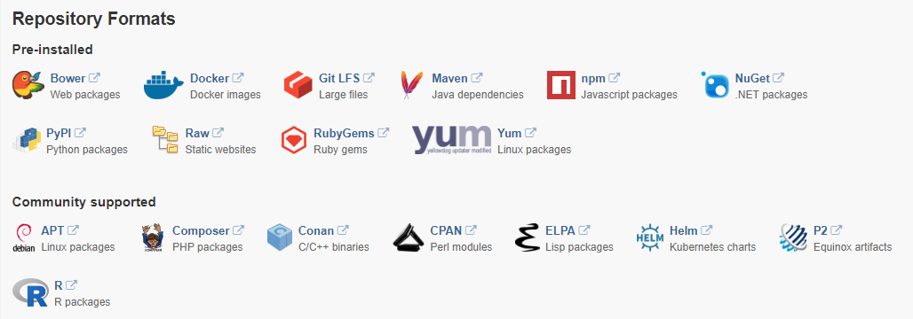

# Nexus Repository Manager OSS

Nexus Open Source还是Nexus Professional，他们只有一个先决条件就是必须有一个Java Runtime Environment


开源版和收费版：

- NEXUS OSS (OSS = Open Source Software，开源软件——免费)  [Nexus Repository OSS - Software Component Management -Sonatype](https://www.sonatype.com/nexus-repository-oss) 

- NEXUS PROFESSIONAL -FREE TRIAL (专业版本——收费）。

Nexus 有两个版本；有完整版，有war版。前者可以单独运行为一个基于jetty的服务，后者是运行在Servlet Constainer的Web应用。


nexus里面有2个文件夹，第一个文件夹是核心文件，第二个文件夹用来存储下载下来的jar


## 安装和配置


使用docker安装，有两个版本（比较大有200M-300M）：

- [sonatype/nexus - Docker Hub](https://hub.docker.com/r/sonatype/nexus/ "sonatype/nexus - Docker Hub") 

  ```
  docker pull sonatype/nexus
  ```

- [sonatype/nexus3 - Docker Hub](https://hub.docker.com/r/sonatype/nexus3/ "sonatype/nexus3 - Docker Hub") 

  ```
  docker pull sonatype/nexus3
  ```

Nexus  Image由 Sonatype 官方管理，而非Docker官方管理。


运行容器：（只做测试）

```shell
docker run -d -p 8081:8081 --name nexus3 -e MAX_HEAP=768m sonatype/nexus3
```

Default credentials are: `admin` / `admin123`

测试连接：启动容器后大约过15分钟后测试（我电脑比较慢）

```shell
curl -u admin:admin123 http://localhost:8081/service/metrics/ping
curl: (7) Failed to connect to localhost port 8081: Connection refused # 有错误
curl: (52) Empty reply from server  # 表示还未启动成功 
pong # 返回 pong 表示已经启动成功
```

在浏览器中管理：

```
# nexus3 直接输入下面的路径
http://localhost:8081/
```


下载安装包见：


> [【Maven】Nexus（Maven仓库私服）下载与安装 - H__D - 博客园](http://www.cnblogs.com/h--d/p/5717920.html "[Maven]Nexus（Maven仓库私服）下载与安装 - H__D - 博客园")
>
> [Nexus的下载和安装 - 东苑草根 - 博客园](http://www.cnblogs.com/dycg/archive/2013/05/29/3105927.html "Nexus的下载和安装 - 东苑草根 - 博客园")
>
> [Maven使用笔记（五）Sonatype Nexus 搭建Maven 私服-博客-云栖社区-阿里云](https://yq.aliyun.com/articles/388201 "Maven使用笔记(五)Sonatype Nexus 搭建Maven 私服-博客-云栖社区-阿里云")


Nexus Repository Manager OSS 3.x：

该版本可管理如下仓库：




