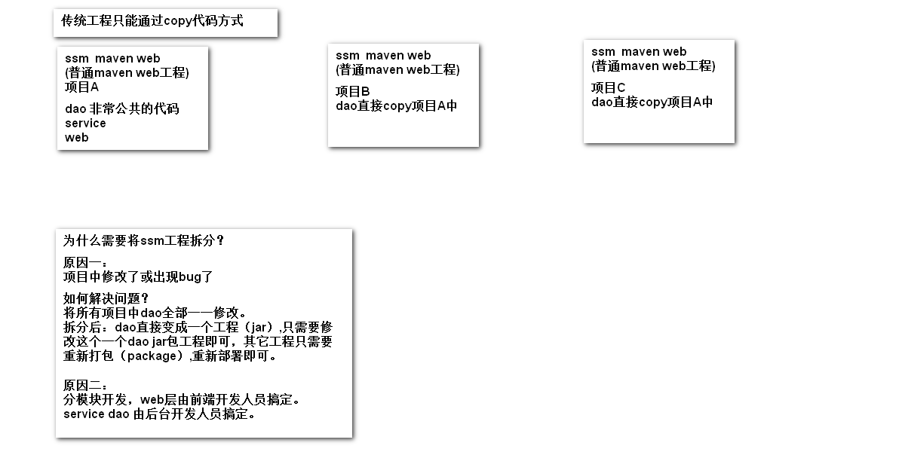
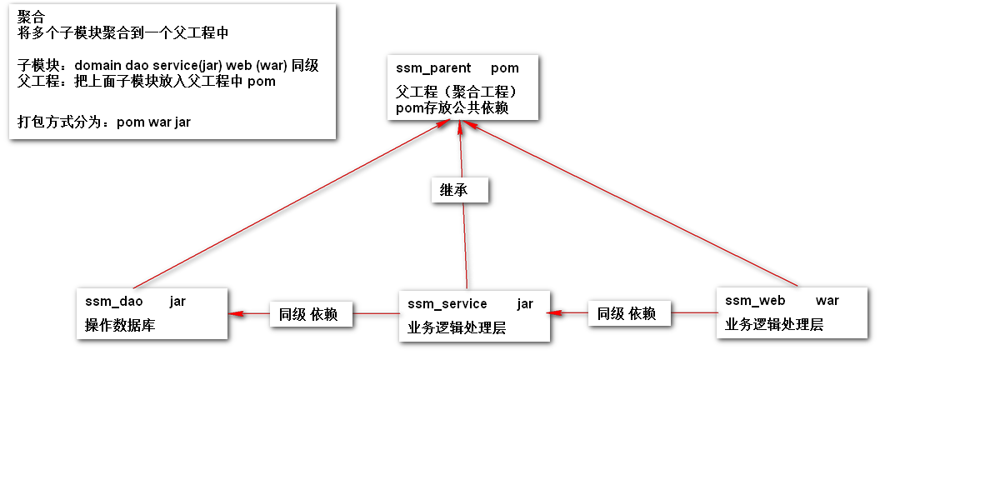

## 拆分什么？

将ssm项目中的 Dao 、Service、Web 各层单独拆分为一个模块。


注意：这里我们把 dao 和 damain 全都放在 Dao 模块。


## 为什么要拆分？





## 如何拆分？





1. 创建ssm_parent的maven项目，该项目为顶层项目，不包含任何java源码，所以删除自动生成的 src 目录，在父工程的pom.xml文件中添加公共依赖

2. 在ssm_parent项目下创建子模块：`右键ssm_parent > new > Model` 在创建过程中因该会看到 "Add as module to -ssm_parent-" 字样。创建完成后

   ssm_parent的pom.xml中会添加如下标签：

   ```xml
   <modules>
       <module>ssm_dao</module>
   </modules>
   ```

   而在ssm_dao的pom.xml中会包含如下标签：

   ```xml
   <parent>
       <artifactId>itheima05_ssm_parent</artifactId>
       <groupId>com.itheima</groupId>
       <version>1.0-SNAPSHOT</version>
   </parent>
   ```

3. 同样创建 ssm_service 的 maven 模块

4. 同样创建 ssm_web 的   webapp骨架的 maven 模块

5. 接下来重点是要让各子模块之间相互依赖，从而产生关联。添加依赖的方式，根据上图分析可知，ssm_web 模块要依赖 ssm_service 模块，而 ssm_service 模块要依赖 ssm_dao 模块，所以我们只需要在 ssm_web 的pom.xml 文件中将 ssm_service 模块坐标添加到一个 `<dependency>`标签下，**以此类推**

   ```xml
       <dependencies>
           <dependency>
               <groupId>com.itheima</groupId>
               <artifactId>ssm_service</artifactId>
               <version>1.0-SNAPSHOT</version>
           </dependency>
       </dependencies>
   ```


   > 但是这里要注意由于创建 ssm_web 时使用了骨架，所以其pom.xml中会自动包含一些不需要的东西，我们可以只保留 `<parent>`、 `<modelVersion>`、`<artifactId>` 、`<packaging>`这些标签而选择先删除其它标签,`<dependencies>` 待会再添加。

6. **编写ssm_dao模块**，并最终在此模块中整合Spring和mybatis

   这里mybatis使用注解，并且将映射配置文件中的内容放入**单独**的applicationContext-dao.xml文件中，（后面的步骤会将其 import到统一的applicationContext.xml文件中）。

   **测试整合：**既然已经在此模块整合了Spring和mybatis，所以可以通过spring单独在此模块测试

   ```java
       /**
        * 单独为ssm_dao测试Spring和Mybatis的整合
        */
       @Test
       public void findById() {
           ApplicationContext ac =
                   new ClassPathXmlApplicationContext("applicationContext-dao.xml");
           //无需为 ItemsDao接口添加@Repository注解，详见之前的ssm整合笔记
           ItemsDao itemsDao = ac.getBean("itemsDao", ItemsDao.class);
           Items item = itemsDao.findById(1);
           System.out.println(item);
       }
   ```

7. 编写 ssm_service 模块，同样在该模块的资源文件夹下创建 `applicationContext-service.xml`来配置Spring，注意这里要在该文件中配置Spring的**事务处理器**并为其配置**切面**，那么在配置时会依赖到 dataSource 所以该模块暂时不能单独测试

8. 编写 ssm_web 模块。编写好后接下来的重点就是配置 web.xml 、 springmvc.xml和applicationContext.xml这三个文件。

9. 配置 tomcat 服务器 （难点），启动服务器测试


> 注意： 各模块的打包方式
>
> - ssm_parent 父模块：打包方式 pom 包 `<packaging>pom</packaging>`
> - ssm_dao 和 ssm_service 子模块：打包方式是 jar 包（默认的打包方式）
> - ssm_web子模块：打包方式是 war 包  `<packaging>war</packaging>`


## 一些配置问题


### 配置 web.xml 、 springmvc.xml和applicationContext.xml这三个文件


### 配置 tomcat 

打开 Project Structure，会发现 ssm-parent 工程中会自动包含了一个 web Facet，我们明明只有 ssm-web 才是web模块。

原因是 ssm-parent 在 pom.xml 中包含了 ssm-web 模块，所以它也包含了一个 web Faces，但是却没有自动为其添加 Artifact 。

那么我们该如何配置 tomcat 服务器？


看起来会有两种方式：

- 在使用外部 tomcat 服务器时，直接配置一个tomcat服务器，并向其添加 ssm_web 中的 Artifact 可以运行成功。

- 如果使用 tomcat7-maven-plugin ，并通过maven 在 ssm-web级别运行该服务器会发现报错，原因是无法再找到依赖。运行方法： `maven project>ssm_web > plugins > tomcat7 > tomcat7:run`

  错误提示

  ```
  Failed to execute goal on project ssm_web: Could not resolve dependencies for project com.itheima:ssm_web:war:1.0-SNAPSHOT: Could not find artifact com
  ```

  因为在其 pom.xml 中有：

  ```xml
          <dependency>
              <groupId>com.itheima</groupId>
              <artifactId>ssm_service</artifactId>
              <version>1.0-SNAPSHOT</version>
          </dependency>
  ```

  此时的 解决办法是 ： 将该依赖安装到本地仓库中，使得maven可以找到该依赖，或者在ssm-parent级别运行该服务器

- 使用 tomcat7-maven-plugin ，并通过maven  在ssm-parent级别运行该服务器 没有问题，可以找到依赖。运行方法： `maven project> ssm_parent > plugins > tomcat7 > tomcat7:run`


亲测 使用外部 tomcat 8 时直接添加 ssm-web的artifact就可以顺利运行；而使用 tomcat7-maven-plugin 时有上面的问题。


>  测试： 在使用外部tomcat服务器时，可以尝试先为 ssm_parent 添加一个 Artifact ，再配置一个tomcat并加载该 Artifact


#### **tomcat7-maven-plugin**

既然存在 tomcat7-maven-plugin ，那么我想寻找 tomcat8-maven-plugin，但是官方却已经不再继续升级该插件。

> tomcat maven plugin is only available for tomcat7, you can try spring boot which has an embedded tomcat8, it also provides other containers, like jetty


> 当使用 tomcat7-maven-plugin 时默认就会从中央仓库中下载 tomcat7 到本地仓库中


找到一篇教程貌似可以解决问题

- [How to deploy war file to tomcat server from command line?](https://www.logicbig.com/tutorials/apache-maven/tomcat-maven-plugin.html "How to deploy war file to tomcat server from command line?")

- [Tomcat 8 Maven Plugin for Java 8 - Stack Overflow](https://stackoverflow.com/questions/26883836/tomcat-8-maven-plugin-for-java-8 "Tomcat 8 Maven Plugin for Java 8 - Stack Overflow")


也就是说我们可以利用 tomcat7-maven-plugin 来运行  Tomcat 8 或 Tomcat 9

只是运行方式和配置方式不同，相比起来更麻烦。感觉可以通过这种方式来结合 docker 容器来使用，因为这样配置时maven和tomcat之间的通讯接口就是一个url:  <http://localhost:8080/manager/text> ，并传递tomcat管理员的用户名和密码即可。


docker 快点搞起来。


>  网站上说 ： We don't have to add web.xml in Servlet 3.1.
>
> 那么我们是否可以在 ssm 项目中完全摆脱 web.xml 呢？ 


### 配置 maven 


## 依赖传递


依赖默认作用范围为 compile 。这里 ssm-service 依赖 ssm-dao ，而 ssm-dao中添加了依赖 junit，并且没有设置 junit 的作用范围，那么我们也是可以在 ssm-service中直接使用 junit；但是如果 ssm-dao中的junit作用范围设置为 test，那么在 ssm-service 中无法直接使用该 junit。

