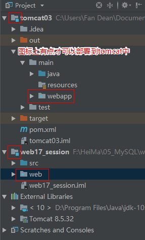
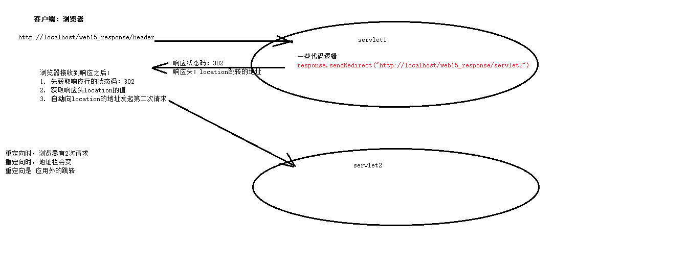
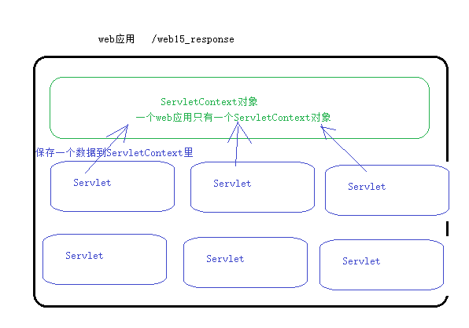
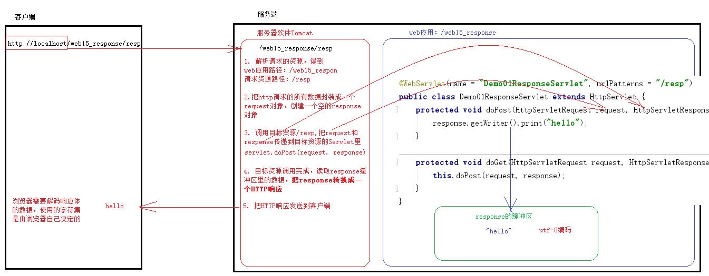
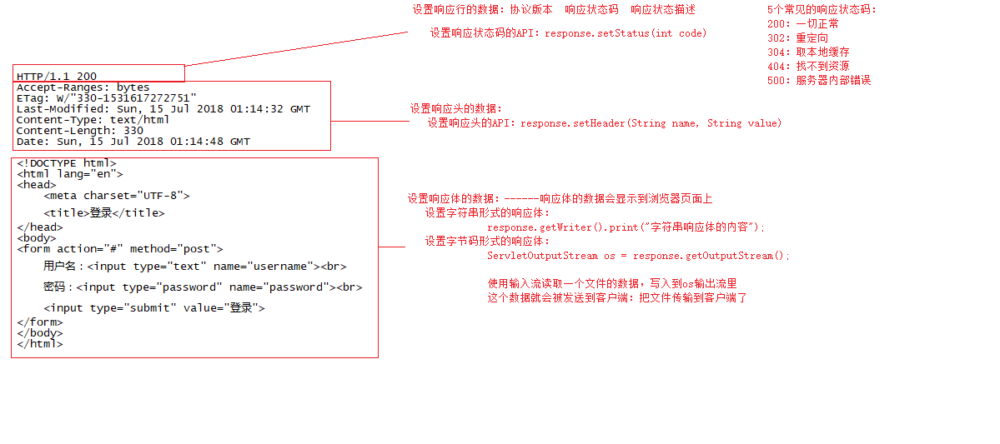

# response

web文件夹中的变动，只需让 tomcat 进行 update resources即可，那么 jsp 也是位于web目录，所以...


使用idea生成的webapp路径：

`C:\Users\Fan Dean\.IntelliJIdea2018.1\system\tomca\**\work\**`


Idea中

可部署的web项目具有相关标识：




如果某项目中的 web 文件夹没有那个小点，我们可以选择该模块右键选择 > Add Framework Support > Web Application  (Versions选择 4.0，取消勾选 "Create web.xml")   为其添加web框架的支持。

但是会出现找不到servlet类，可以尝试。











## 登录

### 登录提交后的页面跳转


```java
            //请求转发，实现刷新当前页面
            request.getRequestDispatcher("/login.jsp").forward(request,response);
            // 3秒后跳转到主页  (推荐)
            // response.setHeader("refresh", "3;url=index.jsp");
            // 每隔3秒，刷新当前网页
            // response.setHeader("refresh", "3");
```


index.jsp

```html
<%@ page contentType="text/html;charset=UTF-8" language="java" %>
<html>
  <head>
    <title>登录</title>
  </head>
  <body>
  <form action="http://localhost/web14_login/login" method="post">
      <input type="text" name="username">
      <input type="password" name="password">
      <input type="submit">
  </form>
  </body>
</html>
```


JavaBean

```java
package com.itheima.domain;

public class User {
    private Integer uid;
    private String uname;
    private String password;

	...
}

```


### LoginServlet

```java
package com.itheima.servlet;

import com.itheima.domain.User;
import com.itheima.util.JdbcUtils;
import org.springframework.jdbc.core.BeanPropertyRowMapper;
import org.springframework.jdbc.core.JdbcTemplate;

import javax.servlet.ServletException;
import javax.servlet.annotation.WebServlet;
import javax.servlet.http.HttpServlet;
import javax.servlet.http.HttpServletRequest;
import javax.servlet.http.HttpServletResponse;
import java.io.IOException;

@WebServlet(name = "LoginServlet", urlPatterns = "/login")
public class LoginServlet extends HttpServlet {
    protected void doPost(HttpServletRequest request, HttpServletResponse response) throws ServletException, IOException {
        //接收参数：客户端提交的用户名和密码
        String username = request.getParameter("username");
        String password = request.getParameter("password");
        //登录校验：检查用户名和密码是否正确
        String sql = "select * from user where uname = ? and password = ?";
        JdbcTemplate jdbcTemplate = new JdbcTemplate(JdbcUtils.getDataSource());
        User user = null;
        try {
            user = jdbcTemplate.queryForObject(sql, new BeanPropertyRowMapper<>(User.class), username, password);
        } catch (Exception e) {
            e.printStackTrace();
        }
        //校验结果
        if(user!=null){
            response.getWriter().print("login successed!!");
        }else{
            response.getWriter().print("login failed!!");
        }


    }

    protected void doGet(HttpServletRequest request, HttpServletResponse response) throws ServletException, IOException {
        this.doPost(request, response);
    }
}
```


### JdbcUtils

```java
package com.itheima.util;

import com.mchange.v2.c3p0.ComboPooledDataSource;

import javax.sql.DataSource;
import java.sql.Connection;
import java.sql.ResultSet;
import java.sql.SQLException;
import java.sql.Statement;

public class JdbcUtils {

    /**c3p0连接池被创建时，会自动从src下加载c3p0-config.xml*/
    private static DataSource dataSource = new ComboPooledDataSource();

    /**
     * 获取连接
     */
    public static Connection getConnection() throws Exception {

        //获取连接
        Connection connection = dataSource.getConnection();
        return connection;
    }

    /**
     * 释放资源
     */
    public static void close(ResultSet resultSet, Statement statement, Connection connection){
        if (resultSet != null) {
            try {
                resultSet.close();
            } catch (SQLException e) {
                e.printStackTrace();
            }
        }

        if (statement != null) {
            try {
                statement.close();
            } catch (SQLException e) {
                e.printStackTrace();
            }
        }

        if (connection != null) {
            try {
                connection.close();
            } catch (SQLException e) {
                e.printStackTrace();
            }
        }

    }

    public static DataSource getDataSource() {
        return dataSource;
    }
}

```


c3p0-config.xml

略


## ServletContext


### Demo01ServletContext

```java
package com.itheima.context;

import javax.servlet.ServletContext;
import javax.servlet.ServletException;
import javax.servlet.annotation.WebServlet;
import javax.servlet.http.HttpServlet;
import javax.servlet.http.HttpServletRequest;
import javax.servlet.http.HttpServletResponse;
import java.io.IOException;

@WebServlet(name = "Demo01ServletContext",urlPatterns = "/context01")
public class Demo01ServletContext extends HttpServlet {
    protected void doPost(HttpServletRequest request, HttpServletResponse response) throws ServletException, IOException {
        //1. 获取到ServletContext对象
        ServletContext servletContext = this.getServletContext();

        //2. 向ServletContext对象里存取数据
        //向ServletContext里保存一个数据
        servletContext.setAttribute("username", "zhangsan");
        //从ServletContext里获取一个数据
        Object username = servletContext.getAttribute("username");
        System.out.println("从ServletContext域对象里获取username的数据：" + username);
        //从ServletContext里删除数据
        //servletContext.removeAttribute("username");
        //删除之后，再从ServletContext里获取数据
        //username = servletContext.getAttribute("username");
        //System.out.println("删除之后，再从ServletContext域对象里获取username的数据：" + username);


        System.out.println("Demo01ServletContext里获取的ServletContext对象：" + servletContext);
    }

    protected void doGet(HttpServletRequest request, HttpServletResponse response) throws ServletException, IOException {
        this.doPost(request, response);
    }
}
```


Demo02ServletContext

```java
package com.itheima.context;

import javax.servlet.ServletContext;
import javax.servlet.ServletException;
import javax.servlet.annotation.WebServlet;
import javax.servlet.http.HttpServlet;
import javax.servlet.http.HttpServletRequest;
import javax.servlet.http.HttpServletResponse;
import java.io.IOException;

@WebServlet(name = "Demo02ServletContext", urlPatterns = "/context02")
public class Demo02ServletContext extends HttpServlet {
    protected void doPost(HttpServletRequest request, HttpServletResponse response) throws ServletException, IOException {
        //1. 获取到ServletContext对象
        ServletContext servletContext = this.getServletContext();

        Object username = servletContext.getAttribute("username");
        System.out.println("Demo02ServletContext里获取username的数据：" + username);

        System.out.println("Demo02ServletContext里获取的ServletContext对象：" + servletContext);
    }

    protected void doGet(HttpServletRequest request, HttpServletResponse response) throws ServletException, IOException {
        this.doPost(request, response);
    }
}

```


### Demo03ServletContextResource: 路径问题

```java
package com.itheima.context;

import javax.servlet.ServletContext;
import javax.servlet.ServletException;
import javax.servlet.annotation.WebServlet;
import javax.servlet.http.HttpServlet;
import javax.servlet.http.HttpServletRequest;
import javax.servlet.http.HttpServletResponse;
import java.io.BufferedReader;
import java.io.FileReader;
import java.io.IOException;

@WebServlet(name = "Demo03ServletContextResource", urlPatterns = "/realpath")
public class Demo03ServletContextResource extends HttpServlet {
    protected void doPost(HttpServletRequest request, HttpServletResponse response) throws ServletException, IOException {
        ServletContext context = this.getServletContext();
        //1. 获取web文件夹里a.txt的实际路径
        String apath = context.getRealPath("/a.txt");
        System.out.println(apath);
        //2. 获取web/aa/aa.txt实际路径
        String aapath = context.getRealPath("/aa/aa.txt");
        System.out.println(aapath);
        //3. 获取src/com/itheima/context/b.txt实际路径。src下的文件的路径是在/WEB-INF/classes
        String bpath = context.getRealPath("/WEB-INF/classes/com/itheima/context/b.txt");
        System.out.println(bpath);
        //4. 获取src/c.txt的实际路径
        String cpath = context.getRealPath("/WEB-INF/classes/c.txt");
        System.out.println(cpath);

        BufferedReader reader = new BufferedReader(new FileReader(cpath));
        String line = reader.readLine();
        System.out.println(line);
        reader.close();
    }

    protected void doGet(HttpServletRequest request, HttpServletResponse response) throws ServletException, IOException {
        this.doPost(request, response);
    }
}

```


### 验证码的生成：BufferedImage

CheckCodeServlet

```java
package com.itheima.demo1;

import javax.imageio.ImageIO;
import javax.servlet.ServletException;
import javax.servlet.annotation.WebServlet;
import javax.servlet.http.HttpServlet;
import javax.servlet.http.HttpServletRequest;
import javax.servlet.http.HttpServletResponse;
import java.awt.*;
import java.awt.image.BufferedImage;
import java.io.IOException;
import java.util.Random;

/**
 * 验证码
 */
@WebServlet("/checkCode")
public class CheckCodeServlet extends HttpServlet {
	public void doGet(HttpServletRequest request, HttpServletResponse response)throws ServletException, IOException {
		
		//服务器通知浏览器不要缓存
		response.setHeader("pragma","no-cache");
		response.setHeader("cache-control","no-cache");
		response.setHeader("expires","0");
		
		//在内存中创建一个长80，宽30的图片，默认黑色背景
		//参数一：长
		//参数二：宽
		//参数三：颜色
		int width = 80;
		int height = 30;
		BufferedImage image = new BufferedImage(width,height,BufferedImage.TYPE_INT_RGB);
		
		//获取画笔
		Graphics g = image.getGraphics();
		//设置画笔颜色为灰色
		g.setColor(Color.GRAY);
		//填充图片
		g.fillRect(0,0, width,height);
		
		//产生4个随机验证码，12Ey
		String checkCode = getCheckCode();
		//将验证码放入HttpSession中
		request.getSession().setAttribute("CHECKCODE_SERVER",checkCode);
		
		//设置画笔颜色为黄色
		g.setColor(Color.YELLOW);
		//设置字体的小大
		g.setFont(new Font("黑体",Font.BOLD,24));
		//向图片上写入验证码
		g.drawString(checkCode,15,25);
		
		//将内存中的图片输出到浏览器
		//参数一：图片对象
		//参数二：图片的格式，如PNG,JPG,GIF
		//参数三：图片输出到哪里去
		ImageIO.write(image,"PNG",response.getOutputStream());
	}
	/**
	 * 产生4位随机字符串 
	 */
	private String getCheckCode() {
		String base = "0123456789ABCDEFGabcdefg";
		int size = base.length();
		Random r = new Random();
		StringBuffer sb = new StringBuffer();
		for(int i=1;i<=4;i++){
			//产生0到size-1的随机值
			int index = r.nextInt(size);
			//在base字符串中获取下标为index的字符
			char c = base.charAt(index);
			//将c放入到StringBuffer中去
			sb.append(c);
		}
		return sb.toString();
	}
	public void doPost(HttpServletRequest request, HttpServletResponse response) throws ServletException, IOException {
		this.doGet(request,response);
	}
}

```


### 以附件形式下载响应体的内容

```java
package com.itheima.demo2;

import com.itheima.utils.DownloadUtils;

import javax.servlet.ServletContext;
import javax.servlet.ServletException;
import javax.servlet.ServletOutputStream;
import javax.servlet.annotation.WebServlet;
import javax.servlet.http.HttpServlet;
import javax.servlet.http.HttpServletRequest;
import javax.servlet.http.HttpServletResponse;
import java.io.IOException;
import java.io.InputStream;

@WebServlet(name = "DownloadServlet", urlPatterns = "/download")
public class DownloadServlet extends HttpServlet {
    protected void doPost(HttpServletRequest request, HttpServletResponse response) throws ServletException, IOException {
        ServletContext context = this.getServletContext();
        //要下载的文件名称 (由客户端提交)
        String fileName = request.getParameter("fileName");

        /*****可以增加代码判断当前用户的权限，或者判断当前用户的余额*****/


        /***********实现文件下载，需要指定浏览器的行为：弹出下载框而不是打开文件*************/
        //告诉浏览器以附件形式下载响应体的内容，并且设置下载的文件名称
        //该工具类是为了解决保存文件时文件名的乱码等问题
        response.setHeader("Content-Disposition", "attachment;filename=" + DownloadUtils.encodeFilename(request, fileName));
        //告诉浏览器传递过去的数据的类型
        //context.getMimeType()方法的作用？获取文件的MIME类型的值
        response.setContentType(context.getMimeType(fileName));


        //把web/files/a.jpg下载
        //下载的本质：把文件拷贝到response的响应体里，数据就会被发送到客户端
        ServletOutputStream os = response.getOutputStream();
        InputStream is = context.getResourceAsStream("/files/" + fileName);
        //把数据从输入流写到输出流
        byte[] buffer = new byte[1024];
        int len = -1;
        while((len = is.read(buffer))!=-1){
            os.write(buffer,0, len);
        }
        //关闭流
        is.close();
        os.close();
    }

    protected void doGet(HttpServletRequest request, HttpServletResponse response) throws ServletException, IOException {
        this.doPost(request, response);
    }
}
```


```java
package com.itheima.utils;

import sun.misc.BASE64Encoder;

import javax.servlet.http.HttpServletRequest;
import java.net.URLEncoder;

public class DownloadUtils {
	/**
	 * 解决下载时，中文文件名称乱码问题<br>
	 * 
	 * @param request request对象
	 * @param filename 你想让用户保存的文件名称
	 */
	public static String encodeFilename(HttpServletRequest request, String filename){ 
		try{
			String agent = request.getHeader("User-Agent");
			if (agent.contains("MSIE")) {
				// IE浏览器
				filename = URLEncoder.encode(filename, "utf-8");
				filename = filename.replace("+", " ");
			} else if (agent.contains("Firefox")) {
				// 火狐浏览器
				BASE64Encoder base64Encoder = new BASE64Encoder();
				filename = "=?utf-8?B?"+ base64Encoder.encode(filename.getBytes("utf-8")) + "?=";
			} else {
				// 其它浏览器
				filename = URLEncoder.encode(filename, "utf-8");				
			}
		}catch(Exception e){
			e.printStackTrace();
		}

		return filename;
	}
}
```


## response 5个示例


这里时5个java文件中的内容： 

```java
package com.itheima.resp;

import javax.servlet.ServletException;
import javax.servlet.annotation.WebServlet;
import javax.servlet.http.HttpServlet;
import javax.servlet.http.HttpServletRequest;
import javax.servlet.http.HttpServletResponse;
import java.io.IOException;

/**
 * 设置响应行数据的API演示
 */
@WebServlet(name = "Demo02ResponseLineServlet", urlPatterns = "/line")
public class Demo02ResponseLineServlet extends HttpServlet {
    protected void doPost(HttpServletRequest request, HttpServletResponse response) throws Exception{
        
        response.getWriter().print("hello");

       //################################################
        
        //设置响应状态码
        response.setStatus(500);

       //################################################
        
                //设置响应头：
        //response.setHeader("username", "tom");

        /**
         * 常用的响应头：
         * refresh： 延迟网页跳转。
         *      响应头的名称：refresh
         *      响应头的值格式： 延迟秒数;url=跳转的路径
         *
         * location：重定向（302状态码的功能）
         */
        //response.setHeader("refresh", "3;url=http://www.itcast.cn");

        //重定向
        //方法1. 分两步设置重定向
        //response.setStatus(302);
        //response.setHeader("location", "http://localhost/web15_response/index.html");
        // 方法2. 使用简化方法直接设置重定向
        //重定向的路径，必须是  /context路径（web应用路径）/资源路径
        response.sendRedirect("/web15_response/index.html");
        
        //################################################
        
         /**
         * 设置中文响应体乱码。所有乱码的原因是 编码和解码方式不一致
         * 原因：
         *      response缓冲区的数据，默认使用的是iso-8859-1字符集，不支持中文
         * 解决方案一（不推荐）：
         *      设置response使用支持中文的字符集：utf-8。 response.setCharacterEncoding("utf-8")
         *      !!还需要手动设置浏览器的解码字符集，也使用utf-8，才能正常显示中文；否则依然乱码
         *
         * 解决方案二（推荐）：
         *      同时设置response缓冲区的编码字符集， 和浏览器的解码字符集：utf-8
         *      response.setContentType("text/html;charset=utf-8");
         *
         *      !!注意：这一行代码一定要写在获取response的输出流之前才有效!!
         */

        response.setContentType("text/html;charset=utf-8");
        //response.setCharacterEncoding("utf-8");
        //设置字符串形式的响应体的数据：向浏览器页面上发送数据
        PrintWriter writer = response.getWriter();
        //writer.write(true);
        //writer.print("hello, response char body");
        writer.print("你好，黑马程序员");

       //################################################
        
        
        //设置字节型响应体，是用来传输文字内容到浏览器的
        ServletOutputStream os = response.getOutputStream();

        //把files/a.jpg发送到客户端
        //使用输入流读取文件
        InputStream is = this.getServletContext().getResourceAsStream("/files/a.jpg");
        //把数据从输入流写到输出流
        byte[] buffer = new byte[1024];
        int len = -1;
        while((len = is.read(buffer))!=-1){
            os.write(buffer,0, len);
        }
        //关闭流
        is.close();
        os.close();
        
        
        
    }

    protected void doGet(HttpServletRequest request, HttpServletResponse response) throws ServletException, IOException {
        this.doPost(request, response);
    }
}

```

