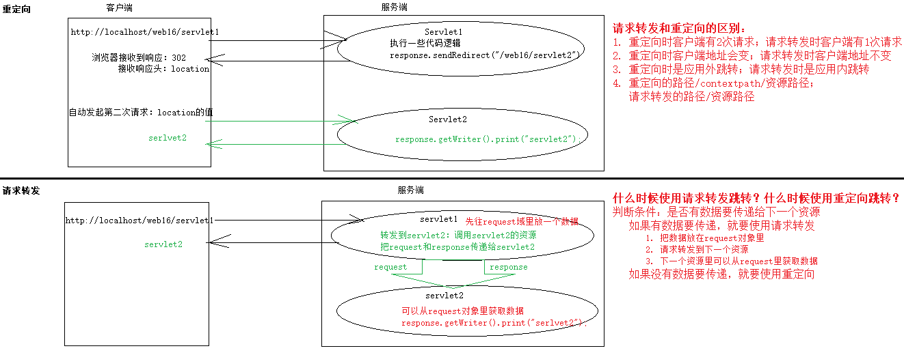
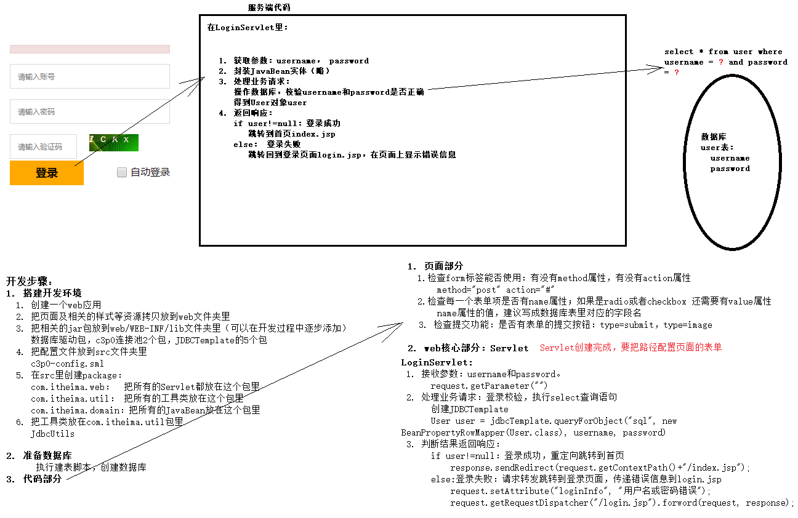
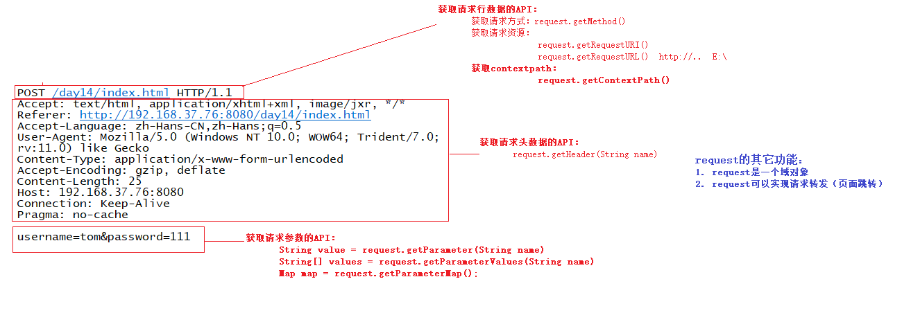

## web16 request


get方法的乱码问题在tomcat 8 中已经可以自动解决，但post乱码需要自己解决。









### request常用方法


Demo01RequestLineServlet

```java
package com.itheima.req;

import javax.servlet.ServletException;
import javax.servlet.annotation.WebServlet;
import javax.servlet.http.HttpServlet;
import javax.servlet.http.HttpServletRequest;
import javax.servlet.http.HttpServletResponse;
import java.io.IOException;

@WebServlet(name = "Demo01RequestLineServlet", urlPatterns = "/line")
public class Demo01RequestLineServlet extends HttpServlet {
    protected void doPost(HttpServletRequest request, HttpServletResponse response) throws ServletException, IOException {
        //获取请求行的数据
        //1. 获取请求方式：目前只有form标签的method指定为post时才是post提交。其它的是get提交
        String method = request.getMethod();
        System.out.println("请求方式是：" + method);

        //2. 获取请求资源
        String requestURI = request.getRequestURI();
        StringBuffer requestURL = request.getRequestURL();
        System.out.println("requestURI:" + requestURI);
        System.out.println("requestURL:" + requestURL);

        //3. 获取context path （即该web应用的路径）
        String contextPath = request.getContextPath();
        //    /web16_request
        System.out.println("contextPath:" + contextPath);

        //response.sendRedirect(request.getContextPath() +"/index.jsp");

        //4. 获取客户端的地址
        String remoteHost = request.getRemoteHost();
        System.out.println(remoteHost);

        //4. 获取get方式的请求参数字符串
        String queryString = request.getQueryString();
        System.out.println(queryString);
    }

    protected void doGet(HttpServletRequest request, HttpServletResponse response) throws ServletException, IOException {
        this.doPost(request, response);
    }
}

```


### 获取请求头信息和实现防盗链


```java
package com.itheima.req;

import javax.servlet.ServletException;
import javax.servlet.annotation.WebServlet;
import javax.servlet.http.HttpServlet;
import javax.servlet.http.HttpServletRequest;
import javax.servlet.http.HttpServletResponse;
import java.io.IOException;
import java.util.Enumeration;

@WebServlet(name = "Demo02RequestHeaderServlet", urlPatterns = "/header")
public class Demo02RequestHeaderServlet extends HttpServlet {
    protected void doPost(HttpServletRequest request, HttpServletResponse response) throws ServletException, IOException {
        //获取用户代理字符串：浏览器的信息
        String userAgent = request.getHeader("User-Agent");
        System.out.println("userAgent:"  + userAgent);

        //请求的目标地址：Host
        String host = request.getHeader("Host");
        System.out.println(host);

        //本次请求从哪个页面发起的：防止盗链，如果是从自己的web应用地址里的页面发起，允许操作；否则 不允许
        //自己的web应用访问地址：http://localhost/web16_request/.....
        String referer = request.getHeader("Referer");

        //获取所有请求头的名称
        Enumeration<String> names = request.getHeaderNames();
        while (names.hasMoreElements()) {
            String name = names.nextElement();
            String value = request.getHeader(name);
            System.out.println(name + ": " + value);
        }
    }

    protected void doGet(HttpServletRequest request, HttpServletResponse response) throws ServletException, IOException {
        this.doPost(request, response);
    }
}

```


### 获取用户提交的参数


```java
package com.itheima.req;

import javax.servlet.ServletException;
import javax.servlet.annotation.WebServlet;
import javax.servlet.http.HttpServlet;
import javax.servlet.http.HttpServletRequest;
import javax.servlet.http.HttpServletResponse;
import java.io.IOException;
import java.util.Arrays;
import java.util.Map;

@WebServlet(name = "Demo03RequestParam1Servlet", urlPatterns = "/param1")
public class Demo03RequestParam1Servlet extends HttpServlet {
    protected void doPost(HttpServletRequest request, HttpServletResponse response) throws ServletException, IOException {
        //接收客户端提交的参数：
        String username = request.getParameter("username");
        System.out.println(username);

        System.out.println("----------------------");

        String[] hobbies = request.getParameterValues("hobby");
        if (hobbies != null) {
            for (int i = 0; i < hobbies.length; i++) {
                System.out.println(hobbies[i]);
            }
        }

        System.out.println("----------------------");
        //获取客户端提交的所有参数，包括参数名和参数值
        Map<String, String[]> map = request.getParameterMap();
        for(Map.Entry<String, String[]> entry: map.entrySet()){
            //每个entry是一个键值对，key是参数的名称, value是参数的值
            String name = entry.getKey();
            String[] values = entry.getValue();

            System.out.println(name + Arrays.toString(values));
        }
        
        
        
        /**
         * 接收中文参数乱码：编码解码方式不一致
         * post提交的中文参数乱码
         *  原因：页面使用utf-8编码，request默认使用iso-8859-1解码的。
         *  解决：设置request也使用utf-8进行解码：request.setCharacterEncoding("utf-8")
         *        注意：设置解码字符集的代码，一定要写在所有 获取参数代码的前边
         *
         * get提交的中文正常
         */

        //一定要写在所有 获取参数代码的前边
        request.setCharacterEncoding("utf-8");
        String username = request.getParameter("username");
        System.out.println(username);
    }

    protected void doGet(HttpServletRequest request, HttpServletResponse response) throws ServletException, IOException {
        this.doPost(request, response);
    }
}

```


### 请求转发

应用内的跳转无需加context（即应用名称）


请求转发和重定向 和 request 域对象

```java
package com.itheima.scope;

import javax.servlet.ServletException;
import javax.servlet.annotation.WebServlet;
import javax.servlet.http.HttpServlet;
import javax.servlet.http.HttpServletRequest;
import javax.servlet.http.HttpServletResponse;
import java.io.IOException;

@WebServlet(name = "Demo01ScopeServlet", urlPatterns = "/scope1")
public class Demo01ScopeServlet extends HttpServlet {
    protected void doPost(HttpServletRequest request, HttpServletResponse response) throws ServletException, IOException {
        //域对象可以进行数据的存取，必定会有三个方法：
        //设置数据
        request.setAttribute("username", "zhangsan");
        //获取数据
        Object username = request.getAttribute("username");
        System.out.println("Demo01ScopeServlet里获取username：" + username);
        //清除数据
        /*request.removeAttribute("username");
        username = request.getAttribute("username");
        System.out.println("清除之后，Demo01ScopeServlet里获取username：" + username);*/


        //请求转发到/scope2
        /*RequestDispatcher dispatcher = request.getRequestDispatcher("/scope2");
        dispatcher.forward(request, response);*/
        request.getRequestDispatcher("/scope2").forward(request, response);

        //重定向到/scope2
        //response.sendRedirect(request.getContextPath() + "/scope2");
    }

    protected void doGet(HttpServletRequest request, HttpServletResponse response) throws ServletException, IOException {
        this.doPost(request, response);
    }
}

```


> forward方法和include方法的区别：
>
> ```java
> request.getRequestDispatcher("/scope2").forward(request, response);
> request.getRequestDispatcher("/scope2").include(request, response);
> ```
>
> [Servlet中的RequestDispatcher 两个方法详解 - 简书](https://www.jianshu.com/p/35d9e05d5989 "Servlet中的RequestDispatcher 两个方法详解 - 简书")
>
> [【Servlet】关于RequestDispatcher的原理 - lulipro - 博客园](https://www.cnblogs.com/lulipro/p/7471987.html "[Servlet]关于RequestDispatcher的原理 - lulipro - 博客园")


下面代码验证 request 域对象的作用范围（生命周期）

```java
package com.itheima.scope;

import javax.servlet.ServletException;
import javax.servlet.annotation.WebServlet;
import javax.servlet.http.HttpServlet;
import javax.servlet.http.HttpServletRequest;
import javax.servlet.http.HttpServletResponse;
import java.io.IOException;

@WebServlet(name = "Demo02ScopeServlet", urlPatterns = "/scope2")
public class Demo02ScopeServlet extends HttpServlet {
    protected void doPost(HttpServletRequest request, HttpServletResponse response) throws ServletException, IOException {
        Object username = request.getAttribute("username");
        System.out.println("Demo02ScopeServlet里获取username：" + username);


        response.getWriter().print("scope2");
    }

    protected void doGet(HttpServletRequest request, HttpServletResponse response) throws ServletException, IOException {
        this.doPost(request, response);
    }
}

```

