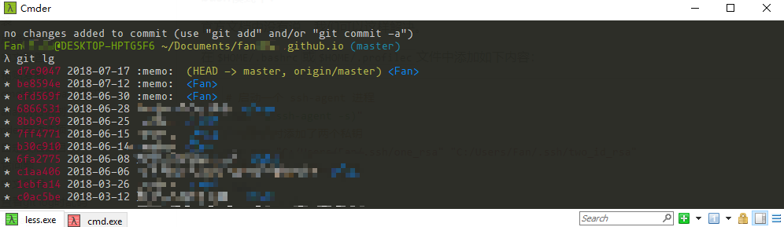
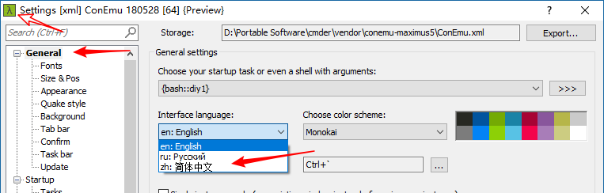
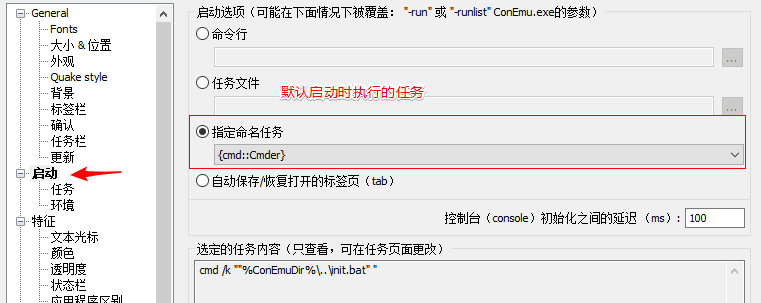
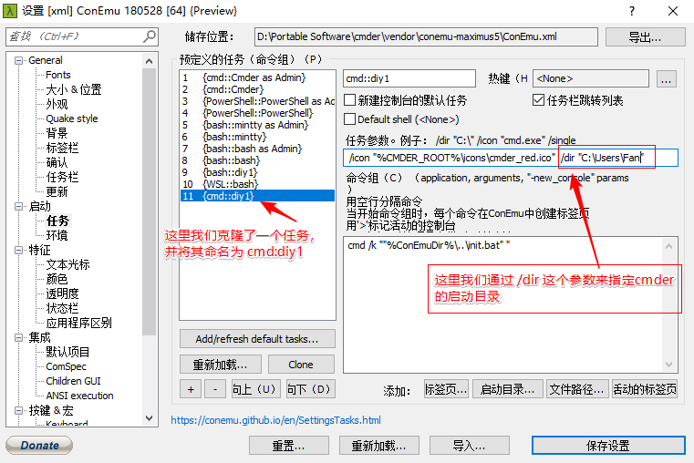
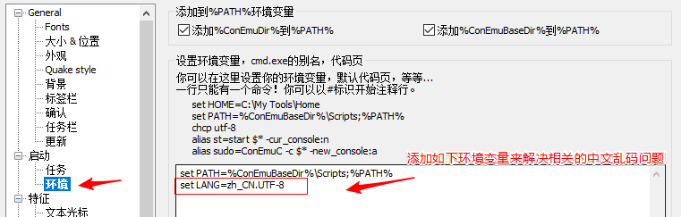

# Cmder

> 已发布

Cmder是一个用于替换windows自带的cmd的，包含各种软件包（比如 git）并且非常好用的终端模拟器。




## 安装

在官网[Cmder](http://cmder.net/ "Cmder | Console Emulator")下载cmder压缩包，解压即可。这里**注意**解压路径不能位于需要管理员访问权限的地方。


- 添加环境变量：

  新建环境变量`%cmder_root%` 将其值设置为 `cmder.exe`所在路径，再将`%cmder_root%`添加到系统的`PATH`环境变量中。

- 将cmder添加到文件夹右键菜单：

  以管理员权限打开 cmd ；切换到 cmder 的解压路径；执行 `.\cmder.exe /REGISTER ALL`，即可添加。

- 为cmder创建桌面快捷方式。


## 常用操作

### 中文配置

进入seting界面：点击Cmder窗口左上角的图标 或者 右下角的 `三`图标，然后选择 `setting`

选择 `Startup -> Environment ` 在这里添加下面的语句：

```
set LANG=zh_CN.UTF-8
```


设置中文界面： 选择`General->Interface language -> zh:简体中文` 





### 粘贴复制

复制：只需选中一段文字那么该段文字就会被复制到剪贴板

粘贴：直接`鼠标右键`即可粘贴，或者使用 `Ctrl + v` 进行粘贴.


### 设置为默认终端

`setting > 集成 > 默认项目 > 强制使用ConEmu作为控制台应用程序的默认终端`

如果允许某些程序出现错误，需要关闭此选项；比如 `mkcert`


### cmd模式和bash模式

主要是经常再cmd模式下输入bash相关的命令格式，导致相关错误。


### alias别名机制

**Cmder增加了alias功能：** 它让你用短短的指令执行一些常见但指令超长又难以记忆的语法; 
在其控制台输入`alias`可以查看。


**1. cmd aliases：**

在`%CMDER_ROOT%\config\user-aliases.cmd `中添加cmd aliases，它**仅用于 cmd 命令**

示例：

```cmd
ls=ls --show-control-chars -F --color $*
pwd=cd
clear=cls
```


> `user-aliases.cmd`: aliases in cmd; called from vendor\init.bat; autocreated from
> `vendor\user-aliases.cmd.example`.
>
> 参考：[cmder/README.md at master · cmderdev/cmder](https://github.com/cmderdev/cmder/blob/master/README.md "cmder/README.md at master · cmderdev/cmder")


**2. Bash/Mintty aliases：**

对于bash，其配置文件的加载顺序是：

```
$CMDER_ROOT/config/profile.d/*.sh
$CMDER_ROOT/config/user-profile.sh
$HOME/.bashrc
```

所以我们可以在上面的文件中添加 alias 即可。

几个示例：

```shell
alias l.='ls -d .* --color=tty'
alias ll='ls -l --color=tty'
alias ls='ls --color=tty'
```

由于 Git for Windows 会自动创建 `~/.bash_profile`，而对此cmder会提示有冲突，此时可以创建一个`~/.profile`并在该文件中添加别名。（这里 `~`表示`$HOME`）


> 原本是想添加`ssh-agent bash`相关的别名的，但是一旦执行此命令后启动了一个子shell，在此子shell里不可以使用别名。可参考下文的**ssh agent**部分。（这里属于ssh代理相关问题）


**3.Power Shell aliases：**

直接使用`alias`命令添加或在下面的文件中添加：

```
'$ENV:CMDER_ROOT\config\profile.d\*.ps1'
'$ENV:CMDER_ROOT\config\user-profile.ps1'
```


> 补充： 锁定视窗 ，可以让视窗无法再输入 


## Cmder启动选项




相关介绍

- 在Startup处设置cmder启动时需要执行的任务

  默认选择的启动项应该是 `{cmd::Cmder}` 这个命名任务，我们可以更改成其它的命令任务或者直接切换到其它的启动项。

  当选中某个命名任务时，下面的 "Selected task contents(选中的任务内容)"下会显示该任务执行的具体内容

  > 这里`cmd::Cmder`前面的cmd标明它是cmd模式，我们可以看到还有 bash 和 PowerShell等模式

- 我们也可以在`startup -> tasks`处更改和添加 “ Specified named task” 下的命名任务。


### 自定义启动目录


下面就来克隆现有的`{cmd::Cmder}`添加一个设置自定义的启动目录的任务(Task)：


设置启动目录



- 任务参数：下面来看 “Task parameters”命令参数，阅读实例可知参数 `/icon`指定图标位置，`/dir` 指定启动目录，所以我们可以添加下面的参数：` /icon "%CMDER_ROOT%\icons\cmder.ico"  /dir "C:\Users\Fan"`
- 记得在 `startup` 的“ Specified named task” 处选择 `cmd::diy1`
- 保存设置，退出，重新打开cmder查看效果


>  具体配置和使用可见：[cmder: Lovely console emulator package for Windows](https://github.com/cmderdev/cmder "cmderdev/cmder: Lovely console emulator package for Windows") 。


## cmder连接Linux子系统（WSL）

Windows Subsystem for Linux（简称WSL）。

ConEmu（包括基于 ConEmu 修改的 cmder） 等终端模拟器也已经适配了 WSL 环境。

连接方式： 

- 添加一个标签页时（点击右下角的 ➕），选择 `WSL --> bash`
- 或直接将启动任务指定为 `{WSL::bash}`


Windows系统的分区全部挂载于Linux子系统的 `/mnt` 目录

```shell
$ ls /mnt
c  d  e  f  g
```

> WSL的安装见： [Install the Linux Subsystem on Windows 10 -  Microsoft Docs](https://docs.microsoft.com/zh-cn/windows/wsl/install-win10 "Install the Linux Subsystem on Windows 10 - Microsoft Docs")


## 其它问题

### 中文乱码

在 `Startup -> Environment ` 中添加下面的语句：

```
set LANG=zh_CN.UTF-8
```

> 如果打开的文本文件的编码方式不是 utf-8 那么在cmder中查看时会乱码，这种情况需要转换该文件的编码方式为 utf-8




### 查看git log时乱码

在 `Startup -> Environment ` 中添加下面的语句：

```
set LANG=zh_CN.UTF-8
```
然后执行下面的命令，来配置git log的输出

```
git config --global i18n.logoutputencoding utf-8
```

> 或者在 .gitconfig 文件中配置

> 更多乱码问题见： [cmder中文乱码 - CSDN博客](https://blog.csdn.net/guiying123456/article/details/62881400 "cmder中文乱码 - CSDN博客")


### ssh agent

> ssh-agent 介绍可参考: [SSH相关命令 ](https://www.jianshu.com/p/8e88d4b11dec "SSH相关命令 - 简书")中的ssh-agent部分


**cmd 模式中：**

官方文档中有说在 cmd 模式中如何处理 ssh agent的相关问题：

To start the vendored SSH agent simply call `start-ssh-agent`, which is in the `vendor/git-for-windows/cmd` folder.

If you want to run SSH agent on startup, include the line `@call "%GIT_INSTALL_ROOT%/cmd/start-ssh-agent.cmd"` in `%CMDER_ROOT%/config/user-profile.cmd` (usually just uncomment it).


**bash模式中：**

官方文档中没有说，但我们可以这样解决。

在`$HOME/.bashrc`或`$HOME/.profilec`文件中添加如下内容：

```shell
# 启动一个 ssh-agent 进程 
eval "$(ssh-agent -s)"
# 这里同时添加了两个私钥
ssh-add "C:/Users/Fan/.ssh/one_rsa" "C:/Users/Fan/.ssh/two_id_rsa"
# 清除上面命令的输出内容
clear
```


## 补充

两个版本，分别是 mini 与 full 版；唯一的差别在于有没有内建 msysgit 工具，这是 Git for Windows 的标准配备；全安装版 Cmder自带了 msysgit,除了 git 本身这个命令之外, 里面可以使用大量的 linux 命令；比如 grep, curl(没有 wget)； 像 vim, grep, tar, unzip, ssh, ls, bash, perl 等 


### cmder无法切换路径?

一次想切换到C盘，我输入下面的命令：

```shell
λ cd C:
C:\

D:\Portable Software\cmder
λ cd ~
系统找不到指定的路径。

D:\Portable Software\cmder
λ pwd
D:\Portable Software\cmder

D:\Portable Software\cmder
λ cd C:\Users\Fan Dean\Documents

D:\Portable Software\cmder
λ pwd
```

怎么切换不了路径？在网上查询了一下原来是这样：

如果是用默认的`bash`, 可以直接 `cd /d/myworkstation`
如果用的是`cmd`模式, 需要先输入 `d:`来切换到d盘

```
d:
cd myworkstation
```

 Windows 里，可以用 /? 获取详细的用法，比如： 

输入下面命令来了解一下cmd中cd的用法：

```shell
help cd
# 或者
cd /?
```


### 参考

看啥都不如官方文档管用：

- Readme：[cmder/README.md at master · cmderdev/cmder](https://github.com/cmderdev/cmder/blob/master/README.md "cmder/README.md at master · cmderdev/cmder")
- wiki：[Home · cmderdev/cmder Wiki](https://github.com/cmderdev/cmder/wiki "Home · cmderdev/cmder Wiki")


### 智能路径切换？

看下面的操作：

```shell
# 再当前路径输入 git status， 发现没有 git 仓库
D:\Portable Software\cmder
λ git status
fatal: not a git repository (or any of the parent directories): .git

# 切换到 c 盘
D:\Portable Software\cmder
λ C:
# 然后自动就给我切换到了包含git仓库的路径？？
C:\Users\Fan Dean\Documents\fandean.github.io (master -> origin)
λ 
```


> 还没搞懂


> 乱码问题： 你在 cmder 里面打开的是 cmd 还是 PowerShell 
可以尝试在 Tasks 里面加入“ chcp 65001 ”看看
