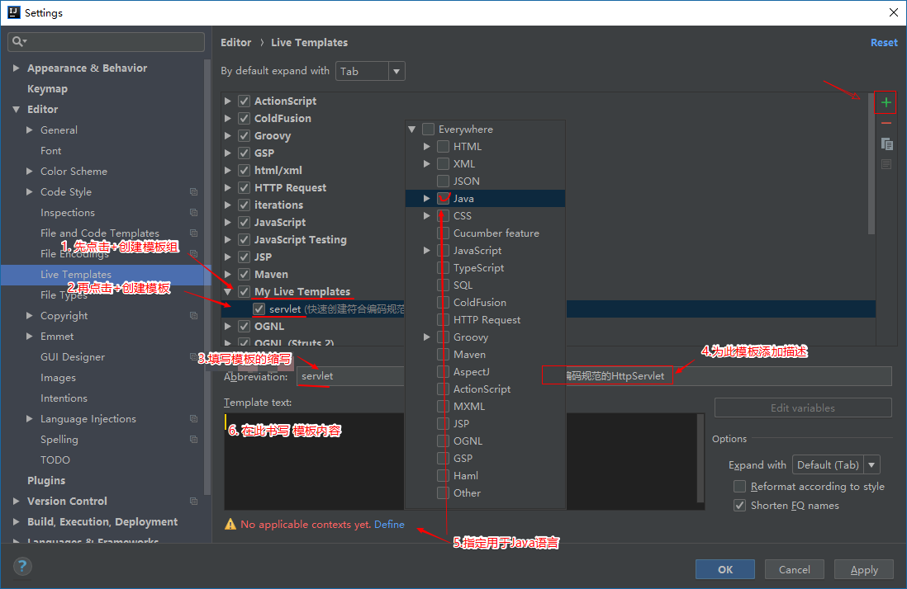
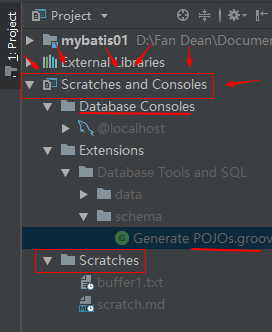
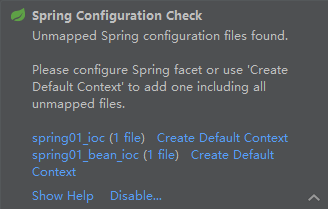

## 通用设置

### 通过授权服务器激活

[XIdea.online Free JetBrains Products License Server.](http://xidea.online/ "XIdea.online Free JetBrains Products License Server.") 这个网站貌似不错。


[JetBrains激活](http://www.imsxm.com/jetbrains-license-server.html "JetBrains激活 - 成都没有派对")

JetBrains 授权服务器(License Server URL):

- 
  http://idea.wlphp.com:1017

- http://intellij.mandroid.cn/ 
- http://idea.imsxm.com/ 
- http://idea.iteblog.com/key.php 
- http://idea.qinxi1992.cn 
- http://idea.lanyus.com/

**使用示例：** 激活时选择License server 填入 `http://idea.imsxm.com`  点击 Active 即可。

**在线激活有一个过期时间**，这个时间一过就必须再次联网授权服务器请求激活。

[IntelliJ IDEA License Server本地搭建教程 - ilanyu's Blog](http://blog.lanyus.com/archives/174.html "IntelliJ IDEA License Server本地搭建教程 - ilanyu's Blog")


还是选择取淘宝购买JetBrains系列全家桶套餐，大概 **10元/年** 左右。具体操作是在淘宝付款后，会要求你提供，要在JetBrains网站上注册时使用的用户名和密码，他会为你注册。注册好后还要你亲自去官网更改验证邮箱。最后在你的Ieda中（或其它）输入用户名和密码，你会发现该账户是提供给教育人员使用。


### 同步设置


> 发现 Android Studio 中也有这个功能


**Setting Repository:**

[Settings Repository - Help - WebStorm](https://www.jetbrains.com/help/webstorm/settings-repository.html)

当开启Settings Repository plugin 时可以看到该选项。Use this page to configure the Settings Repository feature that allows you to **share your IDE settings** between different instances of WebStorm (**or other IntelliJ platform-based**) products installed on different computers.


**Sharing Your IDE Settings:**

[Sharing Your IDE Settings - Help - WebStorm](https://www.jetbrains.com/help/webstorm/sharing-your-ide-settings.html)

确保开启了Settings Repository插件。

配置Settings repository： 选择使用https协议的仓库URL 

将当前IDE的配置同步到远程仓库：

- 在服务器中创建一个Git仓库（比如在GitHub或 GitLab中创建）
- 导航到 File -> Settings Repository打开对话框；或者在欢迎界面通过 Configure ->Settings Repository打开对话框。 在对话框中 指定仓库的URL，并且点击 Overwrite **Remote**。

从远程仓库中获取配置并应用到本地IDE：

- 同样打开Settings Repository对话框，填写仓库的URL，但这次是点击 Overwrite **Local** 。如果你想合并远程和本地现有配置，可以选择点击 **Merge** 进行合并配置。
- 你还可以通过 Setings -> Tools -> Settings Respository -> Read-only Sources下添加多个仓库；或者在这里取消自动同步设置。


设置相关：

导出设置时的默认导出文件 `~/.AndroidStudio2.3/config/settings.jar`


### 代码提示(补全)

参考: [Code Completion](https://www.jetbrains.com/help/idea/2016.1/code-completion-2.html)

代码提示： 在 Editor标签中选择 Code Completion 选项，在"Code Sensitive completion"后的下拉列表中选择"None"，即提示不区分大小写（好吧在Webstorm中设置为None时没有提示，还是设置为First letter）。(默认为First letter)。


### 各种字体设置

**编辑器字体设置：** Editor > Font : 

最棒的字体 mononoki

Size ：16、18、17(感觉大小合适)

Line Spacing：1.1


其它字体还有： Monospaced，Consolas，


1. 设置代码字体（主要字体：推荐 [mononoki](https://madmalik.github.io/mononoki/)，候选字体推荐收费字体"方正稚艺简体"）
    ​    `File --> Settings --> Editor --> Font`

>**默认是不可改变字体的，要想自定义字体需另存一份Scheme（方案）**，点击`Sava As`然后就可在此基础上修改字体（其它一些自定义设置与此类似）。  其中 Show only monospaced fonts 表示只列出等宽字体；Secondary font表示备用字体，可通过它来设置代码中中文的显示字体。

2. 设置程序界面字体   
    `Setting --> Appearance & Behavior --> Appearance --> UI Options` 勾选 `Override default fonts by...` 然后即可设置字体。(建议字体 "Arial Unicode MS" Size:12)

3. 设置控制台字体

  `File --> Settings --> Editor --> Color Scheme --> Console Font`


> 更改某主题的字体，见下面章节。


### 主题

可选的自带主题：Monokai 


下载 "Material Theme UI" 主题插件，然后进行修改：

在 `Editor > Color Scheme > Color Scheme Font` 下选择 Material Default ， 然后选择 Duplicate...  复制该主题，将复制后的主题命名为 "DIY Material Default copy"；按此方法将所有Material相关的主题都复制下来。

接下来禁用"Material Theme UI" 主题插件。

最后**修改该主题的字体：** 这里和前面的字体设置的位置有所不同，这里同样需要在 `Editor > Color Scheme > Color Scheme Font` 中设置。

> 这里主要就是为了复制"Material Theme UI" 主题插件的代码配色方案，然后更改为自己想要的字体。〔强烈推荐〕


整体主题的设置:  
`Setting --> Appearance & Behavior --> Appearance --> UI Options --> Theme`


| AS主题   | Editor主题             |
| -------- | ---------------------- |
| Darcula  | 对应放Editor的暗色主题 |
| IntelliJ | 对应放Editor的浅色主题 |


### 自动保存

**使用星号标记未保存的文件：** Editor > General > Editor Tabls > 勾选“Mark modified tabs with asterisk”

**自动保存：** Appearance & Behavior > System Settings > Synchronization 

下面讲解该处的4个选项：

* Synchronize file on frame or editor tab activation：激活当前窗口时保存
* Save files on frame deactivation：切换到其它窗口时保存
* Save files automatically if application is idle for [15] sec.：程序闲置15秒后保存
* Use "safe write"(save changes to a temporary file first)：...


### 格式化代码

[Reformatting Source Code - Help | WebStorm](https://www.jetbrains.com/help/webstorm/reformatting-source-code.html "Reformatting Source Code - Help | WebStorm")


**对目录进行格式化：**

1. 左键选中某目录
2. 菜单：Code > Reformat Code；将会打开一个对话框
3. 选择你想要勾选的 options 和 filters
4. 点击 Run


### 部署到远程服务器

我们可以在IDE中配置FTP，以手动或自动上传代码到远程服务器。

1. 先设置远程服务器主机：Tools > Deployment > Browse Remote Host > 点击`...`来添加Server > Type可选：FTP、SFTP、FTPS、Local or mounted folder
2. 如果出现目录一直递归显示的情况，更改一下 Advanced Options ，勾选Passive mode 和 Compatibility mode
3. 手动上传：右键选中文件 > Deployment > Upload to xxx
4. 自动上传：Tools > Deployment > Options 更改“Upload changed files automatically to the default server”为非Never的其它选项。


### 通用插件


* .ignore：生成各种.ignore文件
* keypromoter：你用鼠标进行某项操作时，如果有快捷键，会提示你快捷键，如果没有，操作超过三次以后会提示你设置快捷键。
* CodeGlance：minimap
* gfm：GitHub markdown插件，效果不错，但是居然有250M。
* Markdown Navigator：不错的md插件，免费版支持基本功能，付费版支持更多高级功能。（如果vs code中的那个md插件有idea版就好了。对于md文件建议不要使用黑色主题，单独为其配色）
* Dash：结合zeal，方便查看各种离线文档。


[利用grep-console插件使Intellij idea显示多颜色调试日志 - CSDN博客](https://blog.csdn.net/ruglcc/article/details/73844044 "利用grep-console插件使Intellij idea显示多颜色调试日志 - CSDN博客")

[YiiGuxing/TranslationPlugin: Translation plugin for JetBrains IDE/Android Studio](https://github.com/YiiGuxing/TranslationPlugin "YiiGuxing/TranslationPlugin: Translation plugin for JetBrains IDE/Android Studio")


>webstorm minimap对应的插件：
>
>- CodeGlance
>
>* Code Outline 2


### Live Template

Live Template中有大量的模板，设置路径: `Setting --> Editor --> Live Templates`。





导出模板。

[实时模板定义的配置文件](https://www.w3cschool.cn/intellij_idea_doc/intellij_idea_doc-nsj12eb2.html)


### 使用Enter和Tab进行代码补全的差别
（Enter vs Tab for Code Completion）

*描述* ：代码补全时，可以使用Enter或Tab来进行补全操作，但是两者是有差别的。

- 使用Enter时：从光标处插入补全的代码，对原来的代码不做任何操作。
- 使用Tab时：从光标处插入补全的代码，并删除后面的代码，直到遇到点号、圆括号、分号或空格为止。


### 鼠标悬停显示 doc
显示当前鼠标下的类/方法的 Doc （显示函数用法）, 

**需勾选如下设置：**

`File --> Settings --> Editor --> General  |  Other `

- [x] Show quick doc on mouse move Delay (ms) `1500`

>不建议这样做，还是使用快捷键 Ctrl + Q 来代替


### 重启

    File --> Invalidata Caches/Restart...  --> Just Restart


### 使用建议
参考：[Using Suggestion List](https://www.jetbrains.com/help/idea/2016.1/using-suggestion-list.html#sort_order)


**更多详细用法及设置尽在：** [**Meet IntelliJ IDEA**](https://www.jetbrains.com/help/idea/2016.1/meet-intellij-idea.html)


- 由于屏幕太小，可以设置取消勾选工具栏下的导航栏： `View --> Navigation Bar`。
- 设置自动换行；（只对当前文件自动换行`View --> Active Edit --> User Soft Wraps`）


### getter和setter

自动插入的快捷键：

**Android Studio & OSx :**

Press `cmd + n` > Generate > Getter and Setter

**Android Studio & Windows & Linux :**

Press `Alt + Insert` > Generate > Getter and Setter


**自定义getter和setter的风格：**

Go to File->Settings and expand Code Style, selectJava, and add your prefixes/suffixes under the Code Generation tab

>设置方法参考《Android 编程权威指南》第2章


### 高亮匹配的括号...
>Automatic Brace Matching

高亮匹配的各种配对符号的设置路径：  

​`Setting --> Editor --> Colors & Fonts（或者Color Scheme） --> General --> Code --> Matched brace`
​    
推荐勾选 Effects --> Bordered 效果， 一个矩形框框，再为其选择一个颜色。还有就是设置背景色，也可不弄，自己摸索。

>我的一个设置是 : 
>勾选Bold；勾选Foreground，颜色为 #ffef28；勾选Effects，颜色为 #b39613，通过下拉选项选择效果为 Bordered。


配色更改：

- Unknown symbol：Material Darker主题配色有点不好辨别，建议更改，默认背景色为`#FF5370`。更改路径`Editor > Color Scheme > General > Errors and Wrnings > Unknown symbol`，修改背景色为： `#FF0033`


### 在工具栏添加图标

在工具栏右击，选择"Customize Menus and Toolbars"，在弹出的对话框中展开"Main Toolbar"，选中最后一个图标(或任意图标)，然后点击"**Add After...**"来选择需要**添加到此图标之后**的新图标。


### Git版本控制

`VCS -> Enable Version Control Integration` 然后选择Git即可。

在Android Studio中使用GPG对提交进行签名，见 [Signed commits · Wiki · akwizgran / briar · GitLab](https://code.briarproject.org/akwizgran/briar/wikis/signed-commits "Signed commits · Wiki · akwizgran / briar · GitLab")


Android Studio中文件的颜色代表的含义：

- Red – File is not added to git
- Green – File is added but not committed yet
- Blue – New changes is added to a file that is committed to git already


Unversioned Files：指该项目已修改但还未添加到Git 仓库的文件，即“UNversioned Files”.


### .ignore插件

**.ignore 插件的用法:**   

这里介绍了如何通过该插件新建一个.ignore文件（在project视图下）。  


直接在Android Studio外部为项目添加版本控制，在AS的Event Log中会有如下信息，来提示你需在设置中进行注册：  

```
Unregistered VCS root detected
					The directory /home/fan/workspace/AndroidStudioProjects/Test/ZhihuDaily is under Git, but is not registered in the Settings.
					Add root  Configure  Ignore
```

技巧：点击新建一个 .ignore 文件后，会弹出一个 Ignore file Generator 窗口，在此窗口我们可以使用搜索框来快速搜索模板，或者可以选中某个模板然后点击⭐收藏该模板。应该还可以创建 User templates。


如果还没有为整个 Git Project级别添加 .gitignore文件，则会在编辑器顶部有提示信息，点击"Create .gitignore"进行创建。


> [开发准备--Android Studio中的版本管理git - 简书](http://www.jianshu.com/p/53d02cf04694 "开发准备--Android Studio中的版本管理git - 简书")


### 代码提交前后的操作

`Before Commit`，在提交项目前，进行一些前置操作；


- Perform code analysis：IntelliJ IDEA 的Code Analysis机制比较敏感，就算我们在文本注释中用错了标签或者注释时方法的参数与实际参数不一致，在Code Analysis的时候，都会以错误和警告的形式给出。

- `Reformat code`，提交代码之前对代码进行格式化；
- `Optimize imports`，提交代码之前对代码进行导入包的优化；
- `Upload files`，提交代码之后上传文件。


`After Commit`，在提交项目后，进行一些后置操作。


### 文本编辑


- 插入多个光标： 按住 `shift + alt`  ＋ 鼠标点击
- 块级选择： Alt + 鼠标框选


### 默认配置

有些设置在当前项目设置好后，在新建项目时又会恢复到默认配置，导致每次新建项目时都需要手动更改是不是很烦？

IDE有默认配置来帮你解决问题，打开默认配置的方法：

从这里 `File > Other Settings > Default Setting` 即可打开默认设置界面


或者通过下面的方式进入默认设置界面：

在ide启动界面 ：` Configure > Project Defaults > Settings`


>  推荐： [IntelliJ IDEA 常用设置 (二) - 请叫我大表哥 - 博客园](https://www.cnblogs.com/wangmingshun/p/6427088.html "IntelliJ IDEA 常用设置 (二) - 请叫我大表哥 - 博客园")


### 收藏

将一个或多个项目添加到收藏夹。


### 标签页操作

- 固定标签页：右键  pin tab
- 分离标签页：拖动标签页到主窗口外部
- 访问当前标签页中文件路径：Ctrl + 鼠标点击标签页


切换标签页：

- 按 Alt+Right 或 Alt+Left。这样做，鼠标指针会移动到位于“活动编辑器”选项卡右侧或左侧的“编辑器”选项卡。
- 按 `Ctrl+Tab` 使用 切换器。


大神建议关闭标签页：

使用 `Ctrl + E` 查看最近**打开**过的文件

或者直接用 `Ctrl + Shift + E` 来访问最近**编辑**的文件

或者双击 shift 再输入 `/` 加 文件名，来搜索文件。


### 代码折叠

`Ctrl Shift  - `

`Ctrl Shift  + `


折叠注释：支持两种注释

- NetBeans风格

```
//<editor-fold desc="Description">...//</editor-fold>
```

- Visual Studio风格

```
//region Description...//endregion
```

创建注释的方式：

- 手动输入
- 通过 `Code | Surround With  `生成


### scratches文件（临时文件）

 IntelliJ IDEA 提供了临时编辑器。您可以创建一个文本或一段代码进行搜索或探索。IntelliJ IDEA 提供了两种类型的临时文件： 

- Scratch 文件

  scratch 文件功能齐全，如可运行，可调试等。它们需要指定一种语言并具有扩展名。scratch 文件可以通过 ：

  - Ctrl+Shift+Alt+Insert 创
  - 在主菜单上选择（`File | New | Scratch File`） 
  - 按 Ctrl+Shift+A，开始输入 scratch file..，然后选择相应的动作。

- Scratch 缓冲区

  scratch 缓冲区仅用于纯编辑，因此它们不需要指定语言，也不需要扩展名。scratch 缓冲区默认属于`.txt`类型。此操作没有专门的快捷方式，但您可以按照配置键盘快捷键一节进行配置。scratch 文件在创建5个文件后重新使用。这样做，重用后，内容和语言将重置。

  - 按 Ctrl+Shift+A 或  search everywhere。
  - 开始输入命令名称: New Scratch Buffer：（或键入new s b）


查看可用的 scratch 文件和缓冲区 （已经存在的）：

- （project侧边栏）在项目工具窗口中，选择 Scratches 窗口 


查看Scratches文件的方法：




### Terminal相关

Win10 中 Idea中的Terminal不能运行mvn命令，提示mvn不存在，这里mvn已经明确添加到了path环境变量中；当以管理员权限打开 Idea 时才可以运行 mvn 。

解决方案：  

1. 可以手动修改为其他的命令，我设置了git下的sh.exe（或bash.exe）替代cmd.exe。  
2. 把cmd设置为**旧版本特性**，即关闭新特性即可正常使用了。 

[Win10 下intellij idea 的Terminal不能用的问题 - CSDN博客](https://blog.csdn.net/act262/article/details/48263489 "Win10 下intellij idea 的Terminal不能用的问题 - CSDN博客")


但是如果把cmd勾选为 “使用旧版控制台（需要重启）”，会导致找不到 git 命令，所以建议使用第一种解决方案。

> 当指定Idea中的Terminal为bash时（重启Idea后）会提示必须禁用旧版控制台。


### Ctrl + Shift + A


### 双击shift


### Language Injection


>  [Intellij IDEA 一些不为人知的技巧 - 简书](https://www.jianshu.com/p/364b94a664ff "Intellij IDEA 一些不为人知的技巧 - 简书")


Alt + Enter ：是一种快速打开“小灯泡”的快捷键


### 快速跳转


- `ctrl + alt + b` ：跳转到实现类


## IDEA

> [IntelliJ IDEA官方文档(中文)_w3cschool](https://www.w3cschool.cn/intellij_idea_doc/ "IntelliJ IDEA官方文档_w3cschool")


### 项目与模块

新建一个空项目，之后会要求你添加模块。


### 导入其它工程

导入其它工程

- 导入maven工程，需要配置一下maven


### 单行注释

取消单行注释的斜杠出现在每行的开头：`code style > java > code generation > comment code > 取消勾选 Line comment ant first column`


### JDK

如果没有正确配置jdk或没有安装jdk，IDEA（Android Studio也一样）会提示有三种解决方案: 

```
Please use JDK 8 or newer : 还会告诉你使用哪个版本的JDK

use embedded JDK (recommended)  使用内嵌的JDK推荐的方法
Download JDK 8                  下载JDK
Select a JDK from the File System  选择JDK路径
```

内嵌的JDK，一般它不会推荐最新版的JDK。


如果在使用Idea时出现输入法不能跟随光标，可能是与jdk有关。

> 另见：[java - How to set the JDK for Android Studio? - Ask Ubuntu](https://askubuntu.com/questions/467870/how-to-set-the-jdk-for-android-studio "java - How to set the JDK for Android Studio? - Ask Ubuntu")


### 自动导包和智能移除


`Editor > General > Auto Import` 勾选：

- Add unambiguous imports on the fly 自动导包
- Optimize imports on the fly  智能移除


### JavaScript和jQuery

见下文的 WebStorm 


### String或Object显示过时

原来是idea可以在底层jdk或者jar包上加注解的功能，查看过时类的源码，会发现左边会有个`@`，点击或双击即可去掉该注解。

[idea 中 String，Object对象被划横线了怎么破？——CSDN问答频道](https://ask.csdn.net/questions/674750 "idea 15-String，Object对象被划横线了怎么破？——CSDN问答频道")


### 连接数据库


**MySQL：**

在为Idea配置MySQL Data Sources时，对于选择的 Drivers 版本会有不同要求，低于mysql-connector-java-8.jar 版本的 Class 需要选择`com.mysql.jdbc.Driver`而 8 版本的需要选择`com.mysql.cj.jdbc.Driver`

另外可能出现连接参数出现问题：

```
Connection to @localhost failed.
[S1009] The connection property 'zeroDateTimeBehavior' acceptable values are: 'CONVERT_TO_NULL', 'EXCEPTION' or 'ROUND'. The value 'convertToNull' is not acceptable.
注意： CONVERT_TO_NULL 和 convertToNull 的区别，下划线和大小写
```


比如使用 8 版本的驱动，有可能出现 `zeroDateTimeBehavior`的值时不可用的 `convertToNull`，标准的值是全部大写的并且各单词之间是使用`_`连接的，刚开始我一直在 `Drivers > Mysql`下面找，但是它里面的值是正确的（全部是大写的），后来发现，此次连接的属性配置是在配置 你的host, user的界面下的 Advanced 处设置的，这里面有个`zeroDateTimeBehavior`属性的值用的就是`convertToNull`将其更改一下。在该 advanced 下还可以设置 useSSL的值。

当你从 8 版本切换到低版本时又会出现相反的问题。


### DataSource相关


**为表和视图生成Java实体类：**

1. 右击表格或视图。
2. 在右键菜单中，指向“脚本扩展（Scripted Extensions）”，然后单击“生成POJOs.clj（Generate POJOs.clj）”或“生成POJOs.groovy（Generate POJOs.groovy）”。
3. 在打开的对话框中，指定要创建`.java`类文件的目录。


### Tomcat

在Idea中添加Tomcat， `Setting  >  Build, Execution,Deployment > Application Server`添加Tomcat。


Tomcat的解压路径不能有中文。


如果弹出如下对话框：

```
http://localhost:8080/
找不到应用程序
```

原因是选择的浏览器无法运行，修改要打开的浏览器（在 Editor Configurations 中）。


添加tomcat的依赖是为了满足`servlet`和`jsp`依赖的，tomcat作为一个`servlet`容器提供了`servlet`和`jsp`的API。  

那么如果我直接在 maven 中引入 servlet 呢？**可以**，这样就不用再手动添加tomcat的依赖。


### 使用Maven创建web工程


~~见Maven相关文章~~。


>  手动创建的缺点，不能自动添加相关注解，不能自动添加要覆盖的方法。
>
> 直接新建一个 servlet 即可。


artifactid

artifact

Facts: 表示当前项目的适配服务组件

Aftifacts: 这个Aftifacts描述了当前项目发布的信息。


Facets中则可以设置当前项目所用的框架，如Hibernate和Spring，如果是Web项目，也需要添加Web的Facets，这个界面中的显示和Modules中的很类似。如果想要通过idea做Hibernate的映射文件（.hbm）生成或jpa注解配置代码生成，则需要添加Hibernate配置，如果添加了Spring，则在Spring的xml中properties文件的占位符可以被自动替换为properties中已配置的值。 


> 好像还可以通过tomcat的管理员... 配置maven，然后maven自动部署应用到 tomcat中
>
> [\[转\]Maven实现直接部署Web项目到Tomcat7 - dorothychai - 博客园](https://www.cnblogs.com/dorothychai/p/4669808.html "[转]Maven实现直接部署Web项目到Tomcat7 - dorothychai - 博客园")
>
> 
>
> [IDEA——Maven Web工程：无法创建Java Class文件 - CSDN博客](https://blog.csdn.net/gxx_csdn/article/details/79080265 "IDEA——Maven Web工程：无法创建Java Class文件 - CSDN博客")
>
> [Idea 新建Maven项目时没有servlet选项 - CSDN博客](https://blog.csdn.net/u013605060/article/details/80611041 "Idea 新建Maven项目时没有servlet选项 - CSDN博客")


### 插件


- Alibaba Java Coding Guidelines: 阿里代码规约，规约扫描插件,用扫描的方式帮助我们发现代码中的潜在问题和不合规处。用了一下，功能强，中文提示，强烈推荐。类似的插件还有 FindBugs。
  - 用法：选中目标目录 -> Tools > Alibaba  Coding Guidelines > Alibaba  Coding Guidelines A...
  - 扫描结果：分为3个级别。 Blocker级别建议尽量修改； Critical 和 Major的也应该尽量遵循。
- Native Terminal Plugin  :  安装后工具栏多一个图标，点击就可在当前工程目录下打开系统默认终端；还可以通过设置为其它终端，比如 git-bash，但是为啥 指定为 cmder 不行。
- 热部署插件Jerbel：JRebel是一套JavaEE开发工具。 Jrebel 可快速实现热部署，节省了大量重启时间，提高了个人开发效率。 但是他是收费的。


> 搜索：IDEA热部署
>
> [intelliJ Idea自带热部署和Jrebel实现热部署 - CSDN博客](https://blog.csdn.net/wei19880402/article/details/75529231 "intelliJ Idea自带热部署和Jrebel实现热部署 - CSDN博客")
>
> [Intellij IDEA 4种配置热部署的方法 - JCook - 博客园](https://www.cnblogs.com/jcook/p/6910238.html "Intellij IDEA 4种配置热部署的方法 - JCook - 博客园")
>
> （idea自带的）基于JVM提供的热加载仅支持方法块内代码修改，只有debug模式下，并且是在idea失去焦点时才会出发热加载，相对加载速度缓慢。


- grep console：可以方便的查找日志（在控制台右键选择带grep的项），并且可以设置不同的日志级别的显示样式（`other setting>grep console`中点击右侧的 Add 添加一个配置，调整后再将其 set as Default）。

- Lombok：[☆十分钟搞懂Lombok使用与原理 - 简书](https://www.jianshu.com/p/63038c7c515a "☆十分钟搞懂Lombok使用与原理 - 简书") 
- AceJump：快速定位光标位置
  - 第1步：`Ctrl+;` 快捷键，激活插件。此时，IDE代码编辑区会出现一个蓝色光标，然后输入你要跳转的标签。
  - 第2步，这是，IDE全屏所有你刚才输入的标签都会被高亮显示，并且在这个高亮的标签前面会出现相应的键盘字母，你按照相应提示的字母去敲击键盘就可以自动跳转了。
- redis 插件（名字叫ledis）


### 构建Web应用程序

对于web应用程序，Idea提供了两种Artifacts：

- war：部署就绪 war
- war exploded：解压缩的 war


具体操作方式如下：

1. 创建一个web应用：

   - 方式一：在创建项目时就选择 `（File | New | Project | Java Enterprise | Web Application）`等 
   - 方式二：对于现有项目。右键单击相应的模块文件，选择添加框架支持（Add Framework Support）”。然后在打开的对话框中选择“Web应用程序（Web Application） 

2. 为该应用程序创建Artifacts配置：`（File | Project Structure | Artifacts `点击加号添加

   - Web Application(类型时webapp哦)： Exploded（就是war exploded）；当创建好web项目时自动会创建。
   - Web Application：Archive（就是war）；需要手动创建这种 webapp。`（ ➕| Web Application: Archive | For '... exploded'） `

3. 构建 Artifacts：

   `Build |构建工件|<ArtifactName>|建立（Build | Build Artifacts | <ArtifactName> | Build）`。或者，您可以在Docker运行配置的“启动前（Before launch）”任务列表中包含“构建工件（Build artifact）”任务。 


### web.xml的作用


生成`web.xml`文件：

`Project Structure > Modules > 展开modules > web >Deployment Descriptors > + > web.xml` 注意xml文件的路径问题


web.xml加载过程如下：

1. 启动一个WEB项目的时候，WEB容器会去读取它的配置文件web.xml，读取`<listener>`和`<context-param>`两个结点。 
2. 紧急着，容创建一个`ServletContext`（servlet上下文），这个web项目的所有部分都将共享这个上下文。 
3. 容器将`<context-param>`转换为键值对，并交给servletContext。 
4. 容器创建`<listener>`中的类实例，创建监听器。


>
>
> - [Web.xml详解 - CSDN博客](https://blog.csdn.net/believejava/article/details/43229361 "Web.xml详解 - CSDN博客") 
> - [web.xml文件详解 - OpenFire_ - 博客园](http://www.cnblogs.com/hellojava/archive/2012/12/28/2835730.html "web.xml文件详解 - OpenFire_ - 博客园")
> - [web.xml文件的作用及基本配置 - 简书](https://www.jianshu.com/p/285ad45f60d1 "web.xml文件的作用及基本配置 - 简书")
>
>


### Docker

[Docker - Help - IntelliJ IDEA](https://www.jetbrains.com/help/idea/docker.html "Docker - Help - IntelliJ IDEA")

详见 Docker 和 Idea相关文章 


### 代码测试


**先添加测试库**。

**创建测试类**方式之一：

- 在编辑器中打开要创建测试的类，并将光标放在类名上。
- 按下 `Alt+Enter` 可以调用可用意图操作列表。
- 从列表中选择“Create test”。
- 在“Create test”对话框中：选择要使用的测试库。如果模块中缺少选定的库，请单击“修复”按钮。相应的库将自动添加到模块库中。定义要生成的测试类的名称和位置。 

创建测试类其它方式：

- 将光标放在类名上 
- 在主菜单上选择 `Navigate > Test` ，或者
- 在右键菜单上选择 `Go to > Test`


**创建测试方法：**

在 JUnit 测试类中创建存根测试方法，具体操作步骤如下： 

1. 在编辑器中打开相应的 JUnit 测试类。
2. 将光标放在要生成新测试方法的位置。
3. 按 `Alt+Insert`，并从 "生成" 菜单中选择 "测试方法"。


略 ...


### Spring

弹出提示：




- 直接点击 "Create Default Context"  即可
- 或者在 `Project structure > facet` 中选中模块中列出的 "Spring"，此时会发现有提示"Unmapped Spring configuration files:  ***.xml"，点击 ➕ 然后在弹出的对话框中勾选当前项目中对应的 spring配置文件。
- 打开 applicationContext.xml 文件，如果编辑器顶部有提示："Configure application context" 则直接点击该文字，在弹出的界面为当前模块勾选对应的xml文件即可。（如果使用了`<import>`引入过多个xml则将该模块下的列出的xml都勾选上）


**Idea创建Spring的xml配置文件的方法：**

`New > XML Configuration File > Spring Config`


### Mybatis


**mybatis-generator：**

利用 mybatis-generator 自动生成代码，（根据我们的数据库自动生成pojo、dao和映射用的xml文件）

mybatis-generator有三种用法：命令行、eclipse插件、maven插件。网上教程大多都是基于 maven插件 来讲解的；即在 pom.xml 文件中添加 mybatis-generator-maven-plugin 插件。

需要通过 `generatorConfig.xml`配置文件，来配置数据库连接信息、数据库表信息，生成的类名和相关文件存放的路径（需要经常变动的部分）和 生成选项（基本不变）。


> [利用mybatis-generator自动生成代码 - 菩提树下的杨过 - 博客园](http://www.cnblogs.com/yjmyzz/p/4210554.html "利用mybatis-generator自动生成代码 - 菩提树下的杨过 - 博客园")
>
> [mybatis-generator-maven-plugin在idea中使用 - 简书](https://www.jianshu.com/p/4db902936b29 "mybatis-generator-maven-plugin在idea中使用 - 简书")


在Idea上搜索了一下发现idea的 codehelper.generator 插件，看起来不错。该插件暂时只支持 `java + mysql`，更多数据库的支持还在开发中。更多特性：

codehelper.generator ：GenDaoCode 特性：

- 根据Pojo 文件一键生成 Dao，Service，Xml，Sql文件。
- Pojo文件更新后一键更新对应的Sql和mybatis xml文件。
- 提供insert，insertList，update，select，delete五种方法。
- 能够批量生成多个Pojo的对应的文件。
- 自动将pojo的注释添加到对应的Sql文件的注释中。

- 丰富的配置，如果没有配置文件，则会使用默认配置。
- 可以在Intellij Idea中快捷键配置中配置快捷键。
- 目前支持MySQL + Java，后续会支持更多的DB。

[zhengjunbase/codehelper.generator: source code of codehelper.generator](https://github.com/zhengjunbase/codehelper.generator "zhengjunbase/codehelper.generator: source code of codehelper.generator")


### Build

在Java Web工程中，这里使用maven：


示例一：创建一个简单的servlet后，可以编译一下该文件，看该servlet是否正确

Open the Build menu and click Rebuild Project to make sure that the servlet is compiling correctly. The Event Log should output `Compilation completed successfully` 并且你可以看到此时会生成输出目录，在该目录中可以看到对应的 class 文件


示例二：

点击 `Build > Build Artifacts` ，可以在输出目录中生成 war 包，或者解压的 war包目录，这样可以在不启动 Tomcat 服务器的情况下，自动生成 war 包文件。


### Lombok


百度云》慕课Java企业级电商项目架构演进之路 Tomcat集群与Redis分布式》第2章 Lombok框架集成及原理。

另见 简书收藏。

见相关笔记。


### UML


快捷键： Ctrl + Shift + Alt + U 

或者  Ctrl + Alt + U 


## 快捷键

| 快捷键               | 说明                                                         |
| -------------------- | ------------------------------------------------------------ |
| Tab                  | 代码补全(Code Completion)，覆盖当前                          |
| Enter                | 代码补全(Code Completion)，直接插入                          |
| Ctrl + 空格          | 代码补全提示                                                 |
| Ctrl + Shift + 空格  | 触发 SmartType code completion。The SmartType code completion greatly helps to find methods and variables that are suitable in the current context, by analyzing the expected type of the whole expression. So doing, IntelliJ IDEA pinpoints the top five most suitable results and highlights them on the blue background. |
| Ctrl + D             | 复制 当前行／当前选中的代码                                  |
| Alt + J              | 向下搜索当前选中的字符串，实现多选                           |
| Ctrl + W             | 选中单词                                                     |
| Ctrl+Shift+Backspace | (Navigate \| Last Edit Location) brings you back to the last place where you made changes in the code.跳转到上次编辑代码的地方 |
| Ctrl + P             | If the cursor is between the parentheses of a method call, pressing Ctrl+P brings up a list of valid parameters.显式方法参数 |
| Ctrl + Q             | (View \| Quick Documentation)  显示对应的doc文档             |
| Ctrl+Alt+T           | 选中代码，按下该快捷键，然后选择使用何种语句来包含此段代码  (Code \| **Surround With**) |
| Alt + Insert         | (Code \| Generate)                                           |
| Ctrl+O               | (Code \| Override Methods)                                   |
| Ctrl+I               | (Code \| Implement methods)                                  |
| Shift+F6             | (Refactor \| Rename)                                         |
| **Ctrl+F12**         | (Navigate \| File Structure)，快速导航到当前文件的某个位置，同时可以在弹出的对话框中直接输入想要查找的内容。（可以将该窗口固定到边栏） |
| Alt+Q                | (View \| Context Info) 显示光标当前位置的上下文信息          |
| Ctrl+E               | (View \| Recent Files)                                       |
| Ctrl+H               | (Navigate \| Type Hierarchy)                                 |
| Ctrl+Shift+V         | choose and insert recent clipboard contents                  |
| F5                   | Use `Refactor | Copy` to create a class which is a copy of the selected class. This can be useful。 复制class。 |
| Ctrl+Shift+I         | `Quick Definition Viewer` can also be used for items in lookup lists that appear on code completion and class/file/symbol navigaton commands. |
|                      |                                                              |
|                      |                                                              |
|                      |                                                              |
|                      |                                                              |
|                      |                                                              |
|                      |                                                              |
|                      |                                                              |
|                      |                                                              |

 

Alt+F7，查找整个工程中使用地某一个类、方法或者变量的位置 

Ctrl+I，实现方法 

Ctrl+B/Ctrl+Click，快速打开光标处的类或方法（跳转到定义处）

 Ctrl+Alt+B，跳转到方法实现处

Ctrl+Shift+Backspace，*跳转到上次编辑的地方* 

Ctrl+O，重写方法 

Ctrl+Alt+Space，类名自动完成

Alt+F1，查找代码所在位置 

Alt+1，快速打开或隐藏工程面板 

Ctrl+Alt+left/right，返回至上次浏览的位置  （windows需要先禁用显卡快捷键）

Alt+left/right，切换代码视图 

Alt+Up/Down，在方法间快速移动定位

Ctrl+[ OR ]，可以跑到大括号的开头与结尾 

Ctrl+F12，可以显示当前文件的结构 

Ctrl+F7，可以查询当前元素在当前文件中的引用，然后按 F3 可以选择 

Ctrl+N，*可以快速打开类* 

Ctrl+Shift+N，*可以快速打开文件* 

Alt+Q，可以看到当前方法的声明

Ctrl + U
将选定文本更改为小写字符。

编辑.转换为大写
Ctrl + Shift + U
将选定文本更改为大写字符。


快速搜索Project的tree views：光标聚焦到project上，然后直接输入你要查找的文件名。


[在IntelliJ IDEA编辑器中选择文本_w3cschool](https://www.w3cschool.cn/intellij_idea_doc/intellij_idea_doc-lo4i2d91.html "在IntelliJ IDEA编辑器中选择文本_w3cschool")


| 方法                                             | 描述                                             |
| ------------------------------------------------ | ------------------------------------------------ |
| Alt + J                                          | 向下匹配当前选中的字符串，实现多选               |
| Shift + alt + `鼠标点击` 或 `双击` 或 `拖动鼠标` | 插入多个光标 / 选中多个字符串 / 选择多段字符串。 |
| Alt + 鼠标拖动 / 按住鼠标中键/shift + alt + 中键 | 选择一列文本                                     |
|                                                  |                                                  |
|                                                  |                                                  |
|                                                  |                                                  |


常用快捷键：

| 行为                                     | 快捷方式                       |
| ---------------------------------------- | ------------------------------ |
| 按名称查找行为                           | **Ctrl+Shift+A**               |
| 显示可用意图行为的列表                   | Alt+Enter                      |
| 在视图 (项目、结构等) 之间切换           | Alt+F1                         |
| 在编辑器中打开的工具窗口和文件之间切换   | Ctrl+Tab                       |
| 显示导航栏                               | Alt+Home                       |
| 插入实时模板                             | Ctrl+J                         |
| 用实时模板环绕                           | Ctrl+Alt+J                     |
| 从项目或其他树视图编辑项目               | F4                             |
| 使用行或块注释来注释或取消注释行或代码段 | Ctrl+Slash Ctrl+Shift+Slash    |
| 按名称查找类或文件                       | Ctrl+N Ctrl+Shift+N            |
| 复制当前行或选择.                        | Ctrl+D                         |
| 增量表达式选择.                          | Ctrl+W和Ctrl+Shift+W           |
| 在当前文件查找/替换文本字符串.           | Ctrl+F Ctrl+R                  |
| 在项目或指定的目录中查找/替换文本        | Ctrl+Shift+F Ctrl+Shift+R      |
| 四处搜索                                 | 双按 shift                     |
| 快速查看所选符号的用法                   | Ctrl+Shift+F7                  |
| 在编辑器中展开或折叠代码片段             | Ctrl+NumPad Plus Ctrl+NumPad - |
| 调用代码完成                             | Ctrl+Space                     |
| 完成 Smart 声明                          | N/A                            |
| 完成 Smart                               | Ctrl+Shift+Space               |
| 显示可用的重构（重构该列表）             | Ctrl+Shift+Alt+T               |


[十大Intellij IDEA快捷键 - CSDN博客](https://blog.csdn.net/dc_726/article/details/42784275 "十大Intellij IDEA快捷键 - CSDN博客")

[设置IntelliJ IDEA背景图像_w3cschool](https://www.w3cschool.cn/intellij_idea_doc/intellij_idea_doc-i4at2cxi.html "设置IntelliJ IDEA背景图像_w3cschool")


## WebStorm

WebStorm 是收费软件，不过这不是大问题，我们有一些免费使用的方案：**好像该方法不管用了**。 


[WebStorm，你一直在寻找的前端开发 IDE · Issue #6 · cssmagic/blog](https://github.com/cssmagic/blog/issues/6 "WebStorm，你一直在寻找的前端开发 IDE · Issue #6 · cssmagic/blog")

官方下载的版本都是可以 30 天免费试用的。到期之后还可以继续安装更新的 **EAP** 预览版  <http://confluence.jetbrains.com/display/WI/WebStorm+EAP>  ，继续合法免费试用。只要自己勤快一点儿，备份好个人设置，基本上可以一直免费用下去。所以，我完全不建议你去找什么破解版或盗版序列号。


[JavaScript开发工具WebStorm教程：用户界面简介](https://www.evget.com/article/2013/6/24/19100.html "JavaScript开发工具WebStorm教程：用户界面简介-控件新闻-慧都控件网")

[Introduction - webstorm 入门指南](http://book.apebook.org/minghe/webstorm/index.html "Introduction - webstorm 入门指南")


### 代码格式化

结合ESLint进行格式化。ESLint inspections combined with the power of WebStorm code formatting。[利用webstrom的宏，使用eslint规则保存文件自动格式化代码(mac版) - CSDN博客](http://blog.csdn.net/wk3368/article/details/50981767 "利用webstrom的宏，使用eslint规则保存文件自动格式化代码(mac版) - CSDN博客")


[Reformatting Source Code - Help - WebStorm](https://www.jetbrains.com/help/webstorm/reformatting-source-code.html "Reformatting Source Code - Help - WebStorm")


### Run/Debug Configurations

在某些工程，比如node.js项目中，run按钮是灰色的无法点击；这时候需要通过旁边的下拉按钮选择“Edit Configurations”来打开“Run/Debug Configurations”对话框来进行配置。

IDE自带了些默认的配置，在打开的对话框中点击左边的 “+” 会发现有很多种类的默认配置。这里以node.js为例，那么就选择"Node.js"，再为该配置文件起一个名字，然后在 JavaScript file 处指定要运行的 JavaScript文件。


### Usage Scope使用范围

[JavaScript. Usage Scope - Help  WebStorm](https://www.jetbrains.com/help/webstorm/javascript-usage-scope.html)

使用此对话框定义JavaScript库应用于代码补全、高亮显示和导航的范围。范围可能涵盖整个项目，目录甚至个别文件。这有助于使JavaScript的代码补全更精确，并避免太长的建议列表。

| Item           | Description                              |
| -------------- | ---------------------------------------- |
| File/Directory | This column displays the project tree view. |
| Library        | This column displays libraries for a file or directory, if applicable.If a library can be specified for a certain node of the project tree view, click the Library column for a selected file or directory, and choose the desired library from the list of available libraries.If JavaScript libraries are not applicable to a particular node, 'N/A' is shown in grey font.    ( If JavaScript libraries are not applicable to a particular node, 'N/A' is shown in grey font. ) |


### 设置 JavaScript 语言版本

设置 JavaScript 语言版本 ：File -> Setting -> Languages & Frameworks -> JavaScript ，选择语言版本。一般设置为能选择的最新版（比如：ECMAScript 6），否则有些新的语言特性可能不支持。

> 在默认设置中更改

**在本地运行js文件**，右键点击 `run **.js`。事先需要安装好node.js并在webstorm中进行配置（File -> Setting -> Languages & Frameworks -> node.js）


### 打开内嵌的终端

 open the built-in WebStorm Terminal 

press `Alt+F12` （不管用）or choose `View > Tool Windows > Terminal` （可以打开）on the main menu。


### 添加对jQuery的支持

项目中添加对jQuery的支持。

`File -> settings -> Javascript Libraries -> Add`

在files中添加路径，在documentations urls中添加文档支持。这里边需要注意一下的是，要添加原始未压缩的代码，`*.min.js`版的方法是不会被提示。

添加完成后，右边菜单中还有一 download 按钮，单击之后，他会自动选择最新版的js库进行搜索，然后在弹出的列表中，再单击选择一个后，点击Download and Install之后，才会被下载。这块体验不是太好，没有checkbox，也没有radio，只是选中后整行变暗。 

如果添加多个版本的jQuery，就可以直观的看到各个版本之间新方法的差别了。

\* 在这项的子菜单中 Usage Scope 右边 Project 第二栏Library下单击，选择新添加的jQuery，使其对整个项目进行覆盖。


### Vue.js支持

WebStorm默认已经支持Vue.js，请确保 Vue.js 插件处于开启状态。

额外设置：

[intellij idea - How to integrate WebStorm with Vue.js - Stack Overflow](https://stackoverflow.com/questions/36929395/how-to-integrate-webstorm-with-vue-js "intellij idea - How to integrate WebStorm with Vue.js - Stack Overflow")


**Improve HTML-tag's attributes highlighting**

Open `Settings(Preferences)` => `Editor` => `Inspection` => `HTML` => select `Unknown HTML tag attributes` => click `Custom HTML tag attributes`. Add your attributes.

For example, my list:

```
v-on,v-on:click,v-on:change,v-on:focus,v-on:blur,v-on:keyup,:click,@click,v-model,v-text,v-bind,:disabled,@submit,v-class,:class,v-if,:value,v-for,scoped,@click.prevent,number,:readonly,@input,@click,v-show,v-else,readonly,v-link,:title,:for,tab-index,:name,:id,:checked,transition,@submit.prevent,autocapitalize,autocorrect,slot,v-html,:style
```


### Node.js支持

**Enable Node.js Coding Assistance:**

Open `Settings(Preferences)` => `Languages & Frameworks` => `Node.js and NPM`


> If "Node.js core library is not enabled", click button `Enabled`
>
> [Node.js - Help ](https://www.jetbrains.com/help/webstorm/node-js.html )


Node interperter(解释器)： node安装路径。（还不知道是否是这样设置）

Coding Assistance：点击 enable 来下载Node.js的 。如有必要再点击 Usage scope(使用范围)。

[前端开发利器webStorm 3.0配置使用 - 豪情 - 博客园](http://www.cnblogs.com/jikey/archive/2012/01/16/2323590.html "前端开发利器webStorm 3.0配置使用 - 豪情 - 博客园")


[WebStorm开发工具设置React Native智能提示 - CSDN博客](http://blog.csdn.net/xiangzhihong8/article/details/52224527 "WebStorm开发工具设置React Native智能提示 - CSDN博客")


## 一些技巧

* 可以直接拖动文件到编辑器中。比如引入jquery.js，我们先将该文件添加到项目中，再直接拖动该文件到html文档中就会直接生成类似下面的语句`<script src="../build/jquery.js"></script>`。
* 善用“Settings”对话框中的**搜索**功能（直接搜索相关设置）。
* 根据方法自动生成变量，比如： 我们想将`data.getTime()`的返回值保存在一个变量中，可以这样操作：输入`data.getTime().var` 再按Tab或回车，即可自动创建变量。
* 增强for循环的快捷输入，比如有一个集合 col，现在要使用for循环遍历该集合，先输入`col.for`再按Tab或回车。
* 快速为行末添加分号：我们可以在行中任意位置使用快捷键 `Ctrl + Shift + Enter` 来快速补全分号。


## PyCharm

PyCharm有免费社区版。PyCharm Community Edition


docker setting: 翻译下面语句

exposing deamon on tcp without tls helps legacy clients connect to the deamon. it also

makes yourself vulnerable to remote code execution attacks. use with caution.


