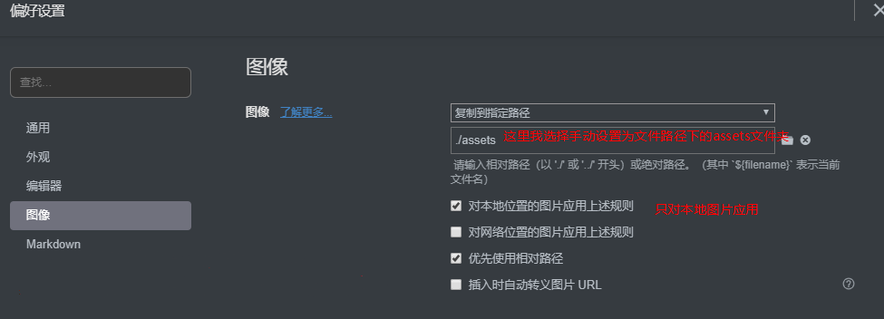
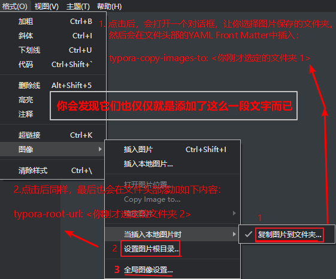

[Typora Support ](http://support.typora.io/) 有详细的说明。查看此文会有意想不到的收获

> 随着 Typora功能不断完善，部分操作可能需要更新。当前时间2019.11.08

## 基本设置

我的个人设置： 文件👉偏好设置

- 通用：打开指定目录；勾选 自动保存
- 外观：经典；字体大小自动（一般为16）；勾选 显示状态栏
- 编辑器：
  - 默认缩进，2
  - 对齐缩进，勾选
  - 匹配括号和引号，**勾选**
  - 匹配Markdown字符，**勾选**
  - 显示当前块元素的md源码，**勾选** （更改标题等级再也不用用鼠标或进入源码模式了）
  - 复制纯文本时复制markdown源码，**不勾选**。（有人居然说Typora的缺点是复制内容到word时会有大量符号）
- 图像：下文讨论
- markdown：
  - 语法偏好：勾选 严格模式
  - 语法扩展：勾选 高亮、图表
  - 智能标点：输入时转换；勾选 **智能破折号** 
  - 代码块：勾选 显示行号、代码块自动换行


设置：无论在何种输入法状态下，输入的 `` 都是英文字符。


一些常用操作：

- 进入源码模式：Ctrl + / 
- **快速打开**：Ctrl + P
- 应用内窗口切换：Ctrl + Tab
- 显示隐藏侧边栏：Ctrl + Shift + L
- 视图👉保持窗口在最前


## 图片


相对路径的设置：

```
---
typora-root-url: ..\..\..\..\Pictures\Git-Pictures\markdown
---
/../../../Documents/notes/开发工具/编辑器与IDE/assets/image-20191107210106946.png
```


### 图片插入

- 支持剪贴板图片插入：一个建议是，通过剪贴板插入图片时能弹出一个窗口来修改图片名称
- 直接拖拽插入
- 常规插入
- 对于插入的图片，我们可以右键该图片选择：
  - 在浏览器中打开（如果该图片是非本地图片）
  - 复制到`<你在全局图片设置中指定的文件夹>`
  - 将图片复制到...


### 全局图片设置

这里主要讲解一些全局图片设置中的相对路径，并且只讲我认为重要的部分。我当前使用Typora的方式是，

- 首先新建一个`笔记`文件夹，然后在此文件夹下按笔记分类创建各种子`文件夹；
- 并且会我想着把所有相关的图片也包含在里面，这样方便管理，所以我需要在`笔记`或其子文件夹下创建一个目录（我这里是assets）来专门用来存放图片；
- 最后我希望不管我是换系统或移动 `笔记` 这个文件夹，Typora都能正确找到图片路径，所以我需要在插入图片时使用相对路径。

下面是全局图片具体的设置：



对于网络位置的图片，是否应用上述规则看个人需求；我的做法是不勾，当真正想要将网络图片保存到本地的时候，我们可以在文件中右键该图片👉选择复制图片到 assets 文件夹中，复制之后你会发现该图片的路径也会自动更改。

### 上传本地图片

这里指将图片上传到图床，保存在服务器中。具体用法见相关说明

- Windows中可以使用 PicGo
- Mac中使用 iPic

**PicGo使用技巧：**

- 可以直接将图片拖动到迷你窗口上传图片（也可尝试拖动到任务栏中的小图标）
- 直接引用的外链图片其地址可能失效，所以建议直接**复制该图片到剪贴板**再通过PicGo上传，而非复制该图片的url地址粘贴到文章中。

**调整图片大小和位置：**

Typora支持你使用 ``标签

> 对图片的设置基本已经完成


### 当前文件中图片的设置

只有有特殊需求才会进行下面的设置；并且**只针对当前文件**。

设置方式是通过 菜单👉格式👉图像 … 来进行，见下图：




 **情况一：** 使用Typora编辑静态网站（例如Jekyll）中的`* .md`帖子。

例如，__posts文件夹下编写文件，你想当一每次插入本地图片时自动将图片复制到静态网站的 _media 文件夹中，那么你需要这样做：

- 首先，确保的全局图片设置中勾选了使用相对路径；否则它会以绝对路径来表示，在做静态网站是你是不希望这样表示的。
- 然后 菜单👉格式👉图像 👉当插入本地图片时👉复制图片到文件夹 👉 选择文件夹
- 它会将  `typora-copy-images-to: {relative path}`   插入到该文件的 YAML Front Matter中（relative path相对你当前文件的路径，所以确保你编辑的文件在 _posts文件夹中）。
- 最后你在该文件中插入的本地图片都会复制到 _media 文件夹中。

> 看起来这和在全局图片设置中设置图片保存路径的效果是一样的。这样做的目的是避免你**切换到不同场合时**频繁的去修改全局图片设置。
>
> 对于Mac用户，还可以通过 ` typora-copy-images-to: ipic ` 直接将图片复制到iPic中。如果你只是想移动图片到 iPic 而不是复制，则可通过   `typora-copy-images-to: ./ipic`  


**情况二：**如果您使用markdown构建网站，则可以在YAML Front Matters中使用属性`typora-root-url`为在本地计算机中预览文件中的图片时自动为图片链接添加一个URL前缀，以使得该图片能够正常显示。【没有真正搞清除它的用途，感觉它就是为了预览图片而存在的，在想要编辑文件并需要插入本地图片时建议先将其删除】

例如，在YAML Front Matters中输入`typora-root-url：/User/Abner/Website/typora.io/`，那么Typora会将文件中的 ``视为 `！[alt] （file：///User/Abner/Website/typora.io/blog/img/test.png）`

> 如果你在带有 `typora-root-url` 的文件中插入图片时，它同样会影响到该图片的url路径（并没有改变图片复制后保存的路径，它会保存在 当前文件设置的图像文件夹 **或** 全局设置的图像保存文件夹）


> 图片命名的一个想法：
>
> ```
> 文档名（简写） +  .  + 图片内容 
> ```
>
> 为图片的名称添加 文档名前缀能方便以后知晓该图片使用的位置
>


## 文件管理

侧边栏：

- 通过快捷键或左下角`<`打开
- 文件列表：
  - 全局查找：在此处搜索框中可以搜索文件名和内容进行查找
  - 点击底部可进行更多操作；比如可以看到最近打开的文件夹；以树形显示文件列表；
  - 右键文件，也有很多选项；比如 撤销重命名、撤销删除、撤销移动
- 大纲列表：
  - 可以在此处搜索框中搜索当前文档内容
  - 可以在偏好设置中勾选 “侧边栏大纲视图允许折叠和展开”


>  全局搜索：Typora本身不支持`#tags` ，但是如果你的文件中有 `#tags` ，你可以在全局搜索中搜索这些 tags。


### 链接到其他文件或文件夹

链接到其他文件或文件夹：在文中使用 `[label](src)` 其中 src 可以是相对路径也可以是绝对路径；按住Ctrl键并鼠标点击就可开此文件


### 快速打开

使用下面方式打开弹出快速打开面板，在此面板你还可以进行搜索

- Ctrl + P  
- 菜单👉文件👉快速打开


### 设置默认文件夹

Typora并没有这个概念，但你可以通过 文件👉偏好设置👉通用👉启动选项👉打开指定目录 来实现类似效果。


## 导出

下载并安装 Pandoc，或使用scoop安装。安装 Pandoc 后导出的文件格式更加完整。


## 高级设置


- 添加自定义的搜索引擎到右键菜单：偏好设置👉通用👉高级设置，编辑改文件将Google改为其他搜索引擎
- 自定义字体：也可以在高级设置文件中设置
- 在命令行中开启 typora ：如果typora是 .md 默认程序，Windows中只需 `.\example.md` 或者 `start example.md`，Linux中需要`typora example.md`
- 在文件中添加视频`<video src="xxx.mp4" />`、音频`  <audio src="xxx.mp3" />  `、Web Contents`  <iframe>  `
- 使用黑暗模式；1.设置系统使用黑暗模式；2.为Typora选择一个黑暗主题


## 自定义样式(主题)

###  如何添加自定义的CSS?

偏好设置👉外观👉打开主题文件夹；

Typora 会加载下面的 CSS 文件：

1. 基本CSS文件 `base.user.css` ，此文件将应用于所有主题
2. `{current-theme}.user.css` 当前使用的主题的CSS文件也将会加载

 这两个文件并未存在，需要自行创建，并且注意文件名是需要区分大小写的（不同系统不同要求）。

你也可以通过 视图👉开发者工具 来调试CSS。


### 为已完成任务添加删除线

在  `base.user.css` 或者 `[theme].user.css` 中添加：

```css
.task-list-done {
    /* styles for completed tasks */
    text-decoration: line-through;
    /*顺便更改一下颜色*/
    color: #777
}
.task-list-not-done {
    /* styles for incomplete tasks */
}
```


### 自定义代码块风格

Typora使用 [CodeMirror](http://codemirror.net/) 来高亮代码块；Typora使用的主题名称为： `cm-s-inner`。

Typora 只会将 `.cm-s-inner` **选择器**的内容设置给代码块，所以你的主题复制到  `base.user.css` 或者 `[theme].user.css` 文件中时需要将现有主题名称全部替换为 `cm-s-inner`；比如你想使用   [material.css](https://codemirror.net/theme/material.css)  但你将其粘贴后，就需要将其中的 `cm-s-material` 全部替换为 `cm-s-inner` 。

还请注意，在 CodeMirror 渲染代码块之前，代码块位于 `<pre class="md-fences"></pre>  `之内，所以也请为  `.md-fences`  选择器定义基本的样式，比如字体、颜色、背景。

最终的文件将会是：

```css
/** ported from https://codemirror.net/theme/material.css **/
/*
    Name:       material
    Author:     Michael Kaminsky (http://github.com/mkaminsky11)
    Original material color scheme by Mattia Astorino (https://github.com/equinusocio/material-theme)
*/

.cm-s-inner {
  background-color: #263238;
  color: rgba(233, 237, 237, 1);
}
.cm-s-inner .CodeMirror-gutters {
  background: #263238;
  color: rgb(83,127,126);
  border: none;
}
.cm-s-inner .CodeMirror-guttermarker, .cm-s-inner .CodeMirror-guttermarker-subtle, .cm-s-inner .CodeMirror-linenumber { color: rgb(83,127,126); }
.cm-s-inner .CodeMirror-cursor { border-left: 1px solid #f8f8f0; }
.cm-s-inner div.CodeMirror-selected { background: rgba(255, 255, 255, 0.15); }
.cm-s-inner.CodeMirror-focused div.CodeMirror-selected { background: rgba(255, 255, 255, 0.10); }
.cm-s-inner .CodeMirror-line::selection, .cm-s-inner .CodeMirror-line > span::selection, .cm-s-inner .CodeMirror-line > span > span::selection { background: rgba(255, 255, 255, 0.10); }
.cm-s-inner .CodeMirror-line::-moz-selection, .cm-s-inner .CodeMirror-line > span::-moz-selection, .cm-s-inner .CodeMirror-line > span > span::-moz-selection { background: rgba(255, 255, 255, 0.10); }

.cm-s-inner .CodeMirror-activeline-background { background: rgba(0, 0, 0, 0); }
.cm-s-inner .cm-keyword { color: rgba(199, 146, 234, 1); }
.cm-s-inner .cm-operator { color: rgba(233, 237, 237, 1); }
.cm-s-inner .cm-variable-2 { color: #80CBC4; }
.cm-s-inner .cm-variable-3 { color: #82B1FF; }
.cm-s-inner .cm-builtin { color: #DECB6B; }
.cm-s-inner .cm-atom { color: #F77669; }
.cm-s-inner .cm-number { color: #F77669; }
.cm-s-inner .cm-def { color: rgba(233, 237, 237, 1); }
.cm-s-inner .cm-string { color: #C3E88D; }
.cm-s-inner .cm-string-2 { color: #80CBC4; }
.cm-s-inner .cm-comment { color: #546E7A; }
.cm-s-inner .cm-variable { color: #82B1FF; }
.cm-s-inner .cm-tag { color: #80CBC4; }
.cm-s-inner .cm-meta { color: #80CBC4; }
.cm-s-inner .cm-attribute { color: #FFCB6B; }
.cm-s-inner .cm-property { color: #80CBAE; }
.cm-s-inner .cm-qualifier { color: #DECB6B; }
.cm-s-inner .cm-variable-3 { color: #DECB6B; }
.cm-s-inner .cm-tag { color: rgba(255, 83, 112, 1); }
.cm-s-inner .cm-error {
  color: rgba(255, 255, 255, 1.0);
  background-color: #EC5F67;
}
.cm-s-inner .CodeMirror-matchingbracket {
  text-decoration: underline;
  color: white !important;
}

/**apply to code fences with plan text**/
.md-fences {
  background-color: #263238;
  color: rgba(233, 237, 237, 1);
  border: none;
}

.md-fences .code-tooltip {
  background-color: #263238;
}
```


### 自定义字体

在  `base.user.css` 或者 `[theme].user.css` 文件中配置，比如：

```css
body {
 font-family: 'Courier'; 
}
```

你也可以使用Web字体。

**字体大小**在 文件👉偏好设置👉外观👉字体大小 中设置。注意： 此选项需要你使用的主题的支持。如果要自己制作主题CSS，请使用rem作为字体单位，以确保该选项（指偏好设置中设置字体的选项）有效。 


### 背景更改


这里有两个示例。

示例一，其背景图片从 [这里](http://www.fuzzimo.com/free-seamless-textures-notebook-papers/) 获取 ，并将其放到 theme文件夹

```css
content {
  background: url(./fzm-seamless.notebook.texture-14.png);
  background-repeat: repeat;
}

#write {
  padding-left: 120px; /*adjust writing area position*/
}

body {
  background: #F3F3F3; 
  /*Please set this background color as close to the background image as possible.
  titlebar for seamless window on macOS will use this background color. 
  typora for Win/Linux will use this to judge whether typora is in dark mode or light mode*/
}

/**Other css may needed to adjust UI components**/
```

示例二：

```css
content {
  background-image: url(http://localhost:4000/media/background/crashed_ship_by_hiddenvortexdesigns-da57nk8.jpg);
  background-repeat: repeat;
  background-position: -52px;
}

#write {
  margin-top: 24px;
  background-color: rgba(255, 255, 255, 0.68);
  margin-bottom: 24px;
  min-height: calc(100% - 48px);
}

body {
  background-color: #8F9D9A;
}

/**Other CSS to adjuest UI components*/
```


### 隐藏目录层级

 在Typora中 `[TOC]` 将会生成目录，并且默认可以显示 h1 ~ h6。如果你想隐藏h6可以像这样：

```css
.md-toc-h6 {
  display: none;
}
```


### 为标题自动添加数字

分为三种情况：

- 在你添加标题时自动为你添加数字
- 为`[TOC]`自动生成数字
- 为大纲自动生成数字

详见 ：[Auto Numbering for Headings](http://support.typora.io/Auto-Numbering/)


> 空格和换行符：[Whitespace and Line Breaks](http://support.typora.io/Line-Break/)

